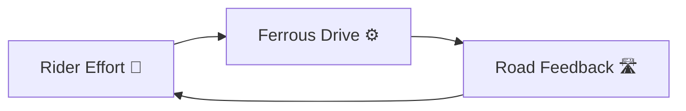
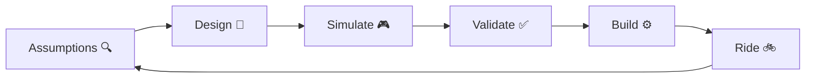
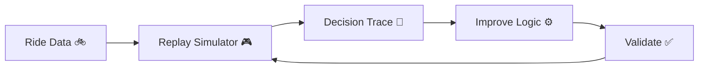

# Ferrous Drive 🚲🦀⚙️

[](https://www.rust-lang.org/)
[](LICENSE)
[](docs/roadmap.md)
[](https://github.com/tspreck/ferrous-drive/issues)

> Rider-oriented **Rust** e-bike control software built around simulation, validation, and controller-independent design.
Ferrous Drive is an open-source Rust platform for deterministic e-bike propulsion control.

# Project Mantra

**> _Measure effort > > > Preserve momentum > > > Learn from every ride_**


Ferrous Drive is not a motor controller.

It is a feedback system that helps riders maintain momentum, protects the machine from unnecessary stress, and continuously learns from the outcomes of its decisions.



**The rider provides effort**
**The controller provides support**
**The road provides feedback**


The project focuses on:

- Safety-first control design
- Replayable simulation
- Fault-tolerant telemetry handling
- Explainable assist decisions
- Controller-independent architecture
- Community-driven development

The long-term goal is to create a reusable Rust foundation for e-bike control systems that can be validated on a laptop before ever reaching a moving vehicle.

> ⚠️ **Early Development**
>
> Ferrous Drive is currently focused on architecture, simulation, validation, and hardware abstraction.
>
> Hardware integration and controller support remain future milestones.

---

# Project Philosophy



Every ride teaches something.

Every lesson becomes an assumption.

Every assumption gets tested before becoming trusted.

---

# Development Loop



---

# Current Architecture

```text
Telemetry
    ↓
Telemetry Trust Model
    ↓
Motion State Machine
    ↓
Constraint Handling
    ↓
Assist Decision
    ↓
Motor Request
    ↓
Controller Driver
```

The core intentionally separates:

- Telemetry acquisition
- State management
- Constraint handling
- Motor controller integration

This keeps the control system portable between different hardware platforms.

---

# Current Focus

Current work is centred around:

- Repository Foundation & Project Origin
- Engineering Assumptions Register
- Validation Matrix
- Telemetry Trust Model
- Replay Simulator Foundation

---

# Project Status

✅ Repository Created

✅ Initial Architecture Defined

✅ Requirements Captured

✅ Decision Trail Started

✅ Development Roadmap Defined

🚧 Engineering Foundations

🚧 Telemetry Trust Model

🚧 Replay Simulation

⏳ Controller Abstraction

⏳ Hardware Validation

⏳ First Rolling Prototype

---

# Contributing

Contributions are welcome.

Examples include:

- Rust development
- Simulation tooling
- Testing
- Documentation
- E-bike controller research
- Ride data analysis

Before proposing major architectural changes, please review:

- Project Origin
- Roadmap
- Assumptions Register
- Decision Log

Understanding *why* something exists is often more valuable than immediately changing it.

---

# License

Licensed under:

- Apache-2.0

at your option.

---
