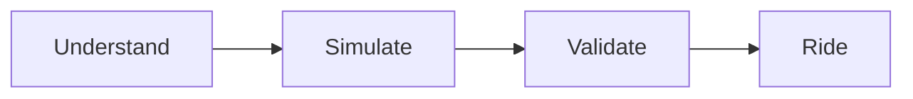
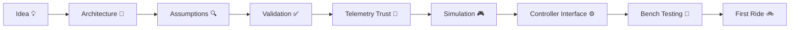
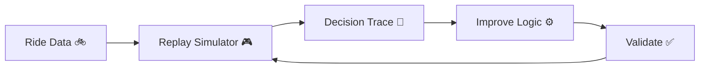

# Ferrous Drive 🚲🦀⚙️

> Safety-oriented, simulation-first e-bike control software written in Rust.

Ferrous Drive is an open-source Rust platform for deterministic e-bike propulsion control.

The project focuses on:

- Safe and predictable assist behaviour
- Simulation before hardware
- Controller-independent architecture
- Fault-tolerant telemetry handling
- Explainable assist decisions
- Community-driven development

The long-term goal is to create a reusable Rust foundation for e-bike control systems that can be validated on a laptop before ever reaching a moving vehicle.

> ⚠️ Early Development
>
> Ferrous Drive is currently focused on architecture, simulation, validation, and hardware abstraction.
>
> Hardware integration and controller support are still under investigation.

---

# Why Ferrous Drive?

Most DIY e-bike projects start with firmware and hardware.

Ferrous Drive intentionally starts somewhere else:

```text
Understand It
    ↓
Simulate It
    ↓
Validate It
    ↓
Ride It
```

The project aims to reduce experimentation on real hardware by moving as much engineering work as possible into deterministic simulation and replay.

---

# Development Philosophy



---

# Project Journey



---

# Current Architecture

```text
Telemetry
    ↓
Telemetry Trust Model
    ↓
Motion State Machine
    ↓
Constraint Engine
    ↓
Assist Decision
    ↓
Motor Request
    ↓
Controller Driver
```

The core intentionally separates:

- Telemetry acquisition
- State management
- Constraint handling
- Motor controller integration

This keeps the control system portable between different hardware platforms.

---

# Design Principles

## Safety First

Ferrous Drive should always favour predictable behaviour over aggressive behaviour.

## Simulation Before Hardware

Controller behaviour should be validated in simulation before it reaches a live bike.

## Explainable Decisions

Every assist request should be traceable back to the telemetry and constraints that produced it.

## Controller Independence

The core should not care whether it eventually communicates with:

- Baserunner
- VESC
- Future controller platforms

## Graceful Degradation

Sensor failures should degrade predictably rather than cause undefined behaviour.

---

# Engineering Confidence Pyramid

```text
            🚲 ROAD TESTED
                  ▲

             🧪 BENCH TESTED
                  ▲

              🎮 SIMULATED
                  ▲

               📐 DESIGNED
                  ▲

                💡 IDEA
```

Every major feature should climb this pyramid before being considered trusted.

---

# Current Roadmap

## Phase 0 · Project Foundation ✅

- Repository created
- Vision established
- Initial architecture documented
- Initial requirements defined
- Change tracking established
- First project issues created

## Phase 1 · Engineering Foundations 🚧

Current focus:

- Project origin documentation
- Assumptions register
- Validation matrix
- Telemetry trust model

## Phase 2 · Simulation First

Upcoming:

- Replay simulator foundation
- GPX / telemetry replay
- Decision tracing
- Regression testing

## Phase 3 · Controller Abstraction

Upcoming:

- Controller interface definition
- Telemetry abstraction
- Health monitoring

## Phase 4 · Controller Research

Upcoming:

- Direct Baserunner communication investigation
- Protocol review
- Hardware capability validation

See the full roadmap in:

```text
docs/roadmap.md
```

---

# Current Open Questions

Some important design assumptions are intentionally being tracked and challenged early:

- Can a Baserunner be controlled directly and safely?
- What telemetry is truly required?
- How should stale data be handled?
- Can simulation catch most control-law issues?
- Which parts of the system must be fail-safe?

The goal is to replace assumptions with evidence over time.

---

# Development Loop



---

# Project Status

Ferrous Drive is currently exploring:

✅ Architecture

✅ Requirements

✅ Project governance

✅ Safety thinking

🚧 Telemetry trust model

🚧 Validation framework

🚧 Replay simulation

⏳ Controller abstraction

⏳ Hardware integration

⏳ Bench testing

⏳ Ride testing

---

# Documentation

| Document | Purpose |
|-----------|----------|
| docs/roadmap.md | Project roadmap |
| docs/project_origin.md | How the project started |
| docs/decision_log.md | Major design decisions |
| docs/assumptions.md | Engineering
