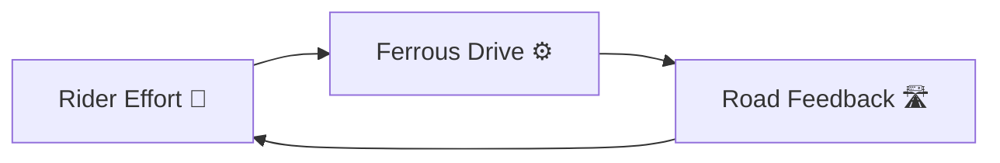
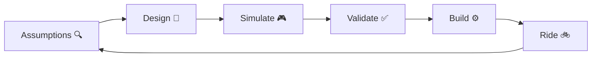

# Ferrous Drive 🚲🦀⚙️

[](https://www.rust-lang.org/)
[](LICENSE)
[](docs/roadmap.md)
[](https://github.com/tspreck/ferrous-drive/issues)

> Ferrous Drive is an open-source **Rust** platform that measures rider effort, manages assistance and regenerative braking, and turns every ride into useful training and engineering data. Simulation first. Rider focused. Built to learn.🚲🦀⚡🔋

Ferrous Drive explores deterministic, explainable control for a digitally connected direct-drive e-bike system. The current prototype direction combines an nRF54L15, RTIC, heapless data structures, a headless Grin controller, and a Grin V3 Rear All-Axle motor.

# Project Mantra

> _Measure effort > > > Preserve momentum > > > Learn from every ride_


Ferrous Drive is not a low-level motor controller.

It is a rider-oriented energy and telemetry platform that measures effort, manages assistance and regeneration, protects the system through explicit constraints, and learns from replayable ride data.



> _**The rider provides effort**_

> _**The controller provides support**_

> _**The road provides feedback**_


The long-term goal is to create a reusable Rust foundation for e-bike control systems that can be validated on a laptop before ever reaching a moving vehicle.

> ⚠️ **Early Development**
>
> Ferrous Drive is currently focused on architecture, simulation, validation, and hardware abstraction.
>
> Hardware integration and controller support remain future milestones.

---

# Project Philosophy

The project focuses on:
 
- Rider-effort-aware assistance
- Controlled regenerative braking
- Hub-side rider-power measurement
- BLE fitness-data broadcasting
- Deterministic replay simulation
- Explainable drive decisions
- Fault-tolerant telemetry handling
- Controller-independent architecture
- Event-driven embedded Rust

# Ways of Working

## Engineering Confidence Pyramid

```text
              🚲 ROAD TESTED
                  ▲▲▲▲

              🧪 BENCH TESTED
                  ▲▲▲

              🎮 SIMULATED
                  ▲▲

              📐 DESIGNED
                  ▲

              💡 IDEA
```

Every major feature should climb this pyramid before being considered "trusted".




> _**Every ride teaches something.**_
> _**Every lesson becomes an assumption.**_
> _**Every assumption gets tested before becoming trusted.**_

---

# Current Architecture

```text
        Torque, PAS, and Vehicle Telemetry
        ↓
        Telemetry Trust Model
        ↓
        Rider-Power Calculation
        ↓
        Motion and Energy-Flow Models
        ↓
        Constraint Arbitration
        ↓
        Assist, Neutral, Regen, or Inhibit Decision
        ↓
        Controller-Independent Request
        ↓
        Digital Grin Controller Driver
```

The core intentionally separates:

- Telemetry acquisition
- State management
- Constraint handling
- Motor controller integration

This keeps the control system portable between different hardware platforms.

---
# Current Prototype Direction

```text
Control Computer
    nRF54L15 DK

Runtime
    RTIC

Memory Strategy
    heapless and fixed-capacity data

Motor
    Grin V3 Rear All-Axle 6T

Motor Controller
    Headless Grin controller

Rider Input
    Integrated freehub torque and quadrature PAS

Fitness Output
    BLE rider-power and cadence broadcasting
```
---
# Experimental Ideas
- Hub-side rider-power broadcasting to cycling head units
- Regen-aware energy management
- Backpedal or brake-triggered regeneration
- Controlled negative torque for low-speed,
- ERG-like outdoor training

These are research directions, not supported features.

---
# Documentation

- 📜 docs/project_origin.md
- 📐 docs/architecture.md
- 📝 docs/decision_log.md
- 🧠 docs/assumptions.md
- ✅ docs/validation_matrix.md
- 🗺️ docs/roadmap.md
- 📋 [Changelog](CHANGELOG.md)

---
# Contributing

Contributions are welcome.

Examples include:

- Rust development
- Simulation tooling
- Testing
- Documentation
- E-bike controller research
- Ride data analysis

Before proposing major architectural changes, please review:

- 📜 docs/project_origin.md
- 📐 docs/architecture.md
- 🧠 docs/assumptions.md
  
Understanding *why* something exists is often more valuable than immediately changing it.4
---

# License

Licensed under the Apache License 2.0.

---
