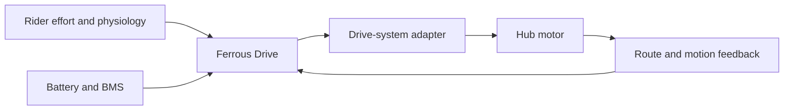
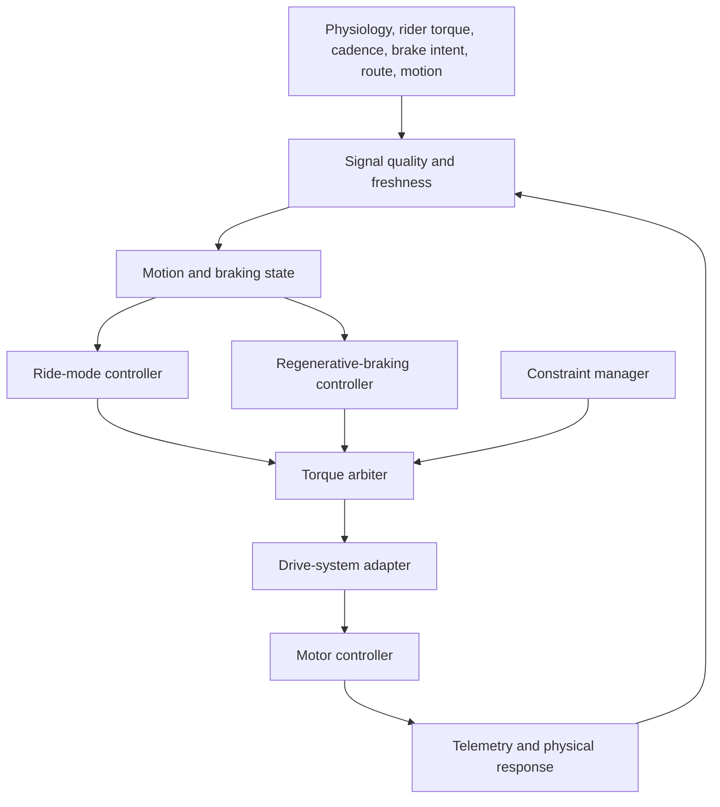
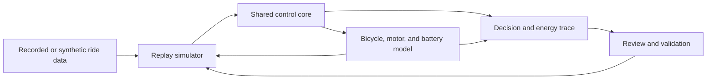

# Ferrous Drive 🚲🦀⚡🔋

[](https://www.rust-lang.org/)
[](LICENSE)
[](docs/roadmap.md)
[](https://github.com/tspreck/ferrous-drive/issues)

**Rider-first Rust software for simulation-driven, controller-independent e-bike assistance and regenerative braking.**

Ferrous Drive is an open-source platform for building deterministic bicycle
control systems that preserve rider intent rather than simply maximizing motor
output.

The project explores how rider power, cadence, heart rate, HRV, route demand,
battery state, and drive-system capability can be combined into assistance that
feels like cycling, not operating a pedal motorbike.

> **Reduce friction. Build consistency. Keep riding.**

> [!WARNING]
> Ferrous Drive is in early development.
>
> The project currently focuses on architecture, simulation, route replay,
> validation, and hardware abstraction. It is not validated for road use and
> must not replace independent motor-controller, battery-management, thermal,
> electrical, or mechanical safety systems.
>
> The bicycle's hydraulic brakes must remain mechanically independent and fully
> functional without Ferrous Drive, the motor controller, or the battery.

---

## Project Direction

Ferrous Drive is not a motor controller. It is the rider-intent and energy
management layer above a compatible controller.



The rider provides the purpose and effort. Ferrous Drive interprets that intent,
applies validated constraints, and requests only the motor contribution needed
to preserve the purpose of the ride.

The current design direction includes:

- Rider-intent operating modes instead of conventional assist levels
- HRV-led, multimodal physiological adaptation
- Positive, zero, and negative torque decisions
- Rider-triggered, speed-scheduled regenerative braking
- A shared removable 36 V battery for multiple smart-wheel configurations
- Route replay and explainable decision traces
- Controller-independent Rust interfaces
- Simulation before moving hardware

---

## Operating Modes

Ferrous Drive modes describe **why the rider is riding**, not how much motor
power should be applied.

| Mode | Rider intent | Assistance policy |
|---|---|---|
| **Neutral Ride** | Ride the bicycle naturally | Compensate only for penalties introduced by the installed system |
| **Active Recovery** | Keep physiological strain deliberately low | Use HRV-led, multimodal adaptation to preserve an easy internal load |
| **Commute** | Complete a sustainable and repeatable journey | Normalize gradients, wind, acceleration, and fatigue while protecting arrival reserve |
| **Tempo** | Hold a purposeful, adaptive sweet-spot effort | Reward sustained rider effort and preserve training intent |

Initial rider-power bands are planning assumptions rather than fixed
prescriptions:

```text
Active Recovery
    50–100 W

Commute
    100–200 W

Tempo
    200–300 W
```

HRV, heart rate, rider power, cadence, signal quality, route demand, and recent
response may refine these bands over time. Physiological signals may shape
positive assistance, but they never initiate braking.

---

## Regenerative Braking

Regenerative braking is a first-class Ferrous Drive subsystem for compatible
direct-drive configurations.

The design is **rider-triggered, speed-scheduled, regen-first, and mechanically
independent**.

```text
Brake-lever intent
        ↓
Positive torque prohibited
        ↓
Validated speed selects nominal regen
        ↓
Soft engagement ramp
        ↓
Battery, motor, thermal, and rear-wheel constraints
        ↓
Bounded wheel-speed and IMU feedback
        ↓
Negative-torque request
```

Core principles:

- The rider initiates every braking event.
- Stopping pedalling means coasting, not braking.
- A light lever movement may initiate routine regenerative slowing.
- Further lever movement adds normal hydraulic braking.
- Mechanical braking remains available at all times.
- Regen remains active in Neutral Ride.
- Generation-one live control is deterministic.
- Adaptive learning initially operates in observation-only mode.

See [Regenerative Braking](docs/regenerative_braking.md) for the full sensing,
state-machine, speed-map, failure-handling, and validation design.

---

## Dual Drive-System Strategy

Ferrous Drive is designed around capabilities rather than one fixed motor.

### Lightweight geared-hub configuration

Current benchmark: a 36 V, 12 × 142 mm thru-axle geared rear hub.

Priorities:

- Lower system mass
- Minimal unpowered drag
- Conventional road-bike feel
- Efficient positive assistance
- Natural coasting

Expected limitations:

- No regenerative braking with a conventional freewheel
- External rider sensing may be required
- Controller and telemetry access remain candidate specific

### Direct-drive configuration

Current benchmark: Grin V3 Rear All-Axle 6T with a compatible Grin controller.

Priorities:

- Regenerative braking
- Integrated rider torque and pedal sensing
- Motor-temperature telemetry
- Positive and negative torque
- Richer experimentation and energy accounting
- Neutral Ride drag compensation

Trade-offs:

- Higher wheel and total system mass
- Direct-drive magnetic drag
- More complex battery and controller integration

Both configurations are intended to use the same Ferrous Drive core and the
same provisional 36 V battery platform.

---

## Battery Platform

The current battery concept is a removable, mild-oval bottle module.

```text
Cell
    Molicel INR-21700-P50B

Configuration
    10S2P

Cell count
    20

Nominal voltage
    36 V

Full-charge voltage
    42 V

Nominal capacity
    10 Ah

Nominal energy
    360 Wh

Physical arrangement
    7 + 6 + 7

Initial CAD envelope
    76 × 70 × 270 mm

Working mass target
    1.75 kg or less
```

The battery must support a bidirectional current path even when the installed
motor cannot regenerate. BMS charge permission, pack-voltage rollback,
temperature limits, and bidirectional current telemetry are therefore part of
the baseline design.

See [Battery Design](docs/battery_design.md).

---

## Architecture



The torque arbiter produces exactly one bounded outcome:

```text
Positive torque
Zero torque
Negative torque
```

Priority is explicit:

```text
1. Critical fault handling
2. Valid brake intent
3. Battery, motor, and controller constraints
4. Regenerative-braking request
5. Ride-mode positive-assistance request
6. Neutral Ride compensation
7. Zero torque
```

This keeps mode logic, braking, constraints, and controller integration
separate and testable.

See [Architecture](docs/architecture.md).

---

## Simulation-First Development

Ferrous Drive aims to validate behaviour on a laptop before reaching moving
hardware.



The simulator should make every decision explainable:

- What did the rider request?
- Which signals were trusted?
- Which ride mode was active?
- Was the bicycle pedalling, coasting, or braking?
- What torque was requested?
- Which constraint limited the request?
- How much energy was consumed or recovered?
- How did the modeled bicycle respond?

The same deterministic control logic should be reusable in simulation and on
hardware wherever practical.

---

## Current Route Baseline

The current commute model uses recorded rides from the present commuter setup:

- Approximately 35 km each way
- Approximately 236 m ascent and 232 m descent
- WTB Vulpine 36c tyres
- Aluminium wheels

The GPX-derived model currently separates regenerative opportunities into:

```text
Descent-related recovery
Junction and corner recovery
```

Current planning values for a complete return commute are approximately:

```text
Descent-related recovery
    41 Wh

Junction-related recovery
    15 Wh

Total planning recovery
    55–56 Wh
```

These figures are simulation inputs inferred from route data. They are not
measured electrical recovery and must be replaced by physical voltage and
current measurements.

---

## Safety Model

Ferrous Drive follows layered protection:

```text
Ride-mode policy
    ↓
Ferrous Drive constraints
    ↓
Motor-controller limits
    ↓
Battery-management protection
    ↓
Fuse, insulation, and mechanical protection
```

Key rules:

- Safety constraints are not ride-mode preferences.
- Invalid or stale telemetry must not be reused silently.
- Unsupported drive capabilities remain disabled.
- Positive and negative torque cannot coexist.
- Brake intent overrides positive assistance.
- Battery recovery never takes priority over predictable braking.
- Learning cannot alter immutable safety limits.
- Hydraulic brakes remain mechanically independent.

---

## Project Status

Ferrous Drive remains in early development.

Current focus:

- Control architecture
- Drive capability abstraction
- Operating-mode refinement
- Battery and packaging design
- Regenerative-braking architecture
- Recorded-route analysis
- Simulation and replay
- Assumption and validation discipline

Not yet complete:

- Prototype hardware
- Validated brake-lever sensing
- Selected BMS
- Validated regen current and speed maps
- Controller protocol integration
- Closed-course testing
- Road validation

---

## Documentation

| Document | Purpose |
|---|---|
| [Architecture](docs/architecture.md) | System boundaries, control layers, torque arbitration, and degraded operation |
| [Regenerative Braking](docs/regenerative_braking.md) | Brake sensing, speed scheduling, feedback, failure handling, and validation |
| [Battery Design](docs/battery_design.md) | 10S2P battery, packaging, BMS, bidirectional current, and regen constraints |
| [Roadmap](docs/roadmap.md) | Development stages and validation gates |
| [Assumptions](docs/assumptions.md) | Open assumptions and provisional values |
| [Validation Matrix](docs/validation_matrix.md) | Evidence, status, and test coverage |
| [Decision Log](docs/decision_log.md) | Why major architectural choices were made |

---

## Development Principles

### Simulation before hardware

Control behaviour should be replayable before it reaches a moving bicycle.

### Explain every request

Every final torque request should include the reason and active constraint.

### Capabilities before assumptions

The core asks what the attached drive supports. Unsupported features do not
silently degrade into approximate behaviour.

### Deterministic first

Safety-relevant live control begins with deterministic, bounded logic. Learning
starts as an observer.

### Preserve the bicycle

Ferrous Drive should enhance consistency and training intent without removing
the qualities that make the bicycle worth riding.

---

## Contributing

Contributions are welcome in areas including:

- Embedded Rust
- Simulation and replay tooling
- Control-system testing
- Controller and BMS adapters
- Ride-data analysis
- Battery and motor modelling
- Physiological-signal research
- Documentation
- Brake and sensor prototyping

Before proposing major architectural changes, review:

- [Architecture](docs/architecture.md)
- [Regenerative Braking](docs/regenerative_braking.md)
- [Battery Design](docs/battery_design.md)
- [Assumptions](docs/assumptions.md)
- [Decision Log](docs/decision_log.md)

Understanding why a subsystem exists is often more valuable than immediately
changing it.

---

## License

See [LICENSE](LICENSE) for the repository's licensing terms.
