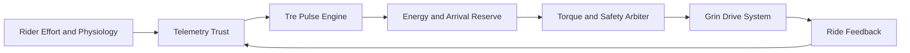

# Ferrous Drive 🚲🦀⚡🔋

> **Measure the rider. Make progress visible. Reward the right behaviour.**

Ferrous Drive is an open-source Rust PAS training system built around three
rider intents: **Neutral, Recovery, and Training**.

It uses rider power, heart rate, HRV, route demand, and battery state to
preserve natural riding, regulate recovery, reward structured work, and learn
from every ride.

```text
Simulation first.
Rider focused.
Built to learn.
```

> [!WARNING]
> Ferrous Drive is in early development. It is not ready to control a ridden
> bicycle, and no feature should be treated as safety-certified or validated.

## Three Modes

### Neutral

Preserve the natural bicycle.

- Compensate only for penalties introduced by Ferrous Drive
- Keep rider-triggered regenerative braking available
- Record useful rider and system data
- No training game or physiological target

### Recovery

Regulate a personalized Zone 2 workload.

- Start from a conservative `1.0:1` assistance ratio
- Use trusted HRV, heart-rate, and power trends to adapt toward `1.2:1`
- Reward physiological discipline and consistency
- Allow speed to fall before compromising recovery or arrival reserve

### Training

Perform structured work and earn assistance.

- Accumulate valid work
- Secure Tre Pulse milestones
- Unlock temporary free speed or recovery support
- Begin with profiles such as Tempo Tailwind and Anaerobic Shield

## Tre Pulse

**Tre Pulse** is Ferrous Drive's shared visual, behavioural, range, and reward
language.

It connects:

```text
Three modes
    Neutral, Recovery, Training

Three interaction segments
    State, progress, reward

Three battery-range layers
    Journey, reserve, contingency

Three physical battery layers
    7 + 6 + 7
```

Completing three valid Recovery or Training cycles consecutively unlocks the
**Golden Streak**, extending reward duration without increasing peak assistance
beyond validated limits.

## Sports-Science-Informed

Recovery and Training concepts have been cross-checked and iteratively refined
against established endurance-sport practices, including:

- Relative power and heart-rate zones
- Time in zone
- Sweet spot
- Critical Power and W-prime concepts
- Autoregulatory training
- HRV-informed readiness and fatigue adaptation

The physiological principles inform the design. Ferrous Drive's scoring,
reward, and assistance parameters remain experimental until they have been
simulated and validated with rider data.

## How It Fits Together


```mermaid
flowchart LR
    Rider[Rider Effort and Physiology]
    Trust[Telemetry Trust]
    Pulse[Tre Pulse Engine]
    Energy[Energy and Arrival Reserve]
    Arbiter[Torque and Safety Arbiter]
    Drive[Grin Drive System]
    Feedback[Ride Feedback]

    Rider --> Trust
    Trust --> Pulse
    Pulse --> Energy
    Energy --> Arbiter
    Arbiter --> Drive
    Drive --> Feedback
    Feedback --> Trust
```

Tre Pulse may request assistance. Final motor behaviour remains subordinate to:

- Brake intent
- Battery protection
- Motor and controller limits
- Valid pedalling
- Trusted telemetry
- Destination arrival reserve

## Prototype Direction

```text
Control computer
    Nordic nRF54L15 DK

Language
    Rust

Runtime direction
    RTIC investigation

Memory strategy
    heapless and fixed-capacity data

Motor
    Grin V3 Rear All-Axle 6T

Controller
    Headless compatible Grin controller

Battery
    10S2P Molicel P50B
    360 Wh nominal
```

## Regenerative Braking

Ferrous Drive uses rider-triggered, regen-first braking on compatible
direct-drive systems.

A brake request immediately cancels positive torque. Regenerative braking is
then applied within battery, thermal, controller, speed, and rear-wheel limits.
The bicycle's hydraulic brakes remain mechanically independent and always
available.

## Simulation First

Ferrous Drive should be understandable on a laptop before it controls moving
hardware.

```text
Input
    ↓
Trusted state
    ↓
Behaviour and control decision
    ↓
Energy and torque constraints
    ↓
Explainable trace
```

The first coding milestone is a clean Rust workspace with:

- A portable `no_std` core
- A desktop simulator
- `heapless` bounded data
- A telemetry trust model
- Unit tests
- GitHub Actions verification

## Documentation

- [Architecture](docs/architecture.md)
- [Tre Pulse Engine](docs/tre_pulse_engine.md)
- [Training Model](docs/training_model.md)
- [Regenerative Braking](docs/regenerative_braking.md)
- [Battery Design](docs/battery_design.md)
- [Decision Log](docs/decision_log.md)
- [Assumptions](docs/assumptions.md)
- [Validation Matrix](docs/validation_matrix.md)
- [Roadmap](docs/roadmap.md)
- [Changelog](CHANGELOG.md)

## Current Priorities

1. Bootstrap the Rust workspace
2. Implement telemetry trust
3. Define the three-mode domain model
4. Implement the Tre Pulse state engine in simulation
5. Simulate Recovery before adding physiological hardware
6. Add Training profiles and Golden Streak only after the shared engine is stable

## Project Philosophy

```text
Neutral
    Preserve

Recovery
    Regulate

Training
    Earn

Tre Pulse
    Understand
```

Ferrous Drive does not exist to turn a bicycle into a pedal motorbike.

It exists to make natural riding, consistent recovery, and productive training
easier to repeat.
