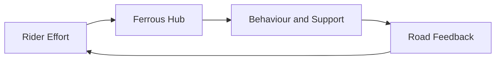
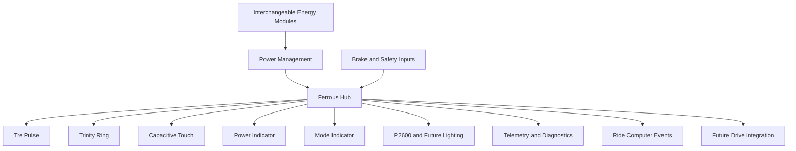
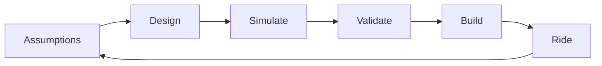

# Ferrous Drive 🚲🦀⚙️

**Rider-oriented Rust cycling-control software built around simulation, validation, and controller-independent design.**

Ferrous Drive is an open-source platform for deterministic rider assistance, behavioural feedback, lighting coordination, telemetry, and future electric-drive integration.

The project is now centred on the **Ferrous Hub**: a portable embedded controller that coordinates Tre Pulse, the Trinity Ring, capacitive-touch interaction, lighting, power state, telemetry, and future peripherals. Batteries are treated as interchangeable energy modules rather than the centre of the architecture.

> **Early development**
>
> Ferrous Drive is currently focused on architecture, simulation, validation, hardware abstraction, and Ferrous Hub V0.1. Hardware integration and controller support remain experimental milestones.

---

## Project mantra

```text
Reduce friction.
Build consistency.
Keep riding.
```

Ferrous Drive is not a motor controller.

It is a rider-centred feedback and orchestration system that:

- measures and interprets rider effort;
- provides explainable support;
- protects the machine from unnecessary stress;
- rewards consistent riding behaviour;
- learns from simulation, testing, and real rides.


```mermaid
flowchart LR
    R[Rider Effort] --> H[Ferrous Hub]
    H --> B[Behaviour and Support]
    B --> F[Road Feedback]
    F --> R
```

**The rider provides effort.**  
**Ferrous Drive provides behaviour and support.**  
**The road provides feedback.**

---

## Platform architecture


```mermaid
flowchart TD
    EM[Interchangeable Energy Modules] --> PM[Power Management]
    PM --> FH[Ferrous Hub]

    FH --> TP[Tre Pulse]
    FH --> TR[Trinity Ring]
    FH --> CT[Capacitive Touch]
    FH --> PI[Power Indicator]
    FH --> MI[Mode Indicator]
    FH --> LT[P2600 and Future Lighting]
    FH --> TM[Telemetry and Diagnostics]
    FH --> RC[Ride Computer Events]
    FH --> DC[Future Drive Integration]

    SF[Brake and Safety Inputs] --> FH
```

### Ferrous Hub owns

- system and ride-mode orchestration;
- Tre Pulse accumulation and reward state;
- Trinity Ring semantic output;
- capacitive-touch interpretation;
- lighting coordination;
- telemetry aggregation and diagnostics;
- power-state coordination;
- peripheral health monitoring;
- future UART and CAN integration boundaries;
- future drive-controller command boundaries.

### Energy modules own

- battery chemistry and cell configuration;
- BMS behaviour;
- cell balancing and cell-level protection;
- module electrical and thermal limits;
- safe charging requirements;
- optional module telemetry.

### Ferrous Hub does not own

- final motor commutation;
- route navigation;
- detailed ride recording;
- post-ride analysis;
- battery chemistry decisions.

---

## Rider experience

Ferrous Drive deliberately separates detailed metrics from behavioural feedback.

```text
Ride computer
    Navigation
    Ride recording
    Detailed metrics
    Post-ride analysis

Trinity Ring
    Behaviour
    Progress
    Consistency
    State
    Rewards
```

The design goal is simple:

> **Ride on feel. Review the numbers afterwards.**

A phone is not required near the stem for normal Ferrous Drive interaction.

---

## Tre Pulse

**Tre Pulse** is the shared visual and behavioural interaction language of Ferrous Drive.

It represents:

- meaningful progress;
- secured milestones;
- consistency;
- earned assistance;
- reward readiness;
- active rewards;
- Golden rewards;
- constrained operation;
- warnings and faults.

Tre Pulse is designed to encourage useful riding behaviour without turning the bicycle into a constantly visible numerical dashboard.

---

## Trinity Ring

The current rider-interface direction uses:

```text
24-LED addressable Trinity Ring
Dedicated power indicator
Dedicated ride-mode indicator
Central capacitive-touch surface
```

The 24-LED ring provides enough granularity for smooth progress, clear milestone grouping, and rewarding animations while still allowing deliberate dark space between regions.

### Initial interaction direction

```text
Tap
    Cycle lighting state

Long press
    Guarded system action
```

Future gesture candidates include double tap for ride-mode changes and triple tap for a guarded function. These mappings remain experimental until touch reliability and safety are validated.

---

## Lighting and the first peripheral

The **P2600 loaded kit** is the first serious Ferrous Drive peripheral.

It solves the immediate winter-lighting requirement with a standalone lamp, battery, charger, mount, and remote. This removes experimental battery development from the critical path for safe commuting.

The P2600 must remain useful without Ferrous Hub. Early integration focuses on lighting intent, state feedback, and a safe future control boundary rather than modification of the commercial lamp or battery.

---

## Energy modules

Batteries are replaceable energy modules behind a stable power and telemetry boundary.

Current and future examples include:

- P2600 Power Pack XL;
- experimental P60B 2S1P module;
- experimental P60B 2S2P module;
- future main drive pack.

P60B experimentation remains useful for power conversion, packaging, monitoring, cold-weather behaviour, and module-interface learning. It is no longer a prerequisite for Ferrous Hub development.

Reclaimed ES2 cells are deprioritized because their condition, capacity, and degradation are uncertain.

---

## Current development target

### Ferrous Hub V0.1

```text
nRF54L15 DK
24-LED Trinity Ring
Capacitive touch
Dedicated power and mode indicators
Lighting-state control
Portable deterministic core logic
```

The immediate objective is to demonstrate:

- deterministic Hub lifecycle states;
- semantic Trinity Ring behaviour;
- normalized touch gestures;
- prototype lighting-state control;
- three-stage Tre Pulse progress;
- reward-ready, active, and Golden states;
- fault-state visual override;
- clean separation between core logic and board drivers.

### Hardware direction

| Element | Initial direction | Status |
|---|---|---|
| Primary development board | Nordic nRF54L15 DK | Selected |
| Compact prototype option | Adafruit Feather nRF52832 | Investigate |
| Behaviour display | 24-LED WS2812B or SK6812 ring | Required for V0.1 |
| Local input | Capacitive-touch sensor | Required for V0.1 |
| Power monitor | INA226 | Optional instrumentation |
| Lighting peripheral | P2600 loaded kit | Available |

---

## Software architecture

```text
Board-independent core
├── ride modes
├── Tre Pulse
├── reward state
├── lighting policy
├── interaction state machine
├── power policy
├── telemetry model
└── fault policy

Board support
├── LED driver
├── touch driver
├── timers and monotonic clock
├── BLE and future ANT+ transport
├── UART adapter
├── future CAN adapter
├── voltage and current sensing
└── board power control
```

The core should remain deterministic, `no_std`, heapless where practical, and testable on a host computer.

---

## Current control architecture

Ferrous Drive retains the separation that made the original project portable:

```text
Telemetry
    ↓
Telemetry Trust Model
    ↓
Motion and System State
    ↓
Constraint Handling
    ↓
Behaviour or Assist Decision
    ↓
Motor or Peripheral Request
    ↓
Hardware Adapter
```

The architecture intentionally separates:

- telemetry acquisition;
- trust and validation;
- state management;
- constraint handling;
- behavioural decisions;
- controller and peripheral integration.

---

## Safety priorities

Ferrous Drive resolves requests in this order:

```text
1. Electrical safety
2. Brake and assist inhibit
3. Hardware protection
4. Destination and operating reserve
5. Ride-mode intent
6. Reward delivery
7. Visual flourish
```

Core architectural invariants include:

1. Battery chemistry must not leak into ride-mode or Tre Pulse logic.
2. Core behaviour must not depend on one microcontroller board.
3. Trinity Ring semantics must remain independent of the LED driver.
4. Lighting must remain usable when optional telemetry is unavailable.
5. P2600 must remain a functional standalone lighting solution.
6. Energy modules must be replaceable without behavioural rewrites.
7. Brake and safety inputs override rewards and animations.
8. Ring failure must not prevent safe shutdown or lighting operation.
9. Experimental hardware must not become an undocumented dependency.

---

## Ways of working

### Engineering confidence pyramid

```text
🚲 ROAD TESTED     ▲▲▲▲
🧪 BENCH TESTED    ▲▲▲
🎮 SIMULATED       ▲▲
📐 DESIGNED        ▲
💡 IDEA
```

Every major feature should climb the confidence pyramid before being considered trusted.


```mermaid
flowchart LR
    A[Assumptions] --> D[Design]
    D --> S[Simulate]
    S --> V[Validate]
    V --> B[Build]
    B --> R[Ride]
    R --> A
```

**Every ride teaches something.**  
**Every lesson becomes an assumption.**  
**Every assumption is tested before it becomes trusted.**

### Major architecture changes

Project-wide changes use:

```text
Idea or feature branch
        ↓
Early draft pull request
        ↓
Decision and migration review
        ↓
Coherent merge into main
```

The Ferrous Hub migration is developed on:

```text
idea/ferrous-hub
```

---

## Current roadmap

### Track A: Ferrous Hub V0.1

- bring up the nRF54L15 DK platform;
- drive the Trinity Ring through a semantic interface;
- normalize capacitive-touch gestures;
- implement lifecycle, warning, and fault states;
- demonstrate Tre Pulse locally.

### Track B: Lighting integration

- keep P2600 immediately usable as a standalone light;
- represent lighting state on Trinity Ring;
- use touch to demonstrate lighting intent;
- investigate a safe future control interface.

### Track C: Energy modules

- document the module electrical contract;
- evaluate P60B 2S1P and 2S2P concepts;
- validate conversion, protection, packaging, and telemetry;
- defer production connector and main-pack decisions.

### Track D: Future drive integration

- retain controller-independent core behaviour;
- define UART and CAN boundaries;
- validate assist and regen policies through simulation first;
- integrate hardware only after assumptions are explicit.

---

## Project philosophy

Ferrous Drive focuses on:

- safety-first control design;
- replayable simulation;
- fault-tolerant telemetry handling;
- explainable assist decisions;
- controller-independent architecture;
- portable embedded Rust;
- simulation-first development;
- documented decision history;
- community-driven development.

The long-term goal is a reusable Rust foundation for rider-centred cycling systems that can be validated on a laptop before reaching a moving bicycle.

---

## Contributing

Contributions are welcome in areas including:

- Rust development;
- embedded systems;
- simulation tooling;
- testing;
- documentation;
- lighting and power electronics;
- e-bike controller research;
- ride-data analysis;
- interaction and accessibility design.

Before proposing a major architectural change, review:

- `docs/project_origin.md`
- `docs/architecture.md`
- `docs/assumptions.md`
- `docs/decision_log.md`
- `docs/architecture/ferrous_hub.md`
- `docs/hardware/energy_modules.md`
- `docs/ui/trinity_ring.md`

Understanding why something exists is often more valuable than immediately changing it.

---

## License

Licensed under the Apache License 2.0.
