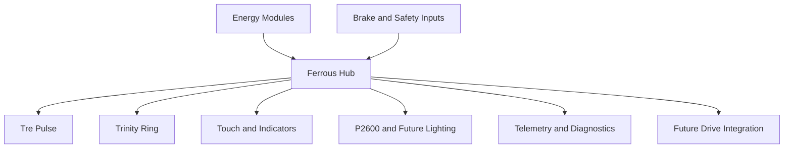

# Ferrous Drive 🚲🦀⚙️

**Rider-centred Rust software for deterministic cycling assistance, behavioural feedback, and future e-bike integration.**

Ferrous Drive is built around simulation, validation, explainable decisions, and hardware-independent core logic. The current architecture is centred on the **Ferrous Hub**, which coordinates Tre Pulse, the Trinity Ring, lighting, local interaction, telemetry, and future drive peripherals.

> **Early development:** architecture, simulation, and Ferrous Hub V0.1 are active. Hardware behaviour remains experimental until validated.

## Project mantra

```text
Reduce friction.
Build consistency.
Keep riding.
```

## Architecture


```mermaid
flowchart TD
    EM[Energy Modules] --> FH[Ferrous Hub]
    FH --> TP[Tre Pulse]
    FH --> TR[Trinity Ring]
    FH --> UI[Touch and Indicators]
    FH --> LT[P2600 and Future Lighting]
    FH --> TM[Telemetry and Diagnostics]
    FH --> DI[Future Drive Integration]
    SF[Brake and Safety Inputs] --> FH
```

### Ferrous Hub owns

- ride-mode and system orchestration;
- Tre Pulse progress and reward state;
- Trinity Ring behaviour;
- capacitive-touch interpretation;
- lighting coordination;
- telemetry and diagnostics;
- power-state coordination;
- future peripheral and drive interfaces.

### Energy modules own

- battery chemistry and configuration;
- BMS and cell-level protection;
- module electrical and thermal limits;
- safe charging requirements;
- optional module telemetry.

## Rider experience

```text
Ride computer
    Navigation, recording, detailed metrics, post-ride analysis

Trinity Ring
    Behaviour, progress, state, consistency, and rewards
```

The goal is to let the rider **ride on feel and review the numbers afterwards**.

## Tre Pulse and Trinity Ring

**Tre Pulse** is the behavioural interaction language of Ferrous Drive. It represents progress, secured milestones, consistency, earned rewards, constraints, warnings, and faults.

The current local-interface direction uses:

```text
24-LED Trinity Ring
Dedicated power indicator
Dedicated ride-mode indicator
Central capacitive-touch surface
```

The proposed ring layout uses three eight-position sectors. Each sector contains seven active progress positions and one normally dark separator.

## Current hardware direction

| Element | Direction | Status |
|---|---|---|
| Primary development board | Nordic nRF54L15 DK | Selected |
| Compact prototype option | Adafruit Feather nRF52832 | Investigate |
| Behaviour display | 24-LED WS2812B or SK6812 ring | V0.1 target |
| Local input | Capacitive-touch sensor | V0.1 target |
| Power monitor | INA226 | Optional |
| Lighting peripheral | P2600 loaded kit | Available |

The P2600 remains a standalone lighting system and is the first serious Ferrous Drive peripheral. P60B energy-module experiments continue as a parallel learning track rather than a prerequisite for Hub development.

## Software structure

```text
Board-independent core
├── ride modes
├── Tre Pulse
├── reward state
├── interaction state machine
├── lighting and power policy
├── telemetry model
└── fault policy

Board adapters
├── LED and touch drivers
├── timers
├── BLE and future ANT+
├── UART and future CAN
├── sensing
└── board power control
```

The core should remain deterministic, `no_std`, heapless where practical, and testable on a host computer.

## Safety priorities

```text
1. Electrical safety
2. Brake and assist inhibit
3. Hardware protection
4. Energy reserve
5. Ride-mode intent
6. Reward delivery
7. Visual flourish
```

## Current focus: Ferrous Hub V0.1

- bring up Trinity Ring and touch on the nRF54L15 DK;
- implement deterministic Hub lifecycle states;
- demonstrate Tre Pulse progress and rewards;
- model lighting intent without modifying the P2600;
- keep core logic separate from board drivers;
- measure current, brightness, false triggers, and failure behaviour.

## Engineering confidence

```text
🚲 ROAD TESTED     ▲▲▲▲
🧪 BENCH TESTED    ▲▲▲
🎮 SIMULATED       ▲▲
📐 DESIGNED        ▲
💡 IDEA
```

Every major feature should move through design, simulation, validation, build, and road testing before being considered trusted.

## Documentation

- [`docs/architecture.md`](docs/architecture.md): whole-system architecture
- [`docs/decision_log.md`](docs/decision_log.md): decisions and rationale
- [`docs/roadmap.md`](docs/roadmap.md): milestones and priorities
- [`docs/architecture/ferrous_hub.md`](docs/architecture/ferrous_hub.md): Hub responsibilities and interfaces
- [`docs/hardware/energy_modules.md`](docs/hardware/energy_modules.md): energy-module boundary
- [`docs/ui/trinity_ring.md`](docs/ui/trinity_ring.md): Trinity Ring and touch interaction
- [`docs/peripherals/p2600.md`](docs/peripherals/p2600.md): lighting-peripheral boundary
- [`docs/planning/ferrous_hub_v0.1.md`](docs/planning/ferrous_hub_v0.1.md): current prototype plan

## Contributing

Contributions are welcome across Rust, embedded systems, simulation, testing, documentation, power electronics, lighting, interaction design, and ride-data analysis.

Major architecture changes should use an idea or feature branch and an early draft pull request so the decision history remains reviewable.

## License

Licensed under the Apache License 2.0.
