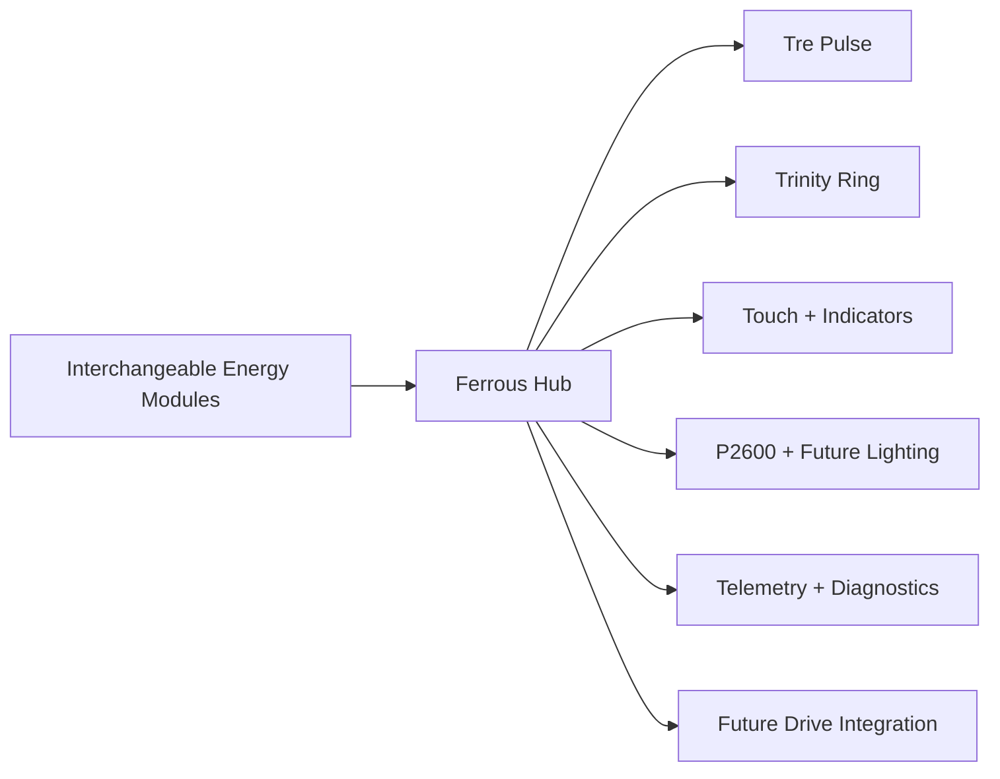

# Ferrous Drive

Ferrous Drive is an open-source, rider-centred cycling platform built around the **Ferrous Hub**.

The Hub coordinates Tre Pulse, ride behaviour, lighting, local interaction, telemetry, and future electric-drive integration. Interchangeable energy modules supply the system without defining its architecture.

## Project mantra

```text
Reduce friction.
Build consistency.
Keep riding.
```

## Platform architecture



## What the Hub owns

- ride-mode orchestration;
- Tre Pulse and reward state;
- Trinity Ring behaviour;
- capacitive-touch interaction;
- lighting coordination;
- telemetry and diagnostics;
- power-state coordination;
- future peripheral and drive interfaces.

## What energy modules own

- cell chemistry and configuration;
- BMS and cell protection;
- module-level electrical limits;
- safe charging requirements;
- optional module telemetry.

## Rider experience

```text
Ride computer
    Navigation, recording and detailed metrics

Trinity Ring
    Behaviour, progress, consistency and rewards
```

Ferrous Drive is designed so the rider can ride on feel and review detailed numbers afterwards.

## Current focus

```text
Ferrous Hub V0.1
    nRF54L15 DK
    24-LED Trinity Ring
    capacitive touch
    dedicated power and mode indicators
    lighting-state control
```

P2600 provides the immediate winter-lighting solution and serves as the first serious Ferrous Drive peripheral. Experimental P60B energy modules remain a parallel learning track rather than a prerequisite for Hub development.
