> 📚 [README](../README.md) · 🗺️ [Roadmap](roadmap.md) · 📜 [Project Origin](project_origin.md) · 🧠 [Assumptions](assumptions.md) · ✅ [ Architecture

> Measure effort. Preserve momentum. Learn from every ride.

Ferrous Drive is a simulation-first, rider-oriented Rust platform for e-bike propulsion, regenerative braking, telemetry processing, and energy-flow experimentation.

The architecture separates domain logic from embedded runtime, wireless protocols, controller communications, and physical hardware. This allows assist behaviour, regenerative behaviour, telemetry trust, and rider-power calculations to be replayed and tested on a desktop before being deployed to a bicycle.

> [!WARNING]
> Ferrous Drive is in early development.
>
> Nothing in this document should be interpreted as road-ready, safety-certified, or validated for controlling a ridden vehicle.

---

## Architecture Status

| Area | Status |
|---|---|
| Overall system architecture | Draft |
| Domain boundaries | Draft |
| nRF54L15 prototype platform | Selected for prototyping |
| RTIC runtime model | Selected for investigation |
| Heapless memory strategy | Selected for investigation |
| Telemetry trust model | In design |
| Replay simulator | Planned |
| Grin controller digital interface | Under investigation |
| Rider-power calculation | Technically plausible, not validated |
| Regenerative braking | Supported by target hardware, integration not validated |
| ERG-like road resistance | Exploratory idea |
| BLE fitness broadcast | Planned |
| ANT+ support | Under investigation |
| Bench validation | Not started |
| Road testing | Not started |

This document reflects the current project direction and will evolve as assumptions are tested.

---

## Table of Contents

- #overview
- #architecture-boundaries
- #design-principles
- #current-prototype-platform
- #system-overview
- #domain-and-platform-separation
- #runtime-model
- #runtime-event-flow
- [Telemetry Pipeline](#telemetryy-trust-model
- #rider-input-sensing
- #rider-power-calculation
- [Fitness Data-broadcasting
- [Motion-state-model
- [Energy-flow-model
- [Braking and Regeneration](#braking-and-architecture
- [Assist-and-regeneration-decisions
- #controller-abstraction
- #replay-simulation
- #outdoor-erg-like-resistance
- [Engineering-feedback-loop
- #known-unknowns
- #non-goals
- #long-term-direction
- [References](#--

## Overview

Ferrous Drive sits between rider and vehicle telemetry on one side, and a digitally connected motor controller on the other.

Its role is to:

1. Receive measurements.
2. Decide whether those measurements can be trusted.
3. Understand the rider and bicycle state.
4. Calculate desired assistance or regenerative resistance.
5. Apply safety and operating constraints.
6. Produce an explainable controller-independent request.
7. Translate that request through a hardware-specific controller driver.
8. Record enough context to replay and understand the decision later.

```text
Rider Input
     +
Vehicle Telemetry
     +
Controller Telemetry
     ↓
Ferrous Drive
     ↓
Assist, Neutral, or Regeneration Request
     ↓
Digital Controller Driver
     ↓
Grin Motor Controller
     ↓
Grin V3 All-Axle Motor
```

Ferrous Drive does not perform low-level field-oriented motor commutation. That remains the responsibility of the motor controller.

---

## Architecture Boundaries

### Ferrous Drive is responsible for

- Telemetry ingestion
- Telemetry validation and freshness tracking
- Rider-input interpretation
- Motion-state modelling
- Assistance-demand calculation
- Regenerative-demand calculation
- Constraint arbitration
- Explainable decision generation
- Controller-independent command generation
- Ride replay and simulation
- Decision logging
- Fitness-data derivation and broadcasting
- Controller-health monitoring at the integration boundary

### Ferrous Drive is not responsible for

- Low-level motor commutation
- Battery-cell balancing
- Battery-management-system protection
- Hardware brake operation
- Mechanical brake control
- Motor-controller power-stage protection
- Replacing controller overcurrent protection
- Replacing independent thermal protection
- Autonomous steering or vehicle control
- Claiming fitness-grade accuracy without validation

Ferrous Drive must preserve independent hardware protections rather than attempt to replace them in software.

---

## Design Principles

### Rider Oriented

The rider provides intent and effort. Ferrous Drive provides support or controlled resistance.

### Safety First

Predictable behaviour is preferred over aggressive behaviour.

### Simulation Before Hardware

Control behaviour should be replayed and inspected before being connected to a moving bicycle.

### Explainable Decisions

Every propulsion or regeneration request should include enough context to explain how it was produced.

### Controller Independence

Domain logic should not depend on a specific controller protocol.

### Event-Driven Execution

The embedded runtime should react to telemetry, timers, interrupts, and communications events rather than depend on a general-purpose task model.

### Fixed-Capacity Data

The embedded target should favour statically bounded data structures and explicit capacity handling.

### Graceful Degradation

Sensor loss, stale data, and communication faults should produce predictable degraded behaviour or a safe state.

### Evidence Before Claims

A hardware platform, controller feature, or fitness metric is not considered supported until its behaviour has been measured and documented.

---

## Current Prototype Platform

```text
Prototype Computer
-----------------------------
Nordic nRF54L15 DK

Processor
-----------------------------
Arm Cortex-M33

Embedded Runtime Direction
-----------------------------
RTIC

Memory Strategy
-----------------------------
heapless and fixed-capacity data

Core Language
-----------------------------
Rust

Motor
-----------------------------
Grin V3 Rear All-Axle
6T standard winding
Direct-drive hub

Motor Controller
-----------------------------
Headless Grin controller
Exact model and protocol to be confirmed

Rider Input
-----------------------------
Integrated freehub torque sensor
Quadrature PAS signal

Wireless
-----------------------------
Bluetooth Low Energy

Future Wireless Investigation
-----------------------------
ANT+

Primary Development Environment
-----------------------------
Desktop replay simulator
```

The nRF54L15 is the current prototype target, not a permanent restriction on the domain architecture.

The control core should remain portable to other suitable embedded targets.

---

## System Overview

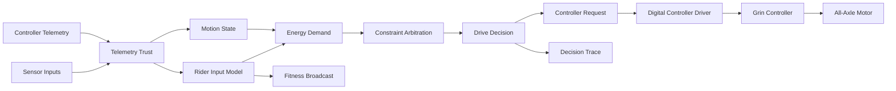

---

## Domain and Platform Separation

Ferrous Drive is divided conceptually into a portable domain core and platform-specific adapters.

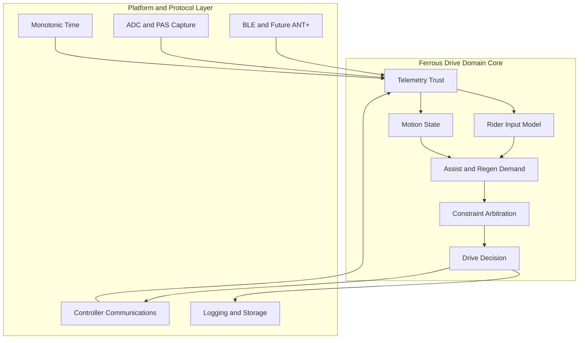

The domain core should not directly depend on:

- nRF54L15 peripheral registers
- RTIC macros
- BLE stack details
- ANT+ stack details
- Grin serial frames
- Desktop file formats
- Logging transport
- Hardware-specific clocks

Those dependencies belong in adapter crates or platform modules.

---

## Runtime Model

The current embedded-runtime direction is RTIC rather than a conventional general-purpose RTOS.

RTIC provides task-based, priority-aware concurrency using hardware interrupt facilities. Ferrous Drive intends to investigate this model for deterministic event handling and resource sharing.

The current runtime preference is:

```text
Hardware Event
      ↓
RTIC Task
      ↓
Update Bounded Resource
      ↓
Schedule or Trigger Dependent Work
```

Heapless collections are preferred where queues, buffers, strings, or temporary collections are required.

```text
Fixed Capacity
      ↓
Explicit Overflow Handling
      ↓
Known Memory Bounds
      ↓
More Predictable Runtime Behaviour
```

RTIC and heapless remain architectural choices requiring prototype validation on the nRF54L15.

---

## Runtime Event Flow

Potential runtime events include:

- Torque-sensor ADC sample
- PAS edge
- Wheel-speed update
- Motor-temperature update
- Battery-voltage update
- Controller telemetry frame
- Controller acknowledgement
- Brake input
- BLE sensor update
- Control-cycle timer
- Communications timeout
- Log-buffer flush
- Fitness-data broadcast interval
- Watchdog service

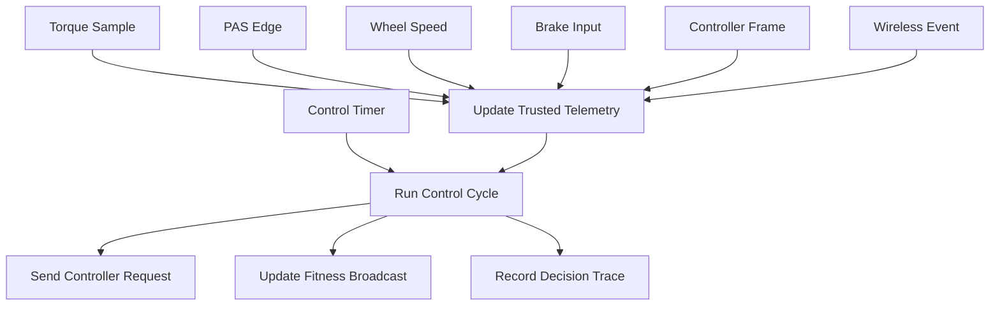

Exact priorities, frequencies, deadlines, and queue capacities must be established through measurement and scheduling analysis.

---

## Telemetry Pipeline

Telemetry moves through four conceptual stages.

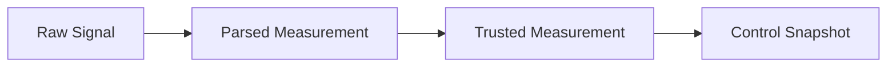

### Raw signal

Examples:

- ADC voltage
- PAS edge timestamps
- BLE characteristic
- Serial frame
- Digital brake input

### Parsed measurement

Examples:

- Freehub torque
- Freehub rotational speed
- Wheel speed
- Battery voltage
- Battery current
- Motor temperature

### Trusted measurement

The parsed measurement plus:

- Capture time
- Age
- Quality
- Source
- Validity
- Calibration revision

### Control snapshot

A consistent set of trusted readings used for one control decision.

The snapshot should make it clear when measurements were captured at different times.

---

## Telemetry Trust Model

Presence does not imply trust.

Each reading should carry a quality state.

```text
VALID
AGING
STALE
INVALID
```

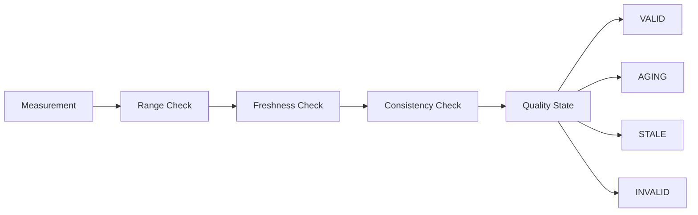

The trust model must eventually define:

- Per-signal range checks
- Per-signal freshness thresholds
- Frozen-value detection
- Startup conditions
- Sensor reconnection behaviour
- Conflicting sensor handling
- Missing mandatory telemetry
- Confidence propagation into derived values
- Controller-communications health

The trust model should be implemented independently from the assistance algorithms.

---

## Rider Input Sensing

The target Grin V3 rear All-Axle configuration includes freehub-based rider sensing.

The intended rider-input sources are:

```text
Freehub Torque
      +
Quadrature PAS
      ↓
Rider Input Model
```

Torque and PAS must be interpreted together.

A torque signal should not independently cause propulsion without valid pedal rotation.

### Important measurement location

The torque and rotation measurements occur at the rear freehub rather than at the crank.

This means:

- Torque is measured after bicycle gearing.
- Rotational speed is measured at the freehub.
- The individual torque and speed values differ from crank values.
- Their product represents mechanical rider power arriving at the hub.
- Drivetrain losses occur before this measurement point.

The domain model should preserve this distinction.

Suggested terminology:

```text
freehub_torque_newton_meters
freehub_angular_velocity_radians_per_second
rider_hub_power_watts
```

Avoid calling this crank power unless a validated conversion has been applied.

---

## Rider-Power Calculation

The initial rider-power calculation is:

```text
Rider Hub Power
    =
Freehub Torque
    ×
Freehub Angular Velocity
```

In symbols:

```text
P = τ × ω
```

Where:

- `P` is mechanical power at the rear freehub in watts.
- `τ` is measured freehub torque in newton-metres.
- `ω` is freehub angular velocity in radians per second.

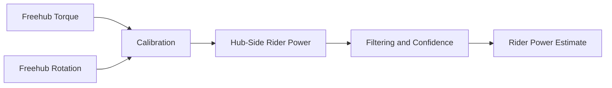

### Output levels

Ferrous Drive should distinguish between:

```text
Measured Hub-Side Rider Power
```

and:

```text
Estimated Crank-Equivalent Rider Power
```

Hub-side power is the direct calculated quantity.

Crank-equivalent power would require a documented drivetrain-loss model or calibration against a reference power meter.

### Accuracy position

Until comparative testing is completed, Ferrous Drive should describe this output as:

```text
Estimated rider power at the rear hub
```

The project should not claim laboratory-grade, crank-based, or fitness-certified accuracy.

---

## Fitness Data Broadcasting

One project goal is to broadcast calculated rider power to a compatible cycling head unit.

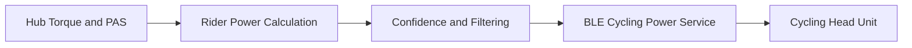

### Initial target

```text
Bluetooth Low Energy
```

Potentially broadcast data includes:

- Rider power
- Cadence
- Wheel speed
- Energy or work totals
- Data-quality status for diagnostics

### ANT+ status

ANT+ remains under investigation.

The nRF54L15 hardware supports multiprotocol 2.4 GHz operation, but Ferrous Drive has not established an ANT+ stack, licensing approach, or working implementation.

BLE should therefore be treated as the initial supported fitness-broadcast direction.

### Validation requirements

Fitness broadcasting must be validated for:

- Update interval
- Timestamp alignment
- Dropout recovery
- Power smoothing
- Zero-power behaviour
- Cadence behaviour
- Head-unit compatibility
- Difference from a reference meter

---

## Motion State Model

The motion state model describes bicycle and rider motion.

Current conceptual states are:

```text
Stationary
Launching
Cruising
Coasting
```

Braking is shown as rider intent but acts as a higher-priority override rather than an ordinary assist mode.

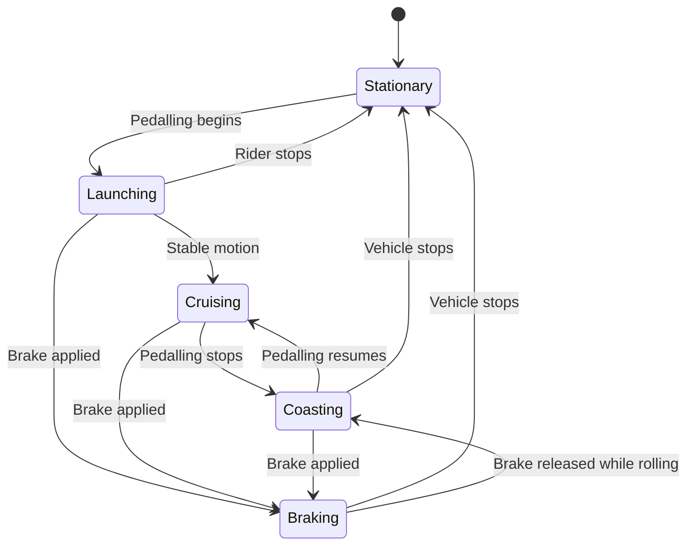

Ferrous Drive does not control the bicycle’s mechanical brakes.

The `Braking` condition represents observed rider intent and the resulting propulsion or regeneration policy.

---

## Energy-Flow Model

The move to a direct-drive motor makes energy flow bidirectional.

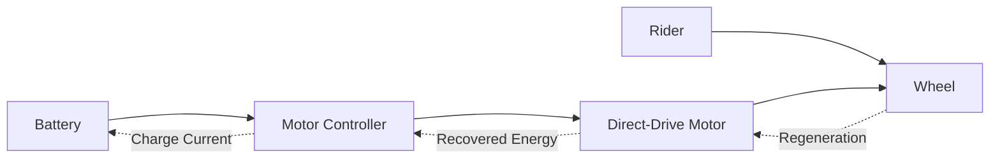

The control decision can therefore request:

```text
Positive Torque
Neutral Torque
Negative Torque
```

Suggested high-level modes:

```text
ASSIST
NEUTRAL
REGENERATE
INHIBIT
```

These modes are separate from motion state.

Examples:

```text
Cruising + Assist
Cruising + Neutral
Coasting + Neutral
Coasting + Regenerate
Braking + Regenerate
Braking + Inhibit
```

This avoids creating one FSM state for every motion and energy-flow combination.

---

## Braking and Regeneration

A brake signal remains a safety-critical input.

However, with a direct-drive motor, braking no longer necessarily means only zero motor torque.

Possible responses include:

```text
Brake Applied
      ↓
Suppress Positive Torque
      ↓
Evaluate Regen Availability
      ↓
Request Safe Negative Torque
```

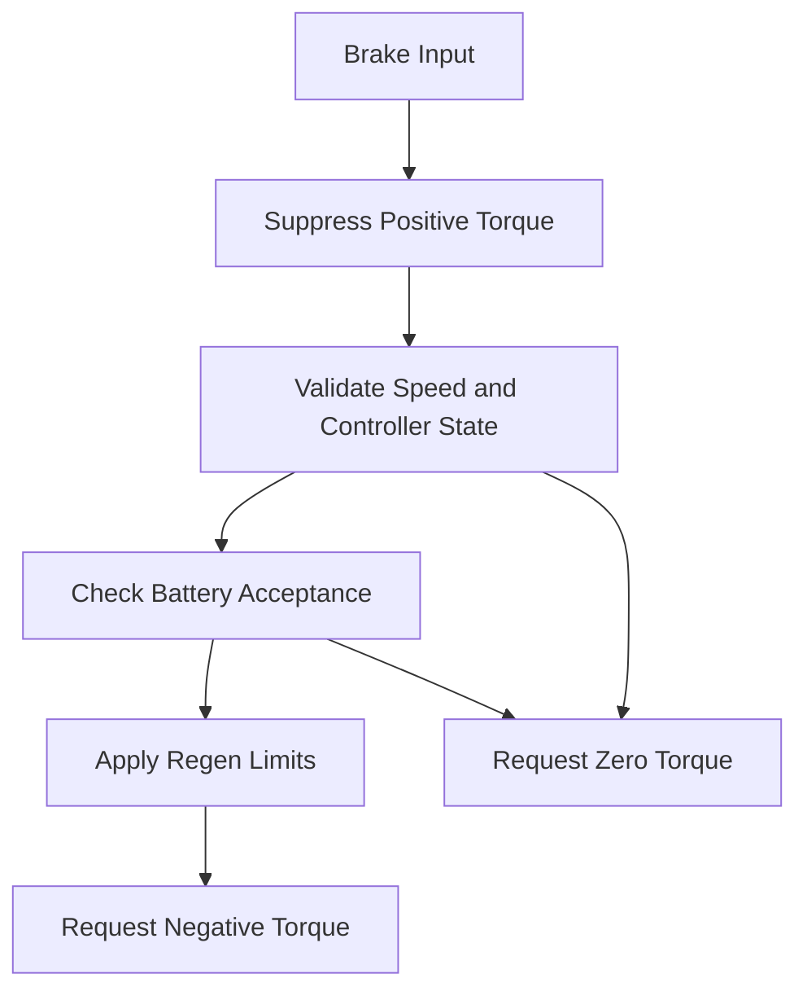

### Regen must be inhibited when

Examples requiring definition and validation include:

- Battery cannot accept charge
- Communications are unhealthy
- Speed measurement is invalid
- Controller state is unknown
- Regen request exceeds configured limits
- Motor or controller conditions prohibit regeneration
- The rider releases the braking request
- Hardware reports a fault

Mechanical brakes remain independent and primary.

Ferrous Drive must not assume regenerative braking alone can meet the rider’s stopping demand.

---

## Constraint Architecture

Constraints determine what energy request is permitted.

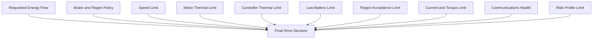

Constraint logic is kept outside the motion-state machine.

Safety constraints must always override ride-profile preferences.

---

## Assist and Regeneration Decisions

The control core should return a structured decision rather than only a scalar watt value.

A future decision may contain:

```text
Motion State
Energy-Flow Mode
Rider Input Source
Measured Rider Hub Power
Requested Assist or Regen
Active Constraints
Final Torque or Power Request
Decision Reason
Telemetry Confidence
Controller Health
```

Conceptually:

```rust
pub enum EnergyFlowMode {
    Assist,
    Neutral,
    Regenerate,
    Inhibit,
}
```

```rust
pub struct DriveDecision {
    pub motion_state: MotionState,
    pub energy_flow_mode: EnergyFlowMode,
    pub rider_hub_power_watts: Option<f32>,
    pub requested_power_watts: f32,
    pub final_power_watts: f32,
    pub primary_reason: DecisionReason,
}
```

These example types illustrate architecture only. They are not final public APIs.

Negative power may represent regeneration, but the final representation must avoid ambiguous sign conventions.

A dedicated request enum may prove clearer than a signed scalar.

---

## Controller Abstraction

The control core should not know the Grin controller’s frame format or transport details.

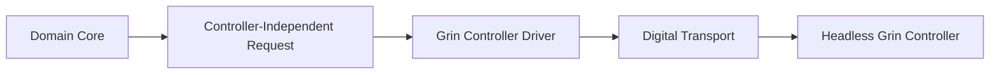

The controller driver should eventually provide:

- Initialization
- Capability discovery or configured capabilities
- Command transmission
- Command acknowledgement
- Telemetry reception
- Fault reporting
- Communications-health reporting
- Safe-state entry
- Assist request
- Neutral request
- Regeneration request

The exact Grin digital protocol, writable command set, timing, and watchdog behaviour remain unverified.

No protocol details should be embedded in the domain core.

---

## Replay Simulation

The simulator is the primary development environment for decision logic.

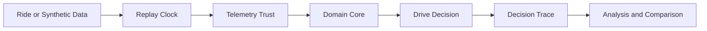

The simulator should support:

- Recorded ride replay
- Synthetic telemetry
- Torque-sensor calibration data
- Reference power-meter comparison
- Sensor dropout injection
- Frozen sensor injection
- Communications failure
- Brake events
- Battery-full regen inhibition
- Thermal rollback
- Assist-to-regen transitions
- Controller acknowledgement loss
- Gear and cadence variation
- Outdoor ERG-like experiments

Identical configuration, initial state, and input data should produce identical output.

---

## Outdoor ERG-Like Resistance

A direct-drive motor can produce negative torque through regenerative operation.

This creates an exploratory possibility: controlled resistance during outdoor riding.

Conceptually:

```text
Target Rider Power
       -
Measured Rider Hub Power
       ↓
Resistance Error
       ↓
Bounded Negative-Torque Request
```

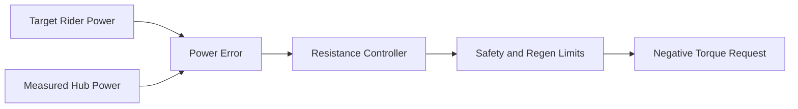

Potential uses include:

- Low-speed training intervals
- Simulated climbing resistance
- Controlled cadence work
- Increased training load without increased road speed

This feature is explicitly exploratory.

It introduces significant rider-experience and safety questions:

- Stability of the power-control loop
- Sudden resistance changes
- Loss of communications
- Battery charge acceptance
- Minimum and maximum useful speed
- Wet or loose surfaces
- Cornering
- Traffic interaction
- Rider override
- Mechanical braking interaction
- Maximum permitted negative torque
- Safe release behaviour

Outdoor ERG-like resistance must not be implemented on a ridden bicycle until it has passed simulation, bench testing, wheel-off-ground testing, and carefully defined rider-safety gates.

---

## Engineering Feedback Loop

Ferrous Drive is intended to improve through measured feedback.

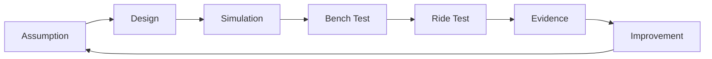

The project should continuously distinguish:

```text
Idea
Designed
Simulated
Bench Tested
Road Tested
Trusted
```

A feature is not trusted merely because it compiles or feels plausible.

---

## Known Unknowns

### nRF54L15 and runtime

- RTIC support and maturity on the selected target
- Required HAL and peripheral support
- BLE stack integration with RTIC
- Interrupt and task-priority design
- Worst-case execution times
- Queue capacities
- Memory budget
- Logging strategy
- Firmware update strategy

### ANT+

- Stack availability
- Licensing requirements
- nRF54L15 integration approach
- Coexistence with BLE
- Certification and compatibility

### Grin controller

- Exact controller model
- Exact firmware
- Writable digital-command interface
- Telemetry frame format
- Command acknowledgement
- Watchdog behaviour
- Communications timeout
- Regen command semantics
- Negative-torque limits
- Dynamic configuration capability
- Fault-state behaviour

### Rider sensing

- Torque-sensor sample rate
- ADC conditioning
- Zero-offset drift
- Temperature drift
- Linearity
- Unit-to-unit variation
- PAS timing accuracy
- Freehub-to-crank power relationship
- Filtering and latency
- Standing-versus-seated behaviour

### Fitness broadcasting

- BLE Cycling Power Service mapping
- Power smoothing
- Cadence mapping
- Head-unit compatibility
- Calibration metadata
- Confidence reporting
- Difference from reference power meters

### Regeneration

- Battery charge acceptance
- Battery-full behaviour
- Low-speed effectiveness
- Regen smoothness
- Motor and controller thermal effects
- Brake blending
- Safe release behaviour
- Road-surface effects

### Outdoor ERG-like resistance

- Control-loop stability
- Acceptable response rate
- Minimum safe speed
- Maximum negative torque
- Rider disengagement
- Traffic and cornering behaviour
- Legal and regulatory implications

These items should remain visible in the assumptions register and validation matrix.

---

## Non-Goals

Ferrous Drive is not currently intended to:

- Replace the Grin controller’s commutation firmware
- Replace the battery-management system
- Replace mechanical brakes
- Guarantee stopping performance using regeneration
- Bypass controller protections
- Claim certified cycling-power accuracy
- Claim ANT+ support before implementation
- Claim direct digital controller control before protocol validation
- Provide autonomous riding or steering
- Maximize power regardless of rider experience
- Deploy outdoor ERG-like resistance without staged validation

---

## Long-Term Direction

Ferrous Drive is evolving from a one-way assistance controller into a rider-oriented energy and telemetry platform.

```text
Measure rider effort
        ↓
Interpret trustworthy telemetry
        ↓
Assist, coast, or recover energy
        ↓
Explain the decision
        ↓
Broadcast useful fitness data
        ↓
Replay and learn from the ride
```

Potential long-term value includes:

- Responsive rider assistance
- Regenerative braking strategies
- Hub-side rider-power measurement
- Virtual cycling-power broadcasting
- Detailed decision traces
- Energy-use and recovery analysis
- Controller-independent drive logic
- Simulation-driven tuning
- Carefully bounded training-resistance modes

The project mantra remains:

```text
Measure effort.
Preserve momentum.
Learn from every ride.
```

---

## References

- [Nordic nRF54L15 product information](https://www.nordicsemi.com/Products/nRF54L15)
- [Nordic nRF54L15 DK information](https://www.nordicsemi.com/Products/Development-hardware/nRF54L15-DK)
- [RTIC documentation](https://rtic.rs/2/book/en/)
- [heapless crate documentation](https://docs.rs/heapless)
- [Grin V3 Rear All-Axle owner guide](https://grintech.eu/amfile/file/download/file/305/product/1913/)
- [Grin Phaserunner product information](https://ebikes.ca/product-info/grin-products/phaserunner.html)
