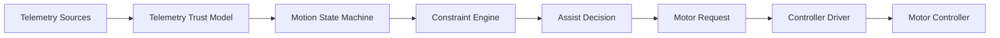

> 📚 [README](../README.md) · 🗺️ [Roadmap](roadmap.md) · 🧠 [Assumptions](assumptions.md) · ✅ [Validation Matrix](validation_matrixure effort. Preserve momentum. Learn from every ride.

Ferrous Drive is a simulation-first, controller-independent Rust platform for e-bike propulsion control.

The architecture separates telemetry acquisition, trust evaluation, assist calculation, constraint handling, and hardware integration so that the control system can be developed, simulated, validated, and replayed independently of any specific hardware platform.

---

# Table of Contents

- #overview
- #design-principles
- #system-overview
- #runtime-control-flow
- #motion-state-machine
- #telemetry-trust-model
- #constraint-architecture
- #simulation-architecture
- #controller-abstraction
- #target-hardware-architecture
- #engineering-feedback-loop
- #known-unknowns
- #non-goals
- #long-term-vision
- #project-mantra

---

# Overview

Ferrous Drive sits between telemetry and motor controllers.

Its job is not to directly control hardware.

Its job is to make the best possible assist decision using the information available at the time.

```text
Rider Effort
      +
Vehicle Telemetry
      ↓
Ferrous Drive
      ↓
Motor Request
      ↓
Controller Driver
      ↓
Motor Controller
```

---

# Design Principles

## Safety First

Predictable behaviour is preferred over aggressive behaviour.

## Simulation Before Hardware

Validation should happen in simulation before running on a moving bike.

## Explainable Decisions

Assist decisions should be observable and traceable.

## Controller Independence

The control core should not depend on a specific controller implementation.

## Graceful Degradation

The system should react predictably when telemetry becomes stale, invalid, or unavailable.

---

# System Overview



---

# Runtime Control Flow

The runtime path executed during each control update.

```mermaid
flowchart LR

    T[Telemetry]
    TM[Telemetry Trust]
    SM[State 
