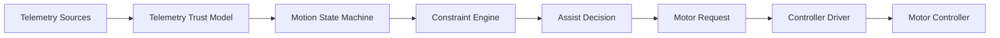
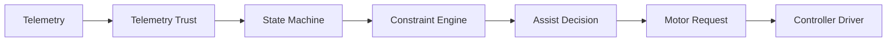
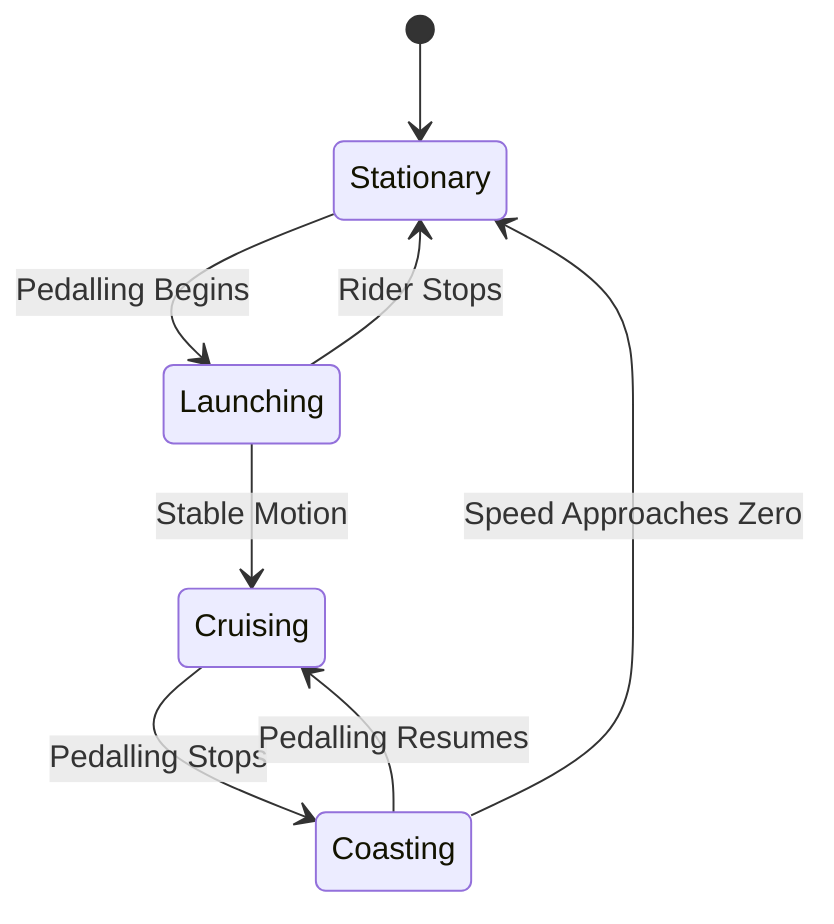
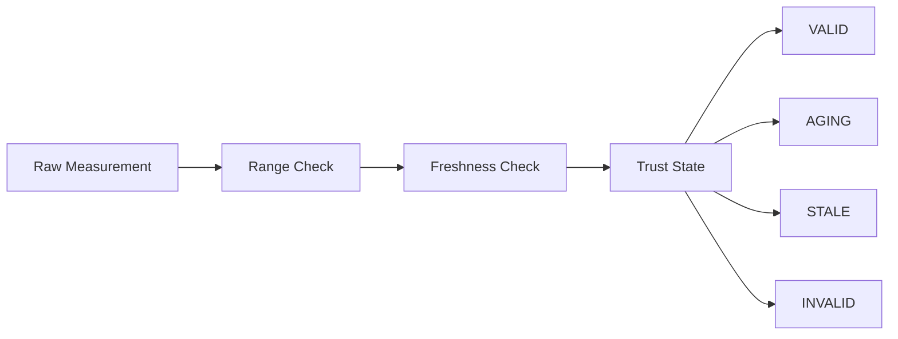
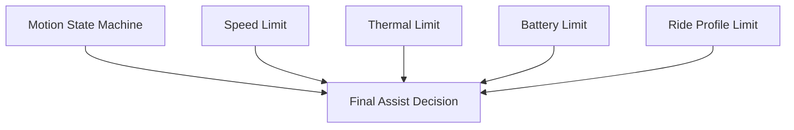
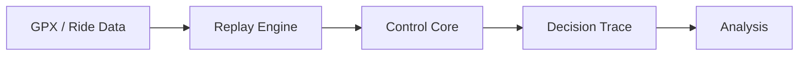
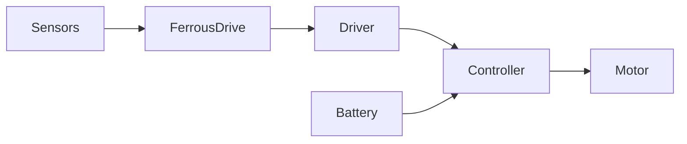
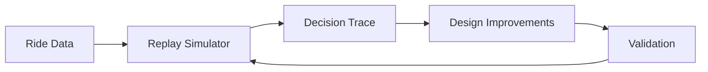
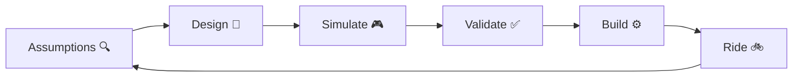
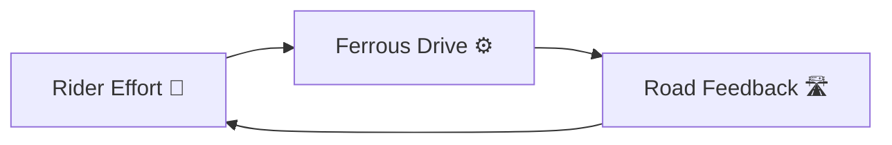

# Architecture

> "Measure effort. Preserve momentum. Learn from every ride."

Ferrous Drive is a simulation-first, controller-independent Rust platform for e-bike propulsion control.

The architecture separates telemetry acquisition, trust evaluation, assist calculation, constraint handling, and hardware integration so that the control system can be developed and validated independently of any specific motor controller.

---

# Table of Contents

- #overview
- #design-principles
- #system-overview
- #runtime-control-flow
- #motion-state-machine
- #telemetry-trust-model
- #constraint-architecture
- #simulation-architecture
- [controller-abstraction
- [Target Hardware Architecture](#targeteering-feedback-loop
- #known-unknowns
- #non-goals
- [Long-Term Vision](#long-term-vision)

rous Drive sits between telemetry and motor controllers.

Its job is not to control hardware directly.

Its job is to make the best possible assist decision using the information available at the time.

```text
Rider Effort
      +
Vehicle Telemetry
      ↓
Ferrous Drive
      ↓
Motor Request
      ↓
Controller Driver
      ↓
Motor Controller
```

---

# Design Principles

## Safety First

Predictable behaviour is preferred over aggressive behaviour.

## Simulation Before Hardware

Validation should happen in simulation before testing on a moving bike.

## Explainable Decisions

Assist decisions should be observable and traceable.

## Controller Independence

The control core should not depend on a specific controller implementation.

## Graceful Degradation

The system should react predictably when telemetry becomes stale, invalid, or unavailable.

---

# System Overview



---

# Runtime Control Flow

The runtime path executed during each controller update.



---

# Motion State Machine

The state machine models rider movement only.

It deliberately does **not** represent:

- Thermal limits
- Battery limits
- Speed limits
- Communication failures

Those belong in the constraint layer.



---

# Telemetry Trust Model

Raw telemetry is not trusted automatically.

Every measurement must pass freshness and quality checks before it influences assist decisions.



Expected trust states:

```text
VALID
AGING
STALE
INVALID
```

Questions around timing, freshness thresholds, and fallback behaviour are tracked under the Telemetry Trust Model work stream.

---

# Constraint Architecture

One of the key architectural decisions in Ferrous Drive is that constraints are **not states**.



This avoids state explosion and keeps the control flow understandable.

---

# Simulation Architecture

Simulation is a first-class citizen.

Most development should happen here before involving hardware.



Expected outcomes:

- Deterministic replay
- Regression testing
- Decision inspection
- Validation before riding

---

# Controller Abstraction

The control core should not know which controller is attached.

```text
Control Core
      ↓
Motor Request
      ↓
Controller Driver
      ↓
Hardware Specific Protocol
```

Potential future targets:

- Baserunner
- VESC
- Future controller platforms

---

# Target Hardware Architecture

Current conceptual deployment architecture.



---

# Engineering Feedback Loop

Ferrous Drive is intended to evolve through continuous learning and iteration.



Project philosophy:



---

# Known Unknowns

Several important areas remain under investigation:

- Direct Baserunner communication
- Controller telemetry capabilities
- Sensor freshness thresholds
- Thermal modelling strategy
- Power estimation strategy
- Replay simulator formats
- Controller fault handling

These are tracked in:

- `docs/assumptions.md`
- `docs/validation_matrix.md`
- `docs/decision_log.md`

---

# Non-Goals

Ferrous Drive is not currently trying to:

- Replace hardware safety protections
- Bypass controller protections
- Bypass battery-management systems
- Implement autonomous ride control
- Maximize power output at all costs

The goal is to improve rider experience, transparency, and maintainability.

---

# Long-Term Vision

Ferrous Drive aims to become an open-source Rust platform for e-bike propulsion control that enables:

- Replayable simulation
- Deterministic behaviour
- Hardware-independent control logic
- Community-driven development
- Safe experimentation

---

# Project Mantra

```text
Measure effort.
Preserve momentum.
Learn from every ride.
```

Ferrous Drive is not a motor controller.

It is a feedback system that helps riders maintain momentum, protects the machine from unnecessary stress, and continuously learns from the outcomes of its decisions.



The rider provides effort.

The controller provides support.

The road provides feedback.
