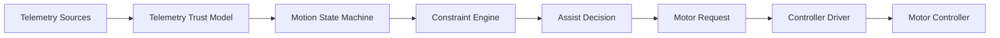
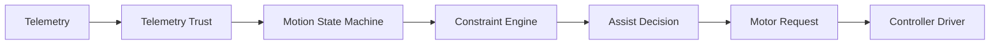
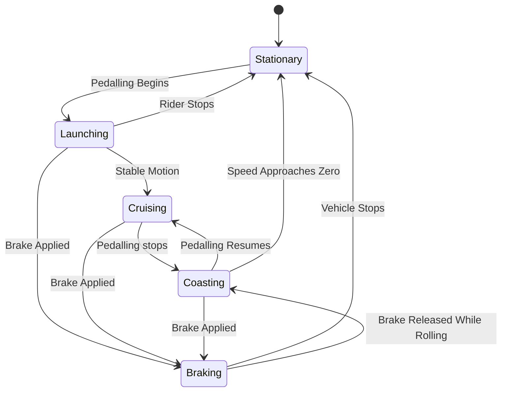
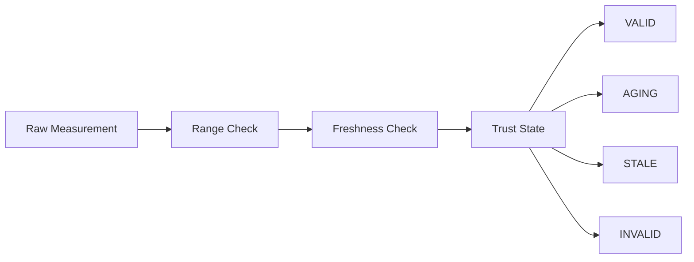
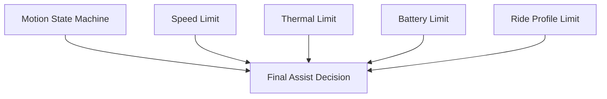
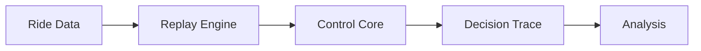

> 📚 [Repository README](../README.md) · 🗺️ [Roadmap](roadmap.md) · 🧠 [Assumptions](x.md · 📜 decision_log.md

# Architecture

> _Measure effort > > > Preserve momentum > > > Learn from every ride_

Ferrous Drive is a simulation-first, controller-independent Rust platform for e-bike propulsion control.

The architecture separates telemetry acquisition, trust evaluation, assist calculation, constraint handling, simulation, and hardware integration so that control logic can be developed and validated independently of any specific motor controller.

---

## Overview

Ferrous Drive sits between telemetry and motor controllers.

Its job is not to directly control hardware.

Its job is to make the best possible assist decision using the information available at the time.

```text
Rider Effort
      +
Vehicle Telemetry
      ↓
Ferrous Drive
      ↓
Motor Request
      ↓
Controller Driver
      ↓
Motor Controller
```

## Architecture Status

| Area | Status |
|--------|--------|
| System Architecture | Draft |
| Telemetry Trust Model | In Design |
| Simulation Architecture | Draft |
| Controller Abstraction | Draft |
| Baserunner Integration | Under Investigation |
| Hardware Deployment | Not Started |

Architecture reflects the current understanding of the project and will evolve as assumptions are validated.

---

## Architecture Boundaries

Ferrous Drive is responsible for:

- Telemetry evaluation
- Ride-state modelling
- Constraint handling
- Assist decision generation
- Simulation and replay

Ferrous Drive is not responsible for:

- Battery management
- Motor commutation
- Hardware safety circuits
- Controller firmware internals
- Autonomous riding decisions

---

## Design Principles

### Safety First

Predictable behaviour is preferred over aggressive behaviour.

### Simulation Before Hardware

Validation should happen in simulation before running on a moving bike.

### Explainable Decisions

Assist decisions should be observable and traceable.

### Controller Independence

The control core should not depend on a specific controller implementation.

### Graceful Degradation

The system should react predictably when telemetry becomes stale, invalid, or unavailable.

---

## System Overview



---

## Runtime Control Flow

The runtime path executed during each control update.



---

## Motion State Machine

The state machine models rider motion.

Braking is treated as a safety override because it immediately suppresses motor assistance regardless of the current motion state.

Current motion states:

```text
Stationary
Launching
Cruising
Coasting
```

### State Diagram



### Architectural Note

Although shown in the diagram, `Braking` is not intended to participate in assist calculations in the same way as normal ride states.

the purpose of the braking state is to model rider intent and visualize system behaviour.

Any active brake signal should be treated as the highest-priority constraint and force the final motor request to zero regardless of:

- Current ride profile
- Requested assistance
  Motion state
- Sensor inputs

---

## Telemetry Trust Model

Raw telemetry is not automatically trusted.

Every measurement must pass quality and freshness checks before it can influence assist decisions.



Expected trust states:

```text
VALID
AGING
STALE
INVALID
```

---

## Constraint Architecture

One of the key architectural decisions in Ferrous Drive is that constraints are not states.



This separation avoids state explosion and keeps the system understandable.

---

## Simulation Architecture

Simulation is a first-class citizen.

Most development should happen here before involving hardware.



Expected outcomes:

- Deterministic replay
- Regression testing
- Decision inspection
- Validation before riding

---

## Controller Abstraction

The control core should not know which controller is attached.

```text
Control Core
      ↓
Motor Request
      ↓
Controller Driver
      ↓
Hardware Protocol
```

Potential future targets:

- Baserunner
- VESC
- Future controller platforms

Controller-specific logic belongs in drivers, not in the control core.

---

## Future Architecture Candidates

The following areas may introduce architectural changes:

- Direct Baserunner integration
- VESC support
- Wireless sensor integration
- Physics-based range estimation
- Ride profile management
- Energy optimization strategies

These remain exploratory and are intentionally excluded from the current architecture until sufficient evidence exists.
