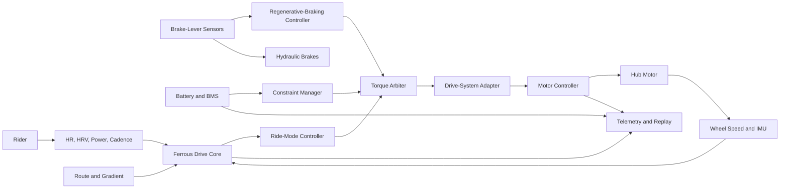
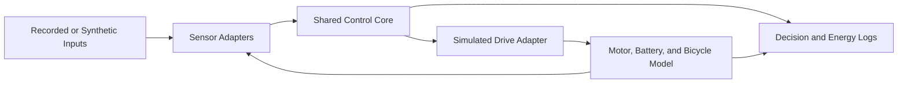

> 📚 [README](../README.md) · 🔋 [Battery Design](battery_design.md) · 🛑 [Regenerative Braking](regenerative_braking.md) · 🧠 [Assumptions](assumptions.md) · ✅ [Validation Matrix](validation_matrix.md) · 📝 [Decision Log](decision_log.md)

# Architecture

> Measure effort. Preserve momentum. Learn from every ride.

## Status

| Area | Status |
|---|---|
| Architecture maturity | Proposed |
| Control-core boundaries | Proposed |
| Drive-system abstraction | Proposed |
| Ride modes | Proposed |
| Regenerative braking | Proposed |
| Battery interface | Proposed |
| Physiological adaptation | Exploratory |
| Simulation | In progress |
| Hardware integration | Not started |
| Road validation | Not started |

> [!WARNING]
> Ferrous Drive is experimental rider-assistance software.
>
> It must not be treated as a replacement for independent motor-controller,
> battery-management, thermal, electrical, or mechanical safety systems.
>
> The bicycle's hydraulic brakes must remain mechanically independent and fully
> functional without Ferrous Drive, the motor controller, or the battery.

---

## Executive Summary

Ferrous Drive is a rider-oriented, controller-independent e-bike control
platform written in Rust.

The architecture separates:

- Rider and physiological sensing
- Route and motion sensing
- Ride-mode intent
- Positive and negative torque decisions
- Battery and thermal constraints
- Drive-system capabilities
- Controller-specific communication
- Telemetry, replay, and validation

The control core expresses desired behaviour without assuming one motor or
controller. A compatible geared hub may support forward assistance but no
regeneration. A compatible direct-drive hub may additionally support negative
torque, regenerative braking, motor temperature, and integrated rider sensing.

```text
Sensors and rider intent
        ↓
Validated system state
        ↓
Ride-mode and braking state
        ↓
Constraint manager
        ↓
Positive, zero, or negative torque decision
        ↓
Drive-system adapter
        ↓
Motor controller
        ↓
Measured physical and electrical response
        ↓
Telemetry, replay, and learning
```

Safety constraints remain outside ride-mode preference. A mode may request a
behaviour, but it cannot override battery, thermal, communications, braking, or
drive-system limits.

---

## Design Goals

The architecture should:

- Keep the rider as the primary propulsion source.
- Support multiple controllers and motor configurations.
- Make assistance decisions explainable and replayable.
- Distinguish rider intent from road demand and physiological response.
- Support positive, zero, and negative torque where hardware permits.
- Preserve genuine free coasting when the rider is not braking.
- Make braking explicitly rider-triggered.
- Keep hydraulic braking independent.
- Protect a configurable arrival-energy reserve.
- Degrade predictably when telemetry is missing or invalid.
- Permit simulation before hardware testing.
- Keep learned behaviour outside immutable safety limits.
- Avoid dynamic allocation in safety-relevant control paths where practical.

---

## Non-Goals

Ferrous Drive is not intended to:

- Replace the motor controller's commutation loop.
- Replace the BMS.
- Replace mechanical braking.
- Infer braking solely because pedalling stopped.
- Hold a fixed speed on every gradient.
- Maximize motor output.
- Hide invalid telemetry.
- Apply unsupported features to a drive system.
- Let machine learning define safety boundaries.
- Claim road readiness before staged validation.

---

## System Context



---

## Architectural Layers

### 1. Hardware and controller layer

Responsible for:

- Motor phase commutation
- Current regulation
- Hall and motor-speed processing
- Controller-local thermal rollback
- Controller-local voltage and current protection
- Controller faults

Ferrous Drive sends bounded requests to this layer. It does not implement the
high-frequency motor-control loop.

### 2. Drive-system adapter

Translates controller-independent requests into the protocol and units required
by the attached controller.

```rust
pub struct DriveCapabilities {
    pub supports_positive_torque: bool,
    pub supports_regeneration: bool,
    pub supports_negative_torque_control: bool,
    pub provides_rider_torque: bool,
    pub provides_pedal_rotation: bool,
    pub provides_motor_speed: bool,
    pub provides_motor_temperature: bool,
    pub provides_battery_current: bool,
}
```

Unsupported capabilities must be disabled by construction.

### 3. Constraint manager

Combines validated limits from:

- Battery voltage
- Battery current
- Battery temperature
- BMS charge and discharge permission
- Motor temperature
- Controller temperature
- Wheel speed
- Sensor quality
- Communication freshness
- Drive capabilities

The output is a bounded capability envelope rather than a ride-mode decision.

### 4. Torque arbiter

Selects the only valid final torque direction and magnitude.

Priority, highest first:

```text
1. Critical fault handling
2. Valid brake intent
3. Battery, motor, and controller constraints
4. Regenerative-braking request
5. Ride-mode positive-assistance request
6. Neutral Ride compensation
7. Zero torque
```

Positive assistance and regenerative torque must never be active
simultaneously.

### 5. Ride-mode controller

Expresses rider intent through four profiles:

| Mode | Purpose | Expected rider input |
|---|---|---:|
| Neutral Ride | Cancel only installed-system penalties | Unrestricted |
| Active Recovery | Preserve a deliberately easy physiological load | 50–150 W initial range |
| Commute | Maintain a sustainable, repeatable journey | 150–250 W initial range |
| Tempo | Reward productive rider effort near an adaptive sweet spot | 250–350 W initial range |

These values are provisional planning bands, not permanent prescriptions.

### 6. Regenerative-braking controller

Owns:

- Brake-intent detection
- Braking state machine
- Speed-dependent regen map
- Soft engagement and release
- Low-speed handoff
- Bounded IMU and wheel-speed feedback
- Regen capability constraints
- Event telemetry
- Shadow learning

Detailed design is defined in [Regenerative Braking](regenerative_braking.md).

### 7. Telemetry, simulation, and replay

Records enough data to reconstruct decisions:

- Input signals and quality
- Ride mode
- Braking state
- Requested and allowed torque
- Active constraint
- Controller response
- Battery energy drawn and recovered
- Motor and controller temperature
- Fault transitions

The same control logic should be usable against live hardware and replayed
route or bench data wherever practical.

---

## System States

```rust
pub enum SystemState {
    Boot,
    Ready,
    Pedalling,
    Coasting,
    Braking,
    Stopped,
    Degraded,
    Fault,
}
```

### `Boot`

- Initialize hardware and static configuration.
- Validate required interfaces.
- Enter a non-propulsive state on failure.

### `Ready`

- No positive or negative torque.
- Required inputs valid.
- Waiting for rider action.

### `Pedalling`

- Ride-mode assistance may be requested.
- Assistance remains bounded by the constraint manager.

### `Coasting`

- No brake intent.
- No ordinary regen.
- Neutral Ride compensation or virtual freewheeling may remain active.

### `Braking`

- Valid brake intent overrides positive assistance.
- Compatible drives may apply bounded regen.
- Hydraulic braking remains independent.

### `Degraded`

- Optional adaptation disabled.
- Conservative deterministic behaviour only.
- Missing capabilities exposed explicitly.

### `Fault`

- Positive torque prohibited.
- Regen removed if safe control cannot be maintained.
- Mechanical braking unaffected.

---

## Torque Request Model

```rust
pub enum TorqueDirection {
    Positive,
    Zero,
    Negative,
}

pub struct TorqueRequest {
    pub direction: TorqueDirection,
    pub wheel_torque_nm: f32,
    pub reason: TorqueReason,
}
```

The final request should be explainable as:

```text
Rider or brake intent
    + route demand
    + physiological response
    + ride-mode policy
    + drive capability
    + active constraints
    = bounded torque request
```

---

## Ride Modes

### Neutral Ride

Purpose:

- Make the electrified bicycle behave approximately like the base bicycle.
- Compensate direct-drive magnetic drag and added-system mass only.
- Preserve deliberate regenerative braking.

Neutral Ride must not compensate aerodynamic drag, headwind, rider mass, or the
original bicycle mass.

### Active Recovery

Purpose:

- Keep internal physiological load appropriately low.
- Use HRV-led, multimodal adaptation rather than fixed motor power.
- Combine personal HRV baseline, real-time HRV trend, HR, rider power, cadence,
  route demand, and signal quality.

HRV is influential but must not act without baseline context and signal-quality
validation.

### Commute

Purpose:

- Normalize external disturbances such as wind, gradients, acceleration, and
  luggage.
- Preserve a sustainable rider contribution.
- Protect arrival reserve.

### Tempo

Purpose:

- Encourage a productive, adaptive sweet-spot effort.
- Reward sustained rider effort rather than isolated torque spikes.
- Increase responsiveness as the rider approaches the target workload.
- Taper support when the rider exceeds the target or physiological strain
  becomes excessive.

Physiological inputs may shape positive assistance. They never initiate
braking.

---

## Regenerative Braking

Ferrous Drive uses rider-triggered, speed-scheduled, regen-first braking on
compatible direct-drive systems.

A binary sensor on either brake lever establishes explicit braking intent.
Valid brake intent immediately prohibits positive motor torque. Validated wheel
speed selects a nominal negative-torque request from a continuous speed map.
A soft engagement ramp, constraint manager, and bounded IMU and wheel-speed
feedback produce the final request.

```text
Brake intent
    ↓
Positive torque prohibition
    ↓
Speed-dependent regen target
    ↓
Soft engagement
    ↓
Battery, motor, thermal, and rear-wheel constraints
    ↓
Bounded feedback trim
    ↓
Negative-torque request
```

The hydraulic brakes remain mechanically independent. More lever movement adds
mechanical braking directly.

Generation one uses deterministic live control. Learning is observation only.

See [Regenerative Braking](regenerative_braking.md) for the full architecture,
state machine, failure handling, and validation plan.

---

## Battery Interface

```rust
pub struct BatteryState {
    pub pack_voltage_v: f32,
    pub pack_current_a: Option<f32>,
    pub temperatures_c: heapless::Vec<f32, 4>,
    pub state_of_charge: Option<f32>,
    pub charge_allowed: bool,
    pub discharge_allowed: bool,
    pub quality: SignalQuality,
}
```

The battery interface must support two independent capability decisions:

```text
Maximum permitted discharge
Maximum permitted regenerative charge
```

Regen must be reduced or inhibited near maximum pack voltage, outside the
validated charge-temperature range, when the BMS prohibits charging, or when
required telemetry is invalid.

Detailed electrical and packaging design is defined in
[Battery Design](battery_design.md).

---

## Signal Quality and Freshness

```rust
pub enum SignalQuality {
    Valid,
    Degraded,
    Stale,
    Invalid,
}
```

Every dynamic input should carry:

- Value
- Timestamp or age
- Quality
- Plausibility state

Rules:

- Stale data must not be reused silently.
- Invalid physiological data disables physiological adaptation.
- Invalid brake intent must not command continuous regen.
- Invalid battery data reduces or removes affected torque capability.
- Invalid wheel speed disables trusted speed-scheduled regen.

---

## Safety and Degraded Operation

### Invalid physiological data

- Disable HRV-led adaptation.
- Fall back to conservative HR and power policy where available.
- Do not alter braking behaviour.

### Unsupported regen

- Positive assistance is inhibited during brake intent.
- No negative torque is requested.
- Hydraulic brakes provide all braking.

### Battery charge unavailable

- Positive assistance remains prohibited during braking.
- Regen is reduced or removed.
- Hydraulic braking remains authoritative.

### Controller communication loss

- Remove positive torque request.
- Disable externally controlled regen.
- Enter the configured degraded or fault state.

### Brake-sensor fault

- Apply the propulsion-inhibit policy.
- Do not assume continuous regen request.
- Preserve mechanical braking.

---

## Simulation Architecture



Simulation scenarios should include:

- Neutral Ride compensation
- Active Recovery at low rider power
- Commute arrival reserve
- Tempo transient support
- Brake entry at multiple speeds
- Low-speed regen handoff
- Full and cold battery regen limits
- Wheel-speed and IMU faults
- Unsupported geared-hub capabilities
- Outbound and return commute replay

---

## First-Generation Scope

### Included

- Controller-independent positive and negative torque requests
- Drive capability discovery or configuration
- Four rider-intent modes
- Binary brake intent
- Speed-dependent regen architecture
- Battery charge and discharge capability separation
- Sensor quality and freshness
- Deterministic control
- Replayable decisions
- Shadow learning

### Deferred

- Live machine-learned control
- Automatic braking without rider intent
- ABS-like regen control
- Hydraulic brake actuation
- Proportional lever-position sensing
- Production certification

---

## Validation Priorities

- [ ] Capability abstraction prevents unsupported regen
- [ ] Brake intent always overrides positive torque
- [ ] Coasting does not trigger braking
- [ ] Positive and negative torque cannot coexist
- [ ] Battery charge constraints limit regen
- [ ] Sensor staleness produces explicit degraded behaviour
- [ ] All final torque requests include an explainable reason
- [ ] Simulation and hardware paths share control logic
- [ ] Hydraulic brakes remain independent
- [ ] Shadow learning cannot alter live control

---

## Open Questions

1. Exact nRF54L15 hardware partitioning
2. Controller command and telemetry interface
3. Exact geared-hub candidate and protocol access
4. BMS model and digital interface
5. Brake Hall sensor implementation
6. IMU model, placement, and sampling rate
7. Regen speed-map thresholds and torque limits
8. HRV source, metric, baseline, and signal-quality method
9. Rider-power estimation accuracy for each drive configuration
10. Public route-data sanitization
11. Legal configuration and applicable validation requirements

---

## References

- [Regenerative Braking](regenerative_braking.md)
- [Battery Design](battery_design.md)
- [Assumptions](assumptions.md)
- [Validation Matrix](validation_matrix.md)
- [Decision Log](decision_log.md)
- [Grin All-Axle Motor](https://ebikes.ca/product-info/grin-products/all-axle-hub-motor.html)
- [Grin Phaserunner](https://ebikes.ca/product-info/grin-products/phaserunner.html)
- [Molicel P50B](https://www.molicel.com/product/inr-21700-p50b/)
