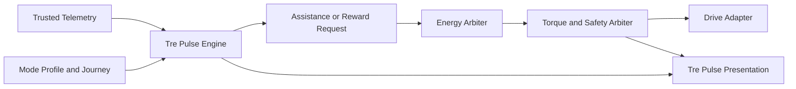

# Architecture

> **Measure the rider. Make progress visible. Reward the right behaviour.**

Ferrous Drive is a simulation-first Rust PAS training and energy-management
platform built around three rider intents: Neutral, Recovery, and Training.

## Status

| Area | Status |
|---|---|
| Overall architecture | Proposed baseline |
| Portable Rust core | Planned |
| Tre Pulse engine | Proposed |
| Recovery model | Proposed |
| Training model | Proposed |
| Regenerative braking | Proposed |
| Battery design | Provisional |
| Embedded runtime | Under investigation |
| Bench validation | Not started |
| Road validation | Not started |

> [!WARNING]
> Ferrous Drive is experimental and is not ready to control a ridden bicycle.
> Mechanical brakes, controller protections, and battery protections remain
> independent and authoritative.

## 1. Architectural Intent

Ferrous Drive separates rider intent, behavioural logic, energy management,
and hardware-specific control.

```text
Trusted rider and system telemetry
        ↓
Mode and journey context
        ↓
Tre Pulse Engine
        ↓
Assistance or reward request
        ↓
Energy and torque arbitration
        ↓
Controller-independent drive request
        ↓
Hardware-specific driver
```

## 2. Three Rider Modes

### Neutral

Preserve natural cycling.

- Compensate only for penalties introduced by Ferrous Drive
- Do not regulate training load
- Keep rider-triggered regen available
- Record data for learning and analysis

### Recovery

Regulate a personalized Zone 2 workload.

- Use relative power and heart-rate targets
- Start assistance at 1.0:1
- Permit trusted HRV-led adjustment up to 1.2:1
- Reward disciplined compliance
- Allow speed to fall before compromising recovery or arrival reserve

### Training

Perform structured work and earn bounded assistance.

- Accumulate valid work through Tre Pulse
- Secure milestones
- Unlock temporary assistance after completion
- Host profiles such as Tempo Tailwind and Anaerobic Shield

## 3. Journey Context

Commute is a journey context, not a rider mode.

Journey context owns:

- Destination
- Remaining distance
- Arrival reserve
- Charging availability
- Route demand
- Weather scenario

Any rider mode may be used within a commute journey.

## 4. Tre Pulse

Tre Pulse is Ferrous Drive's shared visual, behavioural, range, and reward
language.


```mermaid
flowchart LR
    Inputs[Trusted Telemetry]
    Context[Mode Profile and Journey]
    Tre[Tre Pulse Engine]
    Reward[Assistance or Reward Request]
    Energy[Energy Arbiter]
    Torque[Torque and Safety Arbiter]
    Drive[Drive Adapter]
    UI[Tre Pulse Presentation]

    Inputs --> Tre
    Context --> Tre
    Tre --> Reward
    Tre --> UI
    Reward --> Energy
    Energy --> Torque
    Torque --> Drive
    Torque --> UI
```

Tre Pulse owns progress, milestone, streak, and reward eligibility. It does not
own final motor torque, braking, telemetry validation, or battery protection.

See [Tre Pulse Engine](tre_pulse_engine.md).

## 5. Sports-Science-Informed Model

Recovery and Training concepts are cross-checked and refined against established
endurance practices, including:

- Relative power and heart-rate zones
- Time in zone
- Sweet spot
- Critical Power and W-prime concepts
- Autoregulatory training
- HRV-informed readiness

Ferrous Drive's scoring, rewards, and assistance parameters remain experimental.

See [Training Model](training_model.md).

## 6. Portable Domain Core

The core should remain independent from:

- nRF54L15 peripherals
- RTIC macros
- BLE implementation
- Grin protocol frames
- GPX and desktop file formats
- UI rendering

```text
Desktop simulator ──┐
                    ├──> Ferrous Drive core
Embedded runtime ───┘
```

The core should support `no_std` and use bounded data structures where capacity
is meaningful.

## 7. Telemetry Trust

Every input carries quality and freshness.

```text
Valid
Aging
Stale
Invalid
```

Raw presence does not imply permission for control.

Trusted inputs may include:

- Rider power estimate
- Heart rate
- HRV readiness
- Cadence
- Brake intent
- Wheel speed
- Battery state
- Motor and controller telemetry
- Route and journey state

## 8. Assistance and Reward Flow

Tre Pulse produces a request, not a final torque command.

```text
Behaviour request
        ↓
Arrival-reserve check
        ↓
Battery and thermal constraints
        ↓
Brake priority
        ↓
Drive capability
        ↓
Final bounded request
```

Reward outcomes are explicit:

```text
Full
Shortened
Deferred
Unavailable
```

## 9. Braking and Regeneration

Regenerative braking is rider-triggered and independent from behavioural reward
logic.

- Brake intent immediately cancels positive torque
- Regen remains available in all compatible modes
- Golden and normal rewards cannot weaken braking
- Safety braking should not unfairly break a streak
- Mechanical brakes remain independent

See [Regenerative Braking](regenerative_braking.md).

## 10. Battery and Range

The current prototype battery is:

```text
Molicel P50B
10S2P
36 V nominal
42 V full
10 Ah
360 Wh nominal
7 + 6 + 7 physical layers
```

Tre Pulse presents battery capability as:

```text
Journey
Reserve
Contingency
```

The battery arbiter protects arrival reserve before delivering optional rewards.

See [Battery Design](battery_design.md).

## 11. Active Prototype Platform

```text
Computer
    Nordic nRF54L15 DK

Runtime direction
    RTIC investigation

Memory strategy
    heapless and fixed-capacity data

Motor
    Grin V3 Rear All-Axle 6T

Controller
    Headless compatible Grin controller

Battery
    10S2P Molicel P50B
```

The Grin configuration is the active reference path. Earlier geared-hub work is
historical exploration.

## 12. Explainable Decisions

Every decision should record:

- Mode and profile
- Trusted inputs
- Tre Pulse state
- Requested assistance or reward
- Active constraints
- Final drive request
- Reason
- Signal confidence

## 13. Simulation-First Development

The desktop simulator is the primary development environment.

```text
Recorded or synthetic input
        ↓
Trusted state
        ↓
Tre Pulse and control logic
        ↓
Energy and torque arbitration
        ↓
Decision trace
```

Identical input, configuration, and initial state should produce identical
results.

## 14. Priority Order

```text
1. Braking and fault handling
2. Battery, motor, and controller protection
3. Valid PAS and trusted telemetry
4. Destination arrival reserve
5. Physiological objective
6. Earned reward
7. Journey speed
```

## 15. Current Non-Goals

Ferrous Drive does not currently aim to:

- Replace motor commutation firmware
- Replace the BMS
- Replace mechanical brakes
- Make clinical or coaching claims
- Deliver autonomous braking without rider intent
- Guarantee a reward regardless of energy state
- Maximize assistance merely because hardware permits it

## 16. Current Development Sequence

```text
Telemetry trust
    ↓
Three-mode domain model
    ↓
Tre Pulse state engine
    ↓
Recovery simulation
    ↓
Training profile simulation
    ↓
Golden Streak simulation
    ↓
Embedded integration
```

## 17. Core Principle

> Ferrous Drive interprets the rider's intent and response, then uses bounded
> assistance to preserve recovery, reward productive work, and keep the bicycle
> feeling like a bicycle.
