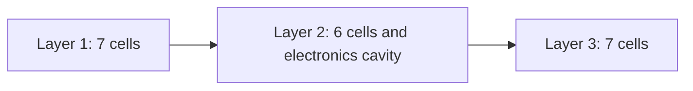
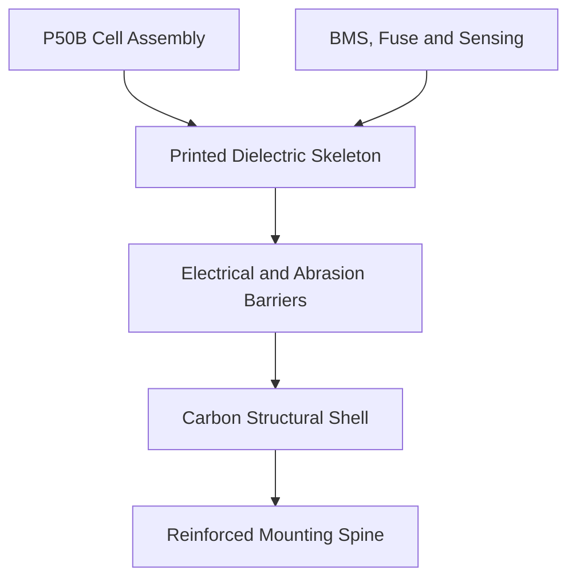
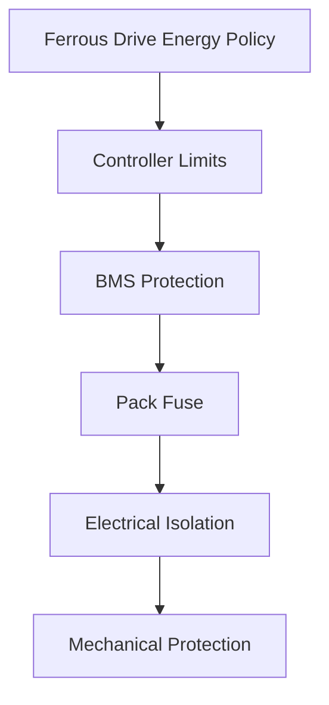
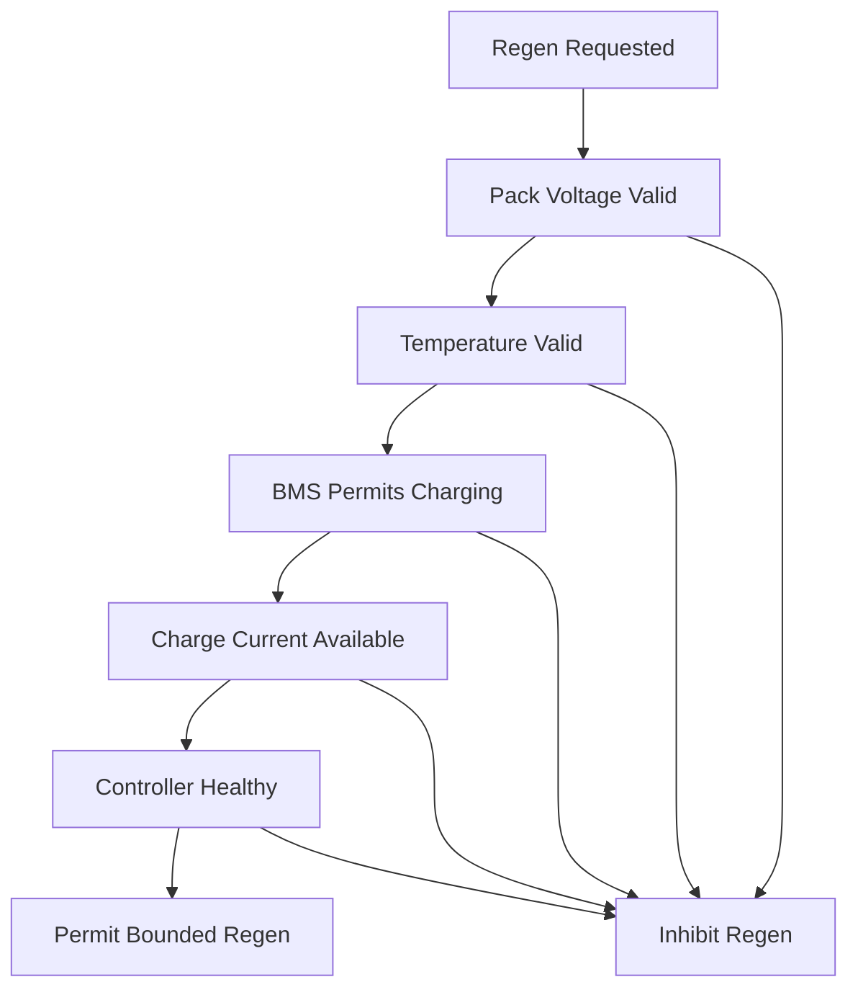

> 📚 [README](../README.md) · 🗺️ [Roadmap](roadmap.md) · 📐 ure](architecture.md) · 📝 decision_log.md · 🧠 assumptions.md · ✅ validation_matrix.md · 📋 ../CHANGELOG.md

# Battery Design

> Carry only the energy needed.  
> Keep the bike feeling like a bike.  
> Use every watt deliberately.

## Status

| Area | Status |
|---|---|
| Design maturity | Provisional |
| Cell selection | Accepted for first prototype |
| Electrical topology | Selected |
| Physical arrangement | Selected for CAD investigation |
| Enclosure design | Not started |
| BMS selection | Open |
| Controller integration | Under investigation |
| Physical validation | Not started |
| Road-ready | No |

> [!WARNING]
> This document describes a system-level battery concept.
>
> It is not a cell-assembly, welding, wiring, or construction guide.
> Lithium-ion battery assembly involves significant electrical, thermal,
> mechanical, fire, and transport risks.
>
> The final electrical design and physical assembly should be reviewed
> or completed by an experienced battery-pack builder.

---

## Design Goals

The battery should support Ferrous Drive without turning the bicycle
into a heavy, permanently electrified platform.

Primary goals:

- Single removable bottle-style battery
- Enough energy for a 35 km commute leg
- Low voltage sag
- Useful winter performance
- Regenerative-current acceptance
- Secure mounting
- Weather-resistant packaging
- Safe electrical isolation
- Easy removal for charging
- Compatibility with Grin controllers
- Measurable operating limits
- Replaceable prototype enclosure and electronics

The design priorities are:

```text
Safety
    ↓
Predictability
    ↓
Electrical Performance
    ↓
Mechanical Reliability
    ↓
Low Mass
    ↓
Visual Integration
```

Mass reduction must not take priority over insulation, protection,
cell retention, temperature sensing, connector security, or structural
integrity.

---

## Current Specification

| Attribute | Current target |
|---|---|
| Cell | Molicel INR-21700-P50B |
| Chemistry | Lithium-ion |
| Cell format | 21700 cylindrical |
| Topology | 10S2P |
| Cell count | 20 |
| Physical arrangement | `7 + 6 + 7` |
| Nominal voltage | 36 V |
| Full-charge voltage | 42 V |
| Nominal capacity | 10 Ah |
| Nominal energy | 360 Wh |
| Maximum bare-cell mass | 1.42 kg |
| Form | Single removable bottle-style module |
| Optimization mass goal | 1.70 kg |
| Working design target | 1.75 kg or less |
| Initial prototype ceiling | 1.85 kg |
| Initial controller | Phaserunner V6 L10 |
| Potential integrated controller | Baserunner V6 L10 |
| Regenerative braking | Required |
| External fitness output | Managed by Ferrous Drive |

These values describe the current design direction, not completed or
validated hardware.

---

## Design Inspiration

The industrial-design benchmark is the MAHLE eX1 external battery.

Relevant characteristics include:

- Bottle-style removable form
- Clean bicycle integration
- Compact mounting
- Weather-resistant enclosure
- Easy off-bike handling
- Low visual impact

The Ferrous Drive design is not intended to copy the MAHLE electrical
or mechanical architecture.

| Attribute | MAHLE eX1 benchmark | Ferrous Drive target |
|---|---:|---:|
| Nominal voltage | 36 V | 36 V |
| Energy | 171 Wh | 360 Wh |
| Diameter | 75 mm | Approximately 74–77 mm wide |
| Length | 195 mm | Approximately 250–290 mm |
| Finished mass | 1.1 kg | Approximately 1.70–1.85 kg |
| Purpose | Range extender | Primary removable battery |
| Regen integration | System dependent | Explicit requirement |

The MAHLE product is a usability and packaging reference, not a direct
mass or dimensional target.

---

## Cell Selection

### Selected cell

```text
Molicel INR-21700-P50B
```

Published cell characteristics:

| Attribute | Published value |
|---|---:|
| Nominal voltage | 3.6 V |
| Maximum charge voltage | 4.2 V |
| Discharge cutoff | 2.5 V |
| Typical capacity | 5.0 Ah |
| Typical energy | 18 Wh |
| Typical DC impedance | 12.8 mΩ |
| Maximum diameter | 21.55 mm |
| Maximum height | 70.15 mm |
| Maximum mass | 71 g |

### Selection rationale

The P50B was selected over the earlier LG M50LT candidate because it
offers a stronger system-level fit for:

- Lower voltage sag
- Reduced internal heating
- Better cold-weather power delivery
- Stable low-state-of-charge behaviour
- Short assistance transients
- Regenerative-current acceptance
- Future controlled-resistance experiments
- More predictable operation across temperature and load

The cell provides considerably more current capability than Ferrous
Drive intends to use.

The electrical headroom exists to support conservative operation, not
maximum motor output.

### Trade-off

The P50B increases cell mass compared with the earlier M50LT concept.

This makes the previous 1.50 kg finished-pack objective impractical
without unacceptable compromises.

---

## Pack Configuration

The prototype uses:

```text
10 series groups
×
2 parallel cells
=
20 cells
```

Electrical result:

```text
Series count       10S
Parallel count      2P
Nominal voltage     36 V
Full voltage        42 V
Nominal capacity    10 Ah
Nominal energy      360 Wh
```


The physical layering does not define the electrical grouping by
itself. Electrical group placement must be designed alongside the
interconnect geometry, insulation barriers, BMS connections, and
fault-current paths.

---

## Physical Layout

The prototype uses three axial cell layers:

```text
Layer 1
    7 cells

Layer 2
    6 cells
    1 electronics and routing cavity

Layer 3
    7 cells

Total
    20 cells
```

Each seven-cell layer consists of one central cell surrounded by six
outer cells placed at 60-degree intervals.

### Seven-cell cross-section

```text
             ○

        ○         ○

     ○       ○       ○

        ○         ○
```

This arrangement forms a rounded hexagonal cluster.

Its natural boundary fits efficiently inside:

- A circular bottle enclosure
- A mildly oval bottle enclosure
- A rounded enclosure with curved sides

The exact layout must be defined in a dimensioned CAD model.

---

## Circular and Oval Packaging

### Cell-cluster dimensions

Using the maximum P50B diameter of 21.55 mm:

```text
Maximum cluster width
    3 × 21.55 mm
    = 64.65 mm

Maximum cluster height
    Approximately 2.732 × 21.55 mm
    = approximately 58.9 mm
```

With an indicative 0.5 mm gap between adjacent cells:

```text
Approximate cluster width
    65.7 mm

Approximate cluster height
    59.7 mm
```

These dimensions cover cells only.

They do not include:

- Cell-wrap tolerance
- Printed retention ribs
- Dielectric barriers
- Abrasion protection
- Carbon-shell isolation
- Structural shell
- External finish

### Circular enclosure option

```text
Indicative internal diameter
    Approximately 68–71 mm

Indicative external diameter
    Approximately 73–77 mm
```

Advantages:

- Familiar bottle appearance
- Simple composite layup
- Good torsional stiffness
- Simple rotational geometry

Disadvantages:

- Unused space around the rounded hexagonal cluster
- Less convenient space for flat electronics
- Greater tendency to rotate in the mount
- Mounting loads require a dedicated internal spine

### Oval enclosure option

```text
Indicative internal dimensions
    Approximately 68–71 mm wide
    Approximately 62–66 mm deep

Indicative external dimensions
    Approximately 73–77 mm wide
    Approximately 67–72 mm deep
```

Advantages:

- Better match to the natural cluster shape
- Less unused internal volume
- Flatter bicycle-facing surface
- Better mounting stability
- Easier mounting-spine integration
- Better resistance to pack rotation
- Fixed connector orientation

Disadvantages:

- More complex carbon layup
- More complex end caps
- Orientation becomes fixed
- Greater CAD and tooling complexity

### Recommended cross-section

The preferred first CAD direction is a mild oval:

```text
Target external width
    76 mm

Target external depth
    70 mm
```

This remains recognizably bottle-sized while providing:

- A gently flattened mounting face
- Space for a structural spine
- Better resistance to rotation
- Reduced dead volume
- Consistent connector orientation
- Improved use of the middle-layer cavity

---

## Layer Arrangement



Conceptual side view:

```text
┌──────────────────────────────────────────────┐
│                                              │
│   Layer 1        Layer 2        Layer 3      │
│                                              │
│    7 cells        6 cells        7 cells     │
│                     +                        │
│                electronics                   │
│                   cavity                     │
│                                              │
└──────────────────────────────────────────────┘
```

### Middle-layer cavity

The middle layer retains the same external envelope as the seven-cell
layers while leaving one cell position empty.

```text
Seven-cell layer             Six-cell middle layer

        ○                            ○

    ○       ○                    ○       ○

 ○      ○      ○              ○     [ ]     ○

    ○       ○                    ○       ○
```

The `[ ]` position represents the electronics and routing cavity.

The cavity should be evaluated for:

1. BMS
2. Pack fuse
3. Balance-lead routing
4. Temperature-sensor wiring
5. Main conductors
6. Connector strain relief
7. Service separation
8. Controlled pressure-relief path

The cavity position may move away from the geometric centre if another
location provides better:

- Electrical clearances
- Thermal separation
- Connector routing
- Structural load paths
- BMS access
- Mass distribution

---

## Packaging Envelope

### Cell-stack length

Using the maximum cell height:

```text
3 × 70.15 mm
= 210.45 mm
```

Additional axial space is required for:

- Inter-layer barriers
- Series connections
- End insulation
- Impact protection
- Connector support
- End caps
- Sealing surfaces
- Mounting features

### Proposed finished envelope

```text
External width
    Approximately 74–77 mm

External depth
    Approximately 68–72 mm

Finished length
    Approximately 250–290 mm

Finished mass
    Approximately 1.70–1.85 kg
```

Preferred initial CAD envelope:

```text
Width
    76 mm

Depth
    70 mm

Length
    270 mm
```

This is a packaging baseline, not a frozen specification.

### Cross-section design rule

The enclosure must provide continuous allowance for:

```text
Cell
    ↓
Cell wrap
    ↓
Controlled spacing
    ↓
Printed dielectric retention
    ↓
Abrasion-resistant barrier
    ↓
Carbon-shell insulation
    ↓
Structural carbon shell
    ↓
External finish
```

The carbon shell must not contact the cells directly.

The original cell wraps must not be treated as the only insulation
between the cells and the conductive carbon structure.

### Mounting orientation

The oval profile should be oriented with:

```text
Wider dimension
    Across the bicycle

Flatter dimension
    Toward the bicycle frame

Mounting spine
    Along the frame-facing surface
```

The final orientation must be checked against:

- Frame clearance
- Crank clearance
- Front-wheel clearance
- Bottle-boss position
- Cable routing
- Battery removal path
- Rider leg clearance

---

## Structural Concept

The enclosure should use a composite structural approach:

```text
Printed dielectric skeleton
        +
Electrical and abrasion barriers
        +
Carbon-fibre structural shell
        +
Reinforced mounting spine
```



### Printed skeleton responsibilities

- Cell location
- Controlled spacing
- Dielectric separation
- Axial support
- Inter-layer positioning
- BMS support
- Protected conductor channels
- Temperature-sensor locations
- Connector alignment
- Load transfer into the mounting spine

The skeleton should not duplicate the structural role of the carbon
shell with unnecessarily thick printed walls.

### Carbon-shell responsibilities

- Bending stiffness
- Torsional stiffness
- Impact-load distribution
- Mounting-load distribution
- Environmental barrier support
- Durable external surface

> [!CAUTION]
> Carbon fibre is electrically conductive.
>
> A continuous abrasion-resistant dielectric barrier is required between
> the carbon structure and every cell, conductor, interconnect, BMS
> terminal, fuse terminal, and connector contact.

### Cell structural isolation

The cell cans must not be used as structural members.

The design must avoid:

- Concentrated radial loads
- Excessive axial compression
- Cell-can abrasion
- Relative cell movement
- Mounting loads through the cells
- Point loading from fasteners
- Carbon contact with damaged cell wraps

---

## Electrical Architecture


The final current path must support:

```text
Battery discharge
    Cells → controller

Regenerative charging
    Controller → cells
```

The electrical design must define:

- Common-port or separate-port BMS
- Regen current path
- Fuse position
- Service disconnect
- Charging connection
- Controller connection
- Connection-inrush behaviour
- Balance connection protection
- Temperature measurement
- Pack-voltage measurement
- Current measurement
- Removal-under-load behaviour

---

## Battery Management System

### Required capabilities

- 10-series lithium-ion monitoring
- Cell-group overvoltage protection
- Cell-group undervoltage protection
- Discharge overcurrent protection
- Charge overcurrent protection
- Short-circuit protection
- Cell balancing
- Temperature monitoring
- Bidirectional current support
- Regenerative-current handling
- Defined fault recovery
- Low standby consumption
- Suitable physical dimensions

### Desired capabilities

- Pack-voltage telemetry
- Individual group-voltage telemetry
- Temperature telemetry
- Charge and discharge permission
- Fault reporting
- State-of-charge estimation
- Configurable thresholds
- Digital interface for Ferrous Drive

### Open questions

- Exact BMS model
- Common-port versus separate-port topology
- Behaviour during regen
- Behaviour near full charge
- Behaviour following overvoltage
- Behaviour following undervoltage
- Handling of a BMS disconnect during regeneration
- Advance communication of charge or discharge inhibition
- Availability of individual group voltages

The motor controller should enforce operating limits before the BMS
needs to open the current path.

---

## Protection Strategy



### Ferrous Drive policy

- Energy budgeting
- Temperature-aware power reduction
- Regen permission
- Arrival reserve
- Graceful low-energy behaviour
- Logging and diagnostics

### Controller protection

- Battery-current limits
- Regen-current limits
- Low-voltage rollback
- Maximum regen voltage
- Motor phase-current limits
- Regen phase-current limits
- Motor thermal rollback
- Controller thermal rollback

### Independent protection

- BMS protection
- Pack fuse
- Electrical isolation
- Impact protection
- Secure mechanical retention

---

## Regenerative Braking

Regenerative charging is a core battery requirement.



Regen should be reduced or inhibited when:

- Pack voltage approaches the configured ceiling
- Any cell group approaches overvoltage
- Pack temperature is outside the validated charge range
- BMS charge permission is unavailable
- BMS telemetry is stale
- Battery-current telemetry is invalid
- Controller communications are unhealthy
- Regen current exceeds the validated limit
- The battery is disconnected
- A battery or controller fault is active

The first energized prototype should use conservative regenerative
limits that are increased only through measured validation.

---

## Temperature Management

At least two battery temperature measurements are recommended:

```text
Sensor 1
    Interior cell group or predicted hotspot

Sensor 2
    Electronics, fuse, or connector region
```

Additional candidates include:

- Outer cell group
- BMS power stage
- Main fuse
- Main connector
- Central cell in a seven-cell layer

Desired behaviour:

```text
Cold battery
    Reduce discharge power
    Reduce or inhibit regen

Normal battery
    Use validated limits

Warm battery
    Reduce discharge and regen limits

Hot battery
    Inhibit energy flow
```

Thresholds must be established through cell, BMS, and pack-level
validation.

---

## Controller Integration

Initial prototype controller:

```text
Phaserunner V6 L10
```

Potential integrated-bike controller:

```text
Baserunner V6 L10
```

Controller configuration must eventually include:

- Maximum battery current
- Maximum regenerative battery current
- Low-voltage rollback start
- Low-voltage cutoff
- Maximum regen voltage start
- Maximum regen voltage end
- Forward phase-current limit
- Regen phase-current limit
- Maximum power
- Motor thermal rollback
- Controller thermal rollback

The weakest validated component determines the system limit.

---

## Power and Current Targets

The prototype should operate well below the maximum P50B capability.

```text
Normal average battery power
    Approximately 150–300 W

Short higher-assist demand
    Approximately 500–600 W

Initial discharge-current limit
    Defined after BMS and interconnect selection

Initial regen-current limit
    Conservative, then increased through testing
```

Approximate current at 36 V:

```text
250 W
    6.9 A pack current
    3.4 A per parallel cell

500 W
    13.9 A pack current
    6.9 A per parallel cell

600 W
    16.7 A pack current
    8.3 A per parallel cell
```

Actual current varies with pack voltage and controller efficiency.

---

## Energy and Range Model

### Nominal energy

```text
20 cells × 18 Wh
= 360 Wh nominal
```

The simulator should distinguish:

- Nominal energy
- Configured usable energy
- Measured available energy
- Arrival reserve
- Regenerated energy

### Preliminary commute model

The current 30 km/h Commute-mode model assumes:

```text
Average battery power
    Approximately 247 W

Consumption
    Approximately 8.2 Wh/km

Mild-weather range
    Approximately 39 km

Provisional winter range
    Approximately 33 km
```

These figures are modelling assumptions, not measured performance.

Ferrous Drive should eventually use arrival-reserve management:

```text
Remaining distance
        +
Remaining usable energy
        +
Recent consumption
        ↓
Predicted arrival reserve
        ↓
Assistance adjustment
```

Regen should initially contribute zero to range forecasting until
route-specific measurements are available.

---

## Mass Budget

### Bare cells

```text
20 × 71 g maximum
= 1,420 g maximum
```

### Working mass budget

| Component | Working allowance | Preliminary range |
|---|---:|---:|
| 20 P50B cells | 1,420 g | Up to 1,420 g |
| Terminal insulation and barriers | 12 g | 10–18 g |
| Interconnects and series links | 25 g | 20–35 g |
| BMS and balance wiring | 35 g | 25–50 g |
| Pack fuse and holder | 8 g | 5–12 g |
| Main wiring and connector | 22 g | 15–35 g |
| Temperature sensing | 3 g | 2–6 g |
| Printed dielectric skeleton | 45 g | 30–65 g |
| Carbon shell and resin | 55 g | 40–80 g |
| End caps and impact protection | 30 g | 20–45 g |
| Mounting and retention | 40 g | 25–60 g |
| Adhesive and cushioning | 15 g | 10–25 g |
| **Working estimate** | **1,710 g** | **Approximately 1,622–1,856 g** |

### Mass targets

```text
Optimization goal
    1.70 kg

Working design target
    1.75 kg or less

Initial prototype ceiling
    1.85 kg
```

The mass target must not be achieved by removing required protection.

---

## Telemetry

### Required battery telemetry

- Pack voltage
- Battery current
- Regenerative current
- At least two temperatures
- BMS charge permission
- BMS discharge permission
- BMS fault state
- Controller battery limits
- Controller communications health

### Desired telemetry

- Individual group voltages
- State of charge
- State of health
- Discharged watt-hours
- Regenerated watt-hours
- Maximum current
- Minimum voltage
- Maximum temperature
- Cell imbalance
- Fault history

---

## Charging

The pack requires controlled charging for a 10S lithium-ion battery.

```text
Series count
    10S

Maximum pack voltage
    42 V

Charging method
    Constant current and constant voltage

Temperature monitoring
    Required

BMS protection
    Active during charging
```

The design should investigate:

- Pack-level charging connector
- Charger communication
- BMS charge permission
- Connector keying
- Moisture protection
- Off-bike charging
- Reduced charge ceiling for longevity
- Post-ride cooldown
- Office charging practicality

---

## Mechanical Mounting

A standard friction-only bottle cage is not sufficient for a battery
of this mass.

The mounting system must resist:

- Braking loads
- Acceleration loads
- Road shock
- Pothole impacts
- Lateral vibration
- Repeated removal
- Partial or incorrect insertion

Mounting principles:

- Loads enter through a dedicated mounting spine.
- The carbon shell distributes load into the spine.
- Electrical contacts do not provide primary retention.
- The pack has positive and secondary retention.
- Removal requires deliberate action.
- Incorrect insertion is mechanically prevented or obvious.

---

## Environmental Requirements

The prototype should be designed for year-round Swedish commuting.

Relevant conditions include:

- Rain
- Road spray
- Condensation
- Mud
- Dust
- Salt exposure
- Freeze-thaw cycling
- Cold-soaked startup
- Indoor-to-outdoor transitions
- Vibration
- Repeated removal
- UV exposure
- Bicycle washing

The first prototype must not claim a formal ingress-protection rating
without standardized testing.

---

## Prototype Stages

### Stage 1: CAD packaging

- Confirm cell geometry
- Model `7 + 6 + 7`
- Model maximum tolerances
- Allocate electronics cavity
- Check frame fit
- Check removal path
- Estimate mass and centre of gravity

### Stage 2: Inert physical model

- Use safe dummy cells
- Validate enclosure dimensions
- Validate mounting
- Validate removal
- Validate clearances
- Measure structural-component mass

### Stage 3: Mechanical enclosure prototype

- Produce printed skeleton
- Produce isolated shell concept
- Validate fit
- Test mounting loads
- Test vibration
- Test impact protection
- Inspect abrasion points

### Stage 4: Instrumented electrical prototype

Only after review of:

- Cell matching
- Electrical topology
- BMS
- Fuse
- Interconnects
- Connector
- Isolation
- Charging path
- Regen path

### Stage 5: Bench validation

- Controlled discharge
- Controlled charging
- Regen simulation
- Thermal measurement
- Voltage-sag measurement
- BMS fault testing
- Controller limit testing

### Stage 6: Bicycle integration

Only after earlier stages pass their validation gates.

---

## Validation Plan

### Cell validation

- [ ] Verify authentic P50B sourcing
- [ ] Record production batch
- [ ] Measure cell mass
- [ ] Measure open-circuit voltage
- [ ] Measure internal resistance
- [ ] Measure usable capacity
- [ ] Match cells before assembly

### Electrical validation

- [ ] Verify series-group voltages
- [ ] Verify pack voltage
- [ ] Verify BMS thresholds
- [ ] Verify balancing
- [ ] Verify discharge current
- [ ] Verify regen current
- [ ] Verify fuse selection
- [ ] Verify connector temperature
- [ ] Verify interconnect temperature
- [ ] Verify voltage sag
- [ ] Verify low-voltage rollback
- [ ] Verify regen-voltage rollback
- [ ] Verify communications-loss behaviour
- [ ] Verify controller safe state

### Thermal validation

- [ ] Validate sensor placement
- [ ] Characterize steady discharge
- [ ] Characterize power transients
- [ ] Characterize repeated regen
- [ ] Validate cold-soaked operation
- [ ] Validate charging behaviour
- [ ] Inspect thermal gradients

### Mechanical validation

- [ ] Measure finished mass
- [ ] Validate cell retention
- [ ] Validate axial protection
- [ ] Validate radial protection
- [ ] Validate mounting retention
- [ ] Validate connector strain relief
- [ ] Perform vibration testing
- [ ] Inspect carbon isolation
- [ ] Inspect cell wraps after testing

### Environmental validation

- [ ] Water-spray testing
- [ ] Condensation testing
- [ ] Freeze-thaw testing
- [ ] Salt exposure
- [ ] Dust and mud exposure
- [ ] Seal inspection
- [ ] Connector contamination testing
- [ ] Post-test insulation testing

### Range validation

- [ ] Recovery-mode consumption
- [ ] Commute-mode consumption
- [ ] Sport-mode consumption
- [ ] Cold-weather consumption
- [ ] Headwind consumption
- [ ] Low-state-of-charge performance
- [ ] Arrival-reserve prediction
- [ ] Regen energy recovery
- [ ] 35 km commute validation

---

## Known Unknowns

- Exact finished dimensions
- Actual cell-batch mass
- Actual pack impedance
- Exact BMS
- BMS regen behaviour
- BMS telemetry
- Fuse selection
- Connector selection
- Charger interface
- Interconnect geometry
- Physical series-group mapping
- Printed skeleton material
- Carbon laminate design
- Carbon isolation system
- End-cap design
- Mounting mechanism
- Weather-sealing method
- Pressure-relief strategy
- Thermal behaviour
- Cold usable energy
- Cold regen acceptance
- Ageing behaviour
- Repair strategy
- End-of-life disassembly
- Applicable battery and transport requirements

---

## Non-Goals

The first prototype is not intended to:

- Use maximum published cell current
- Maximize motor output
- Replace controller protection
- Replace BMS protection with software
- Use carbon as electrical insulation
- Use cell cans structurally
- Claim an ingress-protection rating without testing
- Support cell-level user servicing
- Support hot-swapping
- Support multiple parallel batteries
- Claim production readiness
- Claim regulatory certification
- Sacrifice safety to meet a mass target

---

## Decision Summary

```text
Cell
    Molicel INR-21700-P50B

Configuration
    10S2P

Cell count
    20

Physical arrangement
    7 + 6 + 7

Cross-section
    Mild oval

Target envelope
    76 mm wide
    70 mm deep
    270 mm long

Nominal voltage
    36 V

Full voltage
    42 V

Nominal capacity
    10 Ah

Nominal energy
    360 Wh

Structural concept
    Printed dielectric skeleton
    Electrically isolated carbon shell
    Reinforced mounting spine

Mass targets
    1.70 kg optimization goal
    1.75 kg working target
    1.85 kg prototype ceiling
```

The P50B was selected because stable winter performance, lower voltage
sag, regenerative-current headroom, and predictable transient behaviour
are more valuable than minimizing cell mass alone.

The mild-oval cross-section was selected because it follows the natural
seven-cell cluster more efficiently than a perfect cylinder and provides
a better frame-facing surface for mounting.

The design remains provisional until the cells, BMS, interconnects,
connector, enclosure, mounting system, thermal behaviour, and
regenerative-current path have been validated.

---

## References

- [Molicel P50B product information](https://www.molicel.com/inr-21700-p50b/)
- [Molicel P50B data sheet](https://www.molicel.com/wp-content/uploads/Product-Data-Sheet-of-INR-21700-P50B-80122.pdf)
- [MAHLE eX1 external battery](https://mahle-smartbike.com/e185-range-extender/)
- [Grin Baserunner product information](https://ebikes.ca/product-info/grin-products/baserunner.html)
- [Grin Phaserunner product information](https://ebikes.ca/product-info/grin-products/phaserunner.html)
- [Architecture](architecture.md)
- decision_log.md
- assumptions.md
- validation_matrix.md
