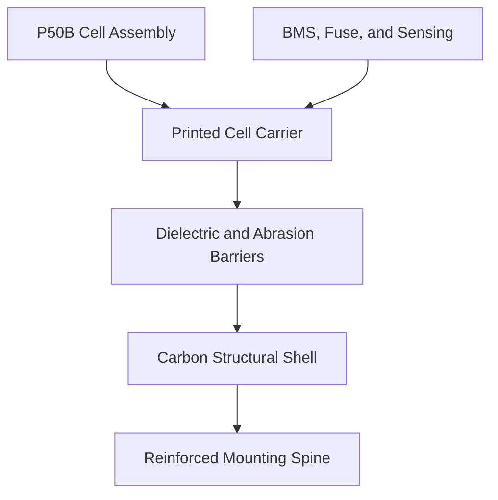
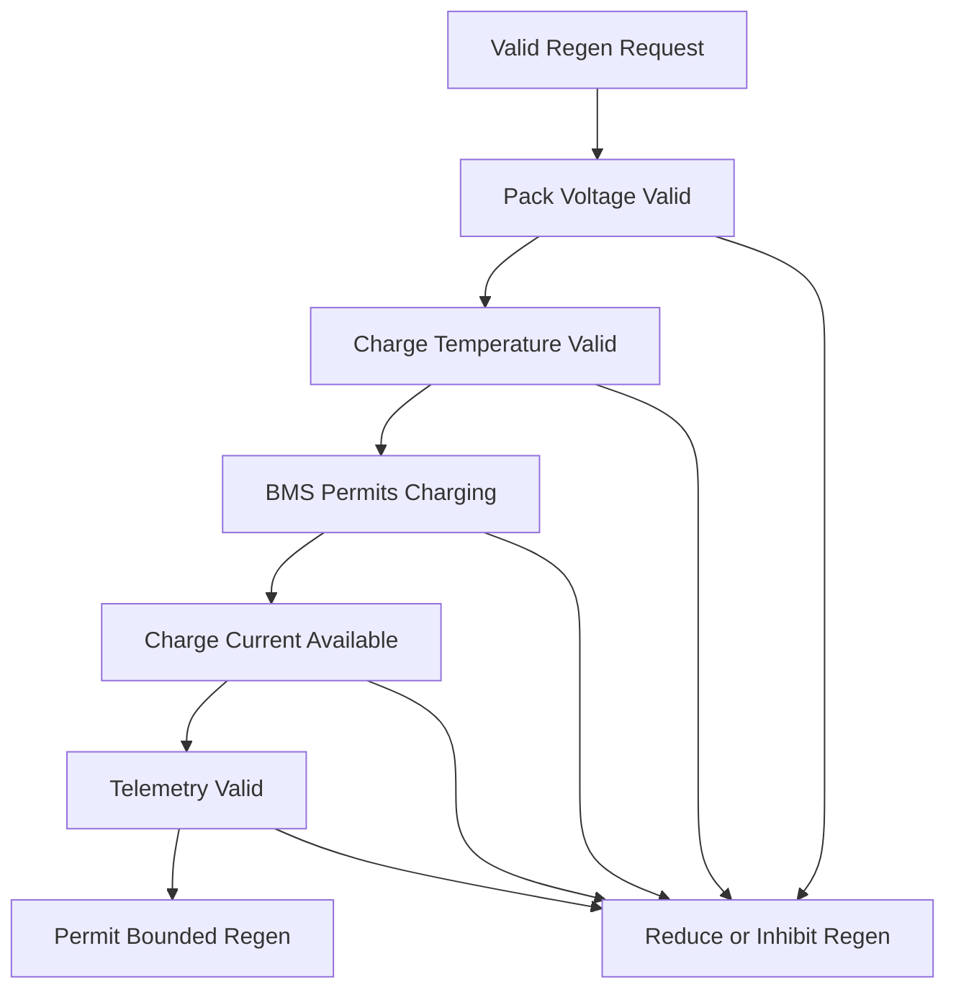
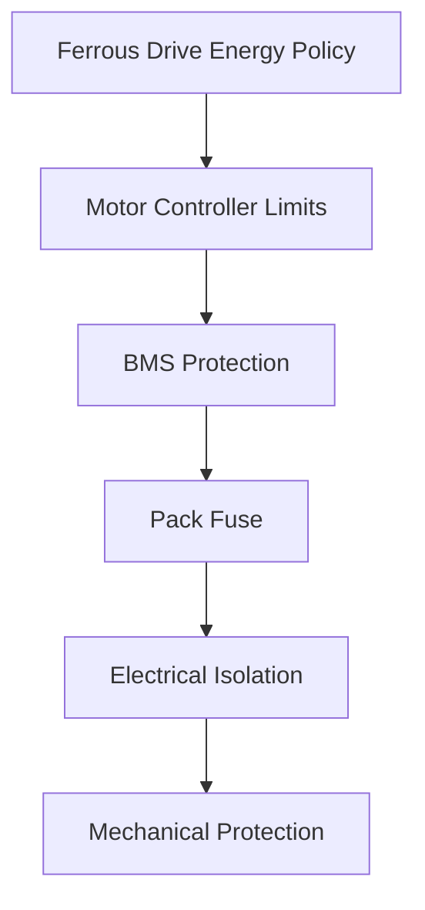

> 📚 [README](../README.md) · 📐 [Architecture](architecture.md) · 🛑 [Regenerative Braking](regenerative_braking.md) · 🧠 [Assumptions](assumptions.md) · ✅ [Validation Matrix](validation_matrix.md) · 📝 [Decision Log](decision_log.md)

# Battery Design

> Carry only the energy needed.  
> Keep the bike feeling like a bike.  
> Accept regeneration safely and predictably.

## Status

| Area | Status |
|---|---|
| Design maturity | Provisional |
| Cell selection | Accepted for first prototype |
| Electrical topology | Selected |
| Physical arrangement | Selected for CAD investigation |
| Enclosure design | Not started |
| BMS selection | Open |
| Regen-capable current path | Required |
| Controller integration | Under investigation |
| Physical validation | Not started |
| Road-ready | No |

> [!WARNING]
> This document describes a system-level battery concept.
>
> It is not a cell-assembly, welding, wiring, or construction guide.
> Lithium-ion battery assembly involves serious electrical, thermal,
> mechanical, fire, and transport risks.
>
> The final electrical design and physical assembly should be reviewed or
> completed by an experienced battery-pack builder.

---

## Executive Summary

The provisional Ferrous Drive battery is a removable 36 V bottle-style module
built around twenty Molicel INR-21700-P50B cells in a 10S2P topology.

```text
Nominal voltage
    36 V

Full-charge voltage
    42 V

Nominal capacity
    10 Ah

Nominal energy
    360 Wh

Cell arrangement
    7 + 6 + 7
```

The pack is shared by two possible drive configurations:

- A lightweight freewheeling geared hub with forward assistance only
- A Grin direct-drive system with positive torque, regenerative braking,
  integrated sensing, and richer telemetry

The battery must therefore remain bidirectional even if the first installed
motor cannot regenerate.

Regeneration is not a secondary convenience. It affects BMS selection, current
path, pack-voltage control, charge-temperature limits, telemetry, state-of-
charge headroom, connector selection, and controller integration.

The target finished mass remains:

```text
Optimization goal
    1.70 kg

Working target
    1.75 kg or less

Initial prototype ceiling
    1.85 kg
```

A finished 360 Wh pack below 1.5 kg is not treated as a credible requirement
with the selected twenty-cell P50B architecture.

---

## Current Specification

| Attribute | Current target |
|---|---|
| Cell | Molicel INR-21700-P50B |
| Cell format | 21700 cylindrical |
| Topology | 10S2P |
| Cell count | 20 |
| Physical arrangement | `7 + 6 + 7` |
| Nominal voltage | 36 V |
| Full-charge voltage | 42 V |
| Nominal capacity | 10 Ah |
| Nominal energy | 360 Wh |
| Maximum bare-cell mass | 1.42 kg |
| Form | Removable bottle-style module |
| Working mass target | 1.75 kg or less |
| Prototype ceiling | 1.85 kg |
| Bidirectional current path | Required |
| Regenerative braking | Required for compatible drives |
| Initial controller candidate | Phaserunner V6 L10 |
| Integrated controller candidate | Baserunner V6 L10 |

These values describe the current design direction, not completed hardware.

---

## Design Goals

The battery should support Ferrous Drive without turning the bicycle into a
permanently electrified platform.

Primary goals:

- Complete a 35 km commute leg with reserve.
- Remain removable and practical to carry.
- Support mild-weather and winter operation.
- Provide low voltage sag.
- Accept bounded regenerative charge current.
- Expose charge and discharge permission.
- Measure voltage, current, and temperature.
- Protect cells independently of Ferrous Drive software.
- Isolate all conductors from a conductive carbon enclosure.
- Withstand vibration, weather, and repeated removal.
- Remain compatible with both candidate drive configurations.

Priority order:

```text
Safety
    ↓
Predictability
    ↓
Electrical performance
    ↓
Mechanical reliability
    ↓
Serviceability
    ↓
Low mass
    ↓
Visual integration
```

Mass reduction must not take priority over insulation, fault protection,
retention, temperature sensing, connector security, or structural integrity.

---

## Cell Selection

### Selected cell

```text
Molicel INR-21700-P50B
```

| Attribute | Published value |
|---|---:|
| Nominal voltage | 3.6 V |
| Maximum charge voltage | 4.2 V |
| Discharge cutoff | 2.5 V |
| Typical capacity | 5.0 Ah |
| Typical energy | 18 Wh |
| Standard charge current | 5 A |
| Maximum charge current | 25 A |
| Continuous discharge current | 60 A |
| Typical DC impedance | 12.8 mΩ |
| Maximum diameter | 21.55 mm |
| Maximum height | 70.15 mm |
| Maximum mass | 71 g |

### Selection rationale

The P50B provides useful headroom for:

- Low voltage sag
- Reduced internal heating
- Cold-weather power delivery
- Short assistance transients
- Regenerative-current acceptance
- Conservative operation below cell limits
- Future controlled-resistance experiments

Published cell limits do not become pack limits automatically. The BMS,
interconnects, fuse, connector, wiring, temperatures, and validated operating
model determine the actual system limits.

---

## Pack Configuration

```text
10 series groups
×
2 parallel cells
=
20 cells
```

```text
Nominal voltage
    36 V

Full voltage
    42 V

Nominal capacity
    10 Ah

Nominal energy
    360 Wh
```


Physical layering does not determine electrical group placement by itself.
Interconnect geometry, insulation, fault-current paths, temperature sensing,
and BMS routing must be designed together.

---

## Physical Layout

The provisional cell arrangement uses three axial layers:

```text
Layer 1
    7 cells

Layer 2
    6 cells
    + electronics and routing cavity

Layer 3
    7 cells

Total
    20 cells
```

Each seven-cell layer uses one central cell surrounded by six outer cells.

```text
             ○

        ○         ○

     ○       ○       ○

        ○         ○
```

The exact geometry requires a tolerance-aware CAD model.

---

## Packaging Envelope

Using the P50B maximum diameter of 21.55 mm:

```text
Cell-only cluster width
    64.65 mm

Cell-only cluster height
    Approximately 58.9 mm
```

Indicative preferred external envelope:

```text
Width
    76 mm

Depth
    70 mm

Length
    270 mm
```

Provisional range:

```text
External width
    Approximately 74–77 mm

External depth
    Approximately 68–72 mm

Finished length
    Approximately 250–290 mm
```

The mild oval is preferred over a perfect cylinder because it provides:

- Better fit to the rounded-hexagonal cell cluster
- A flatter frame-facing surface
- Better resistance to rotation
- A clearer structural-spine location
- More usable electronics and routing volume

---

## Lightweight Printed Cell Carrier

The internal printed component is a lightweight polymer cell carrier, not the
sole electrical-insulation system and not a solid plastic bottle.

It should provide:

- Cell positioning
- Cell-to-cell separation
- Inter-layer alignment
- Protected wire routing
- BMS and fuse support
- Temperature-sensor locations
- Connector alignment
- Load transfer toward the mounting spine

It must not:

- Replace terminal insulation
- Replace inter-layer barriers
- Be the sole barrier to the carbon shell
- Clamp cells excessively
- Carry mounting loads through cell cans
- Trap unnecessary heat
- Use conductive or carbon-filled filament

Dedicated terminal insulation, abrasion barriers, and continuous isolation
from the carbon shell remain required.

---

## Structural Concept

```text
Cells
    ↓
Lightweight printed cell carrier
    ↓
Terminal and inter-layer insulation
    ↓
Continuous abrasion-resistant dielectric barrier
    ↓
Carbon structural shell
    ↓
Reinforced mounting spine
```



> [!CAUTION]
> Carbon fibre is electrically conductive.
>
> It must not contact cells, interconnects, fuse terminals, BMS terminals, or
> connector contacts.

The cell cans must not act as structural members.

---

## Electrical Architecture


The current path must support:

```text
Propulsion
    Cells → controller

Regeneration
    Controller → cells
```

The final design must define:

- Common-port or separate-port BMS
- Regen current path
- Main fuse location
- Service isolation
- Charging connection
- Motor-controller connection
- Connection inrush
- Balance-lead protection
- Current measurement direction and range
- Pack removal under load
- Safe response to BMS charge inhibition

---

## Battery Management System

### Required capabilities

- 10-series lithium-ion monitoring
- Cell-group overvoltage protection
- Cell-group undervoltage protection
- Charge and discharge overcurrent protection
- Short-circuit protection
- Cell balancing
- At least two temperature inputs
- Bidirectional current support
- Regenerative-current handling
- Defined fault recovery
- Low standby consumption
- Suitable physical dimensions

### Desired capabilities

- Pack voltage telemetry
- Bidirectional current telemetry
- Individual group-voltage telemetry
- Battery-temperature telemetry
- Charge and discharge permission
- Fault reporting
- State-of-charge estimation
- Configurable thresholds
- Digital interface for Ferrous Drive

### Open BMS questions

- Exact BMS model
- Common-port or separate-port topology
- Advance charge-permission signal
- Behaviour near full charge
- Behaviour during controller regen
- Behaviour if protection opens during regen
- Individual group-voltage access
- Cold-charge configuration
- Current-measurement precision

The controller and Ferrous Drive should enforce normal operating limits before
the BMS needs to open the current path.

---

## Regenerative Braking Interface

The battery exposes a bounded regen capability to the control architecture.

```rust
pub struct BatteryRegenCapability {
    pub allowed: bool,
    pub maximum_charge_current_a: f32,
    pub voltage_rollback_start_v: f32,
    pub absolute_voltage_limit_v: f32,
    pub limitation_reason: BatteryRegenLimitation,
}
```

The battery does not decide braking feel. It decides what electrical charging
is currently acceptable.

The regenerative-braking controller combines this capability with motor,
controller, wheel-speed, and rear-wheel limits.

Detailed rider intent, speed scheduling, state control, and braking validation
are defined in [Regenerative Braking](regenerative_braking.md).

---

## Regen Permission Logic



Regen must be reduced or inhibited when:

- Pack voltage approaches the configured ceiling.
- Any cell group approaches overvoltage.
- Battery temperature is outside the validated charge range.
- BMS charge permission is unavailable.
- Battery-current or voltage telemetry is stale.
- The controller or communication path is unhealthy.
- Regen current exceeds the validated pack limit.
- The battery is disconnected.
- A battery fault is active.

Mechanical braking remains available whenever regen is restricted.

---

## Voltage and State-of-Charge Headroom

A fully charged 10S pack is approximately 42 V. Regen may be reduced or
unavailable near this ceiling.

The design should evaluate:

- Voltage rollback below the absolute ceiling
- Cell-group overvoltage margin
- Controller response near full charge
- Whether normal commute charging should stop below 100% when early-route regen
  is expected
- How quickly load-induced voltage sag creates usable headroom
- Communication to the rider when regen is unavailable

No reduced charge ceiling is frozen at this stage.

---

## Charge-Current Limits

The cell's published charge capability is not the permitted pack regen limit.

The validated limit is the minimum of:

```text
Cell limit
BMS limit
Interconnect limit
Fuse and connector limit
Temperature-dependent limit
Controller limit
Pack-voltage limit
```

Generation one should start with a conservative pack-level regen limit and
increase it only after bench measurement of:

- Cell-group voltage response
- Pack voltage rise
- BMS behaviour
- Connector temperature
- Interconnect temperature
- Battery temperature
- Current-sensor accuracy

---

## Temperature Management

At least two battery-temperature measurements are recommended:

```text
Sensor 1
    Interior cell group or predicted hotspot

Sensor 2
    BMS, fuse, or connector region
```

Additional candidates:

- Central cell in a seven-cell layer
- Outer cell group
- BMS power stage
- Main connector

Desired behaviour:

```text
Cold battery
    Reduce discharge power
    Reduce or inhibit regen

Normal battery
    Use validated charge and discharge limits

Warm battery
    Reduce both limits

Hot battery
    Inhibit affected energy flow
```

Published cell temperature capability must not be copied directly into the pack
control policy without pack-level validation.

---

## Protection Strategy



### Ferrous Drive policy

- Arrival reserve
- Temperature-aware power limits
- Regen permission
- Voltage rollback request
- Energy accounting
- Sensor freshness
- Diagnostics

### Controller protection

- Battery-current limits
- Regen-current limits
- Low-voltage rollback
- Maximum regen voltage
- Phase-current limits
- Motor thermal rollback
- Controller thermal rollback

### Independent protection

- BMS
- Fuse
- Electrical isolation
- Cell retention
- Impact protection
- Secure mounting

---

## Controller Integration

Initial controller candidate:

```text
Phaserunner V6 L10
```

Potential integrated controller candidate:

```text
Baserunner V6 L10
```

Required controller configuration includes:

- Maximum battery discharge current
- Maximum battery regen current
- Low-voltage rollback
- Maximum regen-voltage rollback
- Absolute voltage limits
- Positive and negative phase-current limits
- Motor thermal rollback
- Controller thermal rollback
- Motor speed and temperature telemetry
- Deterministic command path
- Communication watchdog

Controller capability must be verified against the selected firmware and
integration interface.

---

## Power and Current Planning

Normal operation should remain well below the maximum cell capability.

```text
Normal average battery power
    Approximately 150–300 W

Short higher-assist demand
    Approximately 500–600 W
```

Approximate pack current at 36 V:

```text
250 W
    6.9 A pack current
    3.4 A per parallel cell

500 W
    13.9 A pack current
    6.9 A per parallel cell

600 W
    16.7 A pack current
    8.3 A per parallel cell
```

Actual current depends on pack voltage and controller efficiency.

Regen current values remain open pending BMS, connector, interconnect, and
thermal validation.

---

## Energy and Route Model

### Nominal energy

```text
20 cells × 18 Wh
    360 Wh nominal
```

Simulation should distinguish:

- Nominal energy
- Planning usable energy
- Measured available energy
- Arrival reserve
- Gross propulsion energy
- Descent regen
- Junction regen
- Net battery energy

### Planning usable energy

Current simulations use:

```text
Planning usable energy
    320 Wh
```

This remains a modelling parameter, not a validated pack result.

### Recorded commute baseline

The current route model uses two approximately 35 km recorded rides with:

- WTB Vulpine 36c tyres
- Aluminium wheels
- Approximately 236 m ascent
- Approximately 232 m descent

### Provisional route-informed recovery

| Direction | Descent recovery | Junction recovery | Total |
|---|---:|---:|---:|
| Outbound | ~18 Wh | ~7 Wh | ~25 Wh |
| Return | ~23 Wh | ~8 Wh | ~31 Wh |
| Round trip | ~41 Wh | ~15 Wh | ~55–56 Wh |

Sensitivity range:

```text
Conservative round trip
    Approximately 40 Wh

Planning case
    Approximately 55 Wh

Optimistic round trip
    Approximately 65 Wh
```

These values are inferred from GPS speed and elevation. They are not measured
battery recovery and must be replaced by physical voltage and current data.

---

## Neutral Ride Energy Interaction

For a direct-drive installation, Neutral Ride compensates only for:

- Magnetic motor drag
- Added-system rolling resistance
- Added-system climbing cost

Current modelling estimates approximately 30–40 Wh of compensation per commute
leg. Route-informed regen may recover a substantial part of that energy, but
Neutral Ride must not apply hidden braking to force energy neutrality.

The battery reports recovered energy; the braking subsystem decides when regen
is valid; the ride-mode controller must not manufacture braking events.

---

## Mass Budget

### Bare cells

```text
20 × 71 g maximum
    1,420 g maximum
```

| Component | Working allowance | Preliminary range |
|---|---:|---:|
| 20 P50B cells | 1,420 g | Up to 1,420 g |
| Terminal insulation and barriers | 12 g | 10–18 g |
| Interconnects and series links | 25 g | 20–35 g |
| BMS and balance wiring | 35 g | 25–50 g |
| Pack fuse and holder | 8 g | 5–12 g |
| Main wiring and connector | 22 g | 15–35 g |
| Temperature and current sensing | 5 g | 3–10 g |
| Printed cell carrier | 45 g | 30–65 g |
| Carbon shell and resin | 55 g | 40–80 g |
| End caps and impact protection | 30 g | 20–45 g |
| Mounting and retention | 40 g | 25–60 g |
| Adhesive and cushioning | 15 g | 10–25 g |
| **Working estimate** | **1,712 g** | **Approximately 1,623–1,865 g** |

Mass targets:

```text
Optimization goal
    1.70 kg

Working target
    1.75 kg or less

Initial prototype ceiling
    1.85 kg
```

Protection must not be removed to meet the mass target.

---

## Telemetry

### Required

- Pack voltage
- Bidirectional battery current
- Gross discharged energy
- Gross regenerated energy
- Net battery energy
- At least two temperatures
- BMS charge permission
- BMS discharge permission
- BMS fault state
- Controller battery limits
- Communication health

### Desired

- Individual group voltages
- State of charge
- State of health
- Maximum discharge current
- Maximum regen current
- Minimum pack voltage
- Maximum pack voltage
- Maximum temperature
- Cell imbalance
- Fault history
- Constraint-limited regen energy

---

## Charging

The pack requires controlled 10S lithium-ion charging.

```text
Maximum pack voltage
    42 V

Charging method
    Constant current and constant voltage

Temperature monitoring
    Required

BMS protection
    Active during charging
```

The design should investigate:

- Off-bike charging
- Keyed and weather-resistant connector
- BMS charge permission
- Reduced everyday charge ceiling
- Post-ride cooldown
- Early-route regen headroom
- Office-charging practicality

---

## Mechanical Mounting

A friction-only bottle cage is not sufficient for a battery of this mass.

The mount must resist:

- Braking loads
- Acceleration loads
- Road shock
- Pothole impacts
- Lateral vibration
- Repeated removal
- Incorrect or partial insertion

Principles:

- Loads enter through a dedicated mounting spine.
- The carbon shell distributes load into the spine.
- Electrical contacts do not provide primary retention.
- Positive and secondary retention are required.
- Removal requires deliberate action.
- Incorrect insertion is prevented or obvious.

---

## Environmental Requirements

The pack is intended for year-round Swedish commuting, including:

- Rain and road spray
- Condensation
- Mud and dust
- Salt exposure
- Freeze-thaw cycling
- Cold-soaked startup
- Indoor-to-outdoor transitions
- Vibration
- Repeated removal
- UV exposure
- Bicycle washing

No formal ingress-protection rating should be claimed without standardized
testing.

---

## Prototype Stages

### Stage 1: CAD packaging

- Confirm maximum cell geometry
- Model `7 + 6 + 7`
- Allocate electronics and wiring cavity
- Check frame fit and removal path
- Estimate mass and centre of gravity

### Stage 2: Inert physical model

- Use safe dummy cells
- Validate enclosure and mounting
- Validate clearances and retention
- Measure structural-component mass

### Stage 3: Mechanical enclosure

- Produce printed carrier
- Produce isolated shell concept
- Test mounting, vibration, and impact protection
- Inspect abrasion points

### Stage 4: Instrumented electrical prototype

Only after review of:

- Cell matching
- Electrical topology
- BMS
- Fuse
- Interconnects
- Connector
- Isolation
- Charge path
- Regen path

### Stage 5: Bench validation

- Controlled discharge
- Controlled charge
- Simulated regen
- Voltage-rise measurement
- Thermal measurement
- BMS fault testing
- Controller limit testing

### Stage 6: Bicycle integration

Only after earlier validation gates pass.

---

## Validation Plan

### Cell validation

- [ ] Verify authentic P50B sourcing
- [ ] Record production batch
- [ ] Measure cell mass and open-circuit voltage
- [ ] Measure internal resistance and usable capacity
- [ ] Match cells before assembly

### Electrical validation

- [ ] Verify series-group and pack voltage
- [ ] Verify BMS thresholds and balancing
- [ ] Verify discharge current
- [ ] Verify regen current
- [ ] Verify fuse selection
- [ ] Verify connector and interconnect temperature
- [ ] Verify voltage sag
- [ ] Verify voltage rise under regen
- [ ] Verify low-voltage rollback
- [ ] Verify regen-voltage rollback
- [ ] Verify communication-loss behaviour

### Regen validation

- [ ] Verify BMS charge permission during regen
- [ ] Verify near-full battery rollback
- [ ] Verify full-battery mechanical-only behaviour
- [ ] Verify cold-battery regen limit
- [ ] Verify hot-battery regen limit
- [ ] Verify bidirectional current measurement
- [ ] Verify gross and net energy accounting
- [ ] Verify controller response before BMS protection
- [ ] Verify abrupt charge-permission loss

### Thermal validation

- [ ] Validate sensor placement
- [ ] Characterize steady discharge
- [ ] Characterize assist transients
- [ ] Characterize repeated regen
- [ ] Validate cold-soaked operation
- [ ] Validate charging behaviour
- [ ] Inspect thermal gradients

### Mechanical validation

- [ ] Measure finished mass
- [ ] Validate cell retention
- [ ] Validate axial and radial protection
- [ ] Validate mounting retention
- [ ] Validate connector strain relief
- [ ] Perform vibration testing
- [ ] Inspect carbon isolation
- [ ] Inspect cell wraps after testing

### Environmental validation

- [ ] Water-spray testing
- [ ] Condensation testing
- [ ] Freeze-thaw testing
- [ ] Salt exposure
- [ ] Dust and mud exposure
- [ ] Seal inspection
- [ ] Connector contamination testing
- [ ] Post-test insulation testing

### Route validation

- [ ] Active Recovery energy use
- [ ] Commute energy use
- [ ] Tempo transient energy use
- [ ] Neutral Ride compensation
- [ ] Descent regen measurement
- [ ] Junction regen measurement
- [ ] Cold-weather usable energy
- [ ] Arrival-reserve prediction
- [ ] Outbound and return comparison
- [ ] 35 km commute validation

---

## Known Unknowns

- Exact finished dimensions
- Actual cell-batch mass and impedance
- Exact BMS and protocol
- Common-port or separate-port BMS
- BMS behaviour during regen
- Pack-level maximum regen current
- Voltage rollback thresholds
- Cold and hot regen limits
- Fuse and connector selection
- Charger interface
- Interconnect geometry
- Physical series-group mapping
- Printed carrier material
- Carbon laminate and isolation system
- End-cap and pressure-relief design
- Mounting mechanism
- Environmental sealing
- Thermal behaviour
- Cold usable energy
- State-of-charge estimation
- Repair and end-of-life strategy
- Applicable battery and transport requirements

---

## Non-Goals

The first prototype will not:

- Use maximum published cell current
- Maximize motor output
- Replace controller protection
- Replace BMS protection with software
- Use carbon as insulation
- Use cell cans structurally
- Claim an ingress-protection rating without testing
- Support hot swapping
- Support multiple parallel batteries
- Claim production readiness
- Claim regulatory certification
- Sacrifice protection to meet mass
- Depend on regen for safe braking

---

## Decision Summary

```text
Cell
    Molicel INR-21700-P50B

Configuration
    10S2P

Cell count
    20

Physical arrangement
    7 + 6 + 7

Cross-section
    Mild oval

Target envelope
    76 mm wide
    70 mm deep
    270 mm long

Nominal voltage
    36 V

Full voltage
    42 V

Nominal capacity
    10 Ah

Nominal energy
    360 Wh

Structural concept
    Printed polymer cell carrier
    Dedicated electrical barriers
    Electrically isolated carbon shell
    Reinforced mounting spine

Electrical concept
    Bidirectional current path
    Regen-capable BMS
    Independent charge and discharge capability limits

Mass targets
    1.70 kg optimization goal
    1.75 kg working target
    1.85 kg prototype ceiling
```

The design remains provisional until the cells, BMS, current path,
interconnects, connector, enclosure, mounting, thermal behaviour, and
regenerative-charging behaviour have been validated.

---

## References

- [Molicel P50B product information](https://www.molicel.com/product/inr-21700-p50b/)
- [Molicel P50B data sheet](https://www.molicel.com/wp-content/uploads/Product-Data-Sheet-of-INR-21700-P50B-80122.pdf)
- [Grin Phaserunner](https://ebikes.ca/product-info/grin-products/phaserunner.html)
- [Grin All-Axle Motor](https://ebikes.ca/product-info/grin-products/all-axle-hub-motor.html)
- [Architecture](architecture.md)
- [Regenerative Braking](regenerative_braking.md)
- [Assumptions](assumptions.md)
- [Validation Matrix](validation_matrix.md)
- [Decision Log](decision_log.md)
