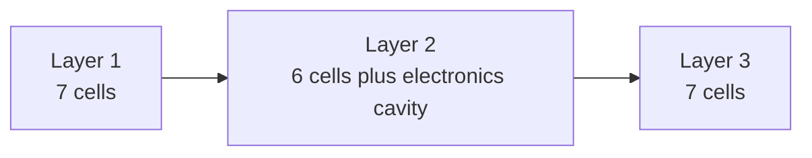
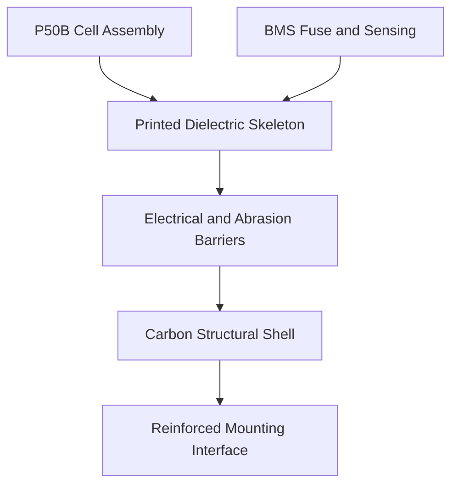
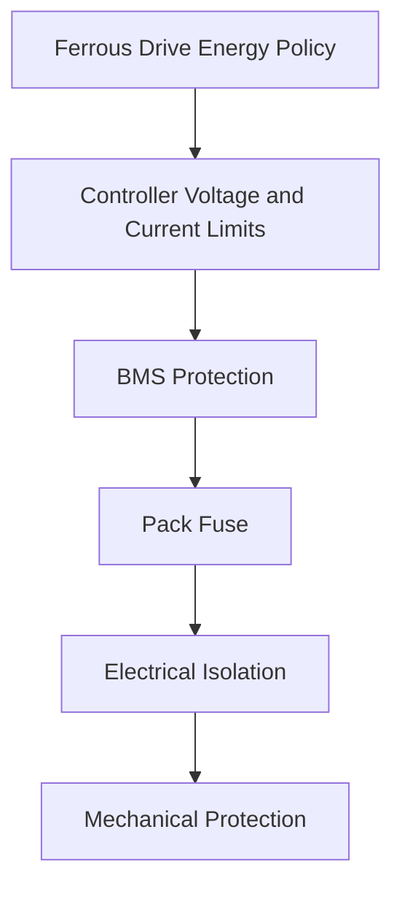
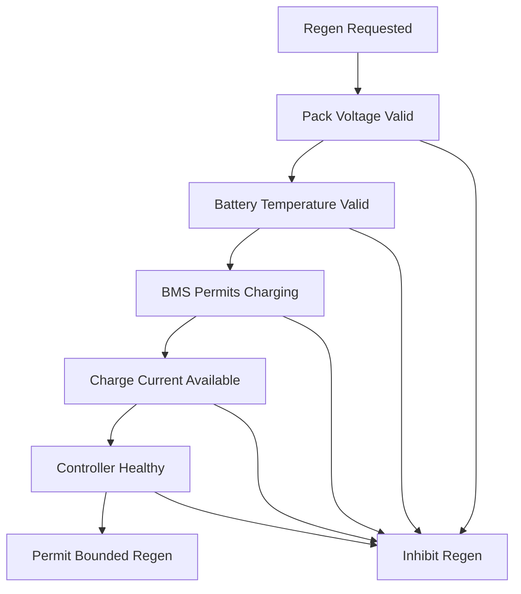

> 📚 [README](../README.md) · 🗺️ [Roadmap](roadmap.md) · 📐 [Architecture](architecture.md) · 📝 [Decision Log](decision_log.md) · 🧠 [Assumptionsd · 📋 ../CHANGELOG.md

# Battery Design

> Carry only the energy needed.  
> Keep the bike feeling like a bike.  
> Use every watt deliberately.

## Status

**Design status:** Provisional  
**Prototype generation:** First physical prototype  
**Road-ready:** No  
**Cell selection:** Accepted for prototype investigation  
**Electrical design:** Not frozen  
**Mechanical design:** CAD study required  
**BMS selection:** Open  
**Validation:** Not started

> [!WARNING]
> This document describes a system-level battery concept.
>
> It is not a cell-assembly, welding, wiring, or construction guide.
> Lithium-ion battery assembly involves fire, electrical, thermal,
> mechanical, and transport risks. The final electrical design and
> physical assembly should be reviewed or completed by an experienced
> battery-pack builder.

---

## Table of Contents

- #design-goals
- #current-specification
- #design-inspiration
- #cell-selection
- #pack-configuration
- #physical-layout
- #packaging-envelope
- [Structural Concept](##electrical-architecture
- #battery-management-system
- [protection-strategy
- [Regenerative Braking](#regmperature-management
- #controller-integration
- [Power and Current Targets](#power-and-current-model
- #mass-budget
- #telemetry
- #charging
- #mechanical-mounting
- #environmental-requirements
- #prototype-stages
- #validation-plan
- #known-unknowns
- #non-goals
- #decision-summary
- #references

---

## Design Goals

The battery should support the rider-oriented goals of Ferrous Drive without turning the bicycle into a heavy, permanently electrified platform.

Primary goals:

- Removable bottle-style form
- Enough energy for a 35 km commute leg
- Low voltage sag
- Useful performance in typical winter conditions
- Regenerative-current acceptance
- Secure bicycle mounting
- Weather resistance
- Safe electrical isolation
- Easy removal for charging
- Compatibility with the Grin controller ecosystem
- Measurable and explainable operating limits
- Replaceable prototype enclosure and electronics

The design prioritizes:

```text
Safety
    ↓
Predictability
    ↓
Electrical Performance
    ↓
Mechanical Reliability
    ↓
Low Mass
    ↓
Visual Integration
```

Mass reduction must not take priority over insulation, protection,
cell retention, temperature sensing, connector security, or structural
integrity.

---

## Current Specification

| Attribute | Current target |
|---|---|
| Cell | Molicel INR-21700-P50B |
| Chemistry | Lithium-ion |
| Cell format | 21700 cylindrical |
| Topology | 10S2P |
| Cell count | 20 |
| Physical arrangement | `7 + 6 + 7` |
| Nominal voltage | 36 V |
| Full-charge voltage | 42 V |
| Nominal capacity | 10 Ah |
| Nominal energy | 360 Wh |
| Bare-cell mass | Up to 1.42 kg |
| Form | Single removable bottle-style module |
| Optimization mass goal | 1.70 kg |
| Working design target | 1.75 kg or less |
| Initial prototype ceiling | 1.85 kg |
| Initial controller | Phaserunner V6 L10 |
| Potential integrated controller | Baserunner V6 L10 |
| Regen support | Required |
| External fitness output | Managed by Ferrous Drive, not the battery |

These values describe design intent rather than completed hardware.

---

## Design Inspiration

The industrial-design benchmark is the MAHLE eX1 external battery.

Relevant product characteristics include:

- Bottle-style removable form
- Clean bicycle integration
- Compact mounting system
- Weather-resistant enclosure
- Easy handling off the bicycle
- Simple charging experience
- Low visual impact

The Ferrous Drive module is not intended to copy the MAHLE electrical
or mechanical design.

The designs differ substantially:

| Attribute | MAHLE eX1 benchmark | Ferrous Drive target |
|---|---:|---:|
| Nominal voltage | 36 V | 36 V |
| Energy | 171 Wh | 360 Wh |
| Diameter | 75 mm | Approximately 72–78 mm target |
| Length | 195 mm | Approximately 250–290 mm target |
| Finished mass | 1.1 kg | 1.70–1.85 kg target |
| Purpose | Range extender | Primary removable battery |
| Regen integration | System dependent | Explicit requirement |

The MAHLE unit should therefore be treated as a usability and packaging
reference, not as a direct mass or dimensional target.

---

## Cell Selection

### Selected cell

```text
Molicel INR-21700-P50B
```

Manufacturer specifications:

| Attribute | Published value |
|---|---:|
| Nominal voltage | 3.6 V |
| Maximum charge voltage | 4.2 V |
| Discharge cutoff | 2.5 V |
| Typical capacity | 5.0 Ah |
| Typical energy | 18 Wh |
| Typical DC impedance | 12.8 mΩ |
| Maximum diameter | 21.55 mm |
| Maximum height | 70.15 mm |
| Maximum mass | 71 g |

### Selection rationale

The P50B was selected over the earlier LG M50LT candidate because it
offers a better system-level fit for:

- Lower voltage sag
- Reduced internal heating
- Cold-weather power delivery
- Low-state-of-charge performance
- Short assistance transients
- Regenerative-current acceptance
- Future controlled-resistance experiments
- Predictable behaviour across changing load

The cell provides far more current capability than Ferrous Drive
intends to use.

The purpose of the electrical headroom is not maximum motor power. It
is to operate the cells conservatively while maintaining stable voltage
and temperature behaviour.

### Trade-off

The P50B is heavier than the earlier LG M50LT candidate.

Across 20 cells, the pack carries approximately 60–80 g of additional
cell mass. This makes the previous 1.50 kg finished-pack objective
unrealistic without unacceptable compromises.

---

## Pack Configuration

The prototype uses:

```text
10 series groups
×
2 parallel cells
=
20 cells
```

Electrical result:

```text
Series count       10S
Parallel count      2P
Nominal voltage     36 V
Full voltage        42 V
Nominal capacity    10 Ah
Nominal energy      360 Wh
```

Simplified topology:


The physical layering does not define the electrical grouping by
itself. Electrical group placement must be designed alongside the
interconnect geometry, insulation barriers, BMS connections, and
fault-current paths.

---

## Physical Layout

The selected arrangement uses three axial layers:

```text
Layer 1
    7 cells

Layer 2
    6 cells
    1 electronics and routing cavity

Layer 3
    7 cells

Total
    20 cells
```

Conceptual cross-section:

```text
          ○

      ○       ○

          ○

      ○       ○

          ○
```

The seven-cell cluster consists of one central cell surrounded by six
cells.

### Layer arrangement



### Electronics cavity

The unused position in the six-cell layer should be evaluated for:

1. BMS
2. Pack fuse
3. Balance-lead routing
4. Temperature-sensor wiring
5. Main conductor routing
6. Connector strain relief
7. Service separation
8. Controlled pressure-relief path

Not all components must occupy this cavity. Final placement depends on
thermal behaviour, creepage, clearance, structural loads, and service
access.

---

## Packaging Envelope

### Cell-cluster diameter

With a maximum cell diameter of 21.55 mm:

```text
Theoretical seven-cell diameter
    3 × 21.55 mm
    = 64.65 mm
```

Practical allowances must include:

- Cell-wrap variation
- Cell-to-cell separation
- Dielectric ribs
- Assembly tolerance
- Abrasion barrier
- Carbon-shell isolation
- Outer structural shell

Current external diameter target:

```text
Approximately 72–78 mm
```

### Cell-stack length

With three axial layers:

```text
3 × 70.15 mm
= 210.45 mm
```

Additional length is required for:

- Layer barriers
- Interconnect clearance
- End insulation
- Axial impact protection
- Connector support
- End caps
- Sealing surfaces
- Mounting features

Current finished-length target:

```text
Approximately 250–290 mm
```

### Target envelope

```text
External diameter
    72–78 mm

Finished length
    250–290 mm

Finished mass
    1.70–1.85 kg
```

The dimensional target must be validated against the available frame
space, bottle-cage position, crank clearance, front-wheel clearance,
cable routing, and removal path.

---

## Structural Concept

The enclosure should use a composite structural approach:

```text
Printed dielectric skeleton
        +
Electrical and abrasion barriers
        +
Carbon-fibre structural shell
        +
Reinforced mounting spine
```



### Printed skeleton responsibilities

The printed component should provide:

- Cell location
- Controlled cell spacing
- Dielectric separation
- Axial support
- Inter-layer positioning
- BMS support
- Protected conductor channels
- Sensor locations
- Connector alignment
- Load transfer into the mounting spine

The skeleton should not be a thick, fully structural enclosure if the
carbon shell is expected to carry structural load.

### Carbon shell responsibilities

The carbon shell should provide:

- Bending stiffness
- Torsional stiffness
- Impact-load distribution
- Mounting-load distribution
- Environmental barrier support
- A durable outer surface

> [!CAUTION]
> Carbon fibre is electrically conductive.
>
> The carbon shell must never serve as the battery’s primary electrical
> insulation. A continuous, abrasion-resistant dielectric barrier is
> required between the carbon structure and every cell, conductor,
> interconnect, BMS terminal, fuse terminal, and connector contact.

### Cell structural isolation

The cell cans must not be used as primary structural members.

The enclosure must avoid:

- Concentrated radial loads
- Excessive axial compression
- Cell-can abrasion
- Relative cell movement
- Direct mount loads through cell groups
- Point loading from fasteners
- Carbon contact with damaged cell wraps

---

## Electrical Architecture

The electrical architecture remains provisional.


The final current path must support:

```text
Battery discharge
    Cells → controller

Regenerative charge
    Controller → cells
```

The architecture must define:

- Common-port or separate-port BMS arrangement
- Regen current path
- Fuse location
- Service disconnect strategy
- Charger connection
- Controller connection
- Pre-charge or connection-inrush behaviour
- Balance connection protection
- Temperature-sensor placement
- Pack-voltage measurement
- Current measurement
- Connector-removal behaviour

No electrical arrangement should be frozen until BMS and controller
behaviour have been verified together.

---

## Battery Management System

The BMS is a required protection layer.

### Required capabilities

- 10-series lithium-ion monitoring
- Cell-group overvoltage protection
- Cell-group undervoltage protection
- Discharge overcurrent protection
- Charge overcurrent protection
- Short-circuit protection
- Cell balancing
- Temperature monitoring
- Bidirectional current support
- Regenerative-current handling
- Defined recovery behaviour after a fault
- Low standby consumption
- Suitable physical dimensions for the electronics cavity

### Desired capabilities

- Pack-voltage telemetry
- Cell-group voltage telemetry
- Battery-temperature telemetry
- Charge and discharge permission state
- Fault reporting
- State-of-charge estimation
- Configurable current limits
- Configurable voltage thresholds
- Digital interface accessible to Ferrous Drive

### Open questions

- Exact BMS model
- Common-port versus separate-port topology
- Safe handling of controller regeneration
- Behaviour at full charge
- Behaviour after overvoltage trip
- Behaviour after undervoltage trip
- Whether a BMS disconnect under regeneration can expose the controller
  to a damaging voltage transient
- Whether charge and discharge permission can be communicated before
  an abrupt hardware cutoff
- Whether individual group voltages are available digitally

The controller must also enforce battery limits. The BMS should remain
the independent last-resort protection layer.

---

## Protection Strategy

Protection should be layered:



### Ferrous Drive policy layer

Responsible for:

- Energy budgeting
- Temperature-aware power reduction
- Regen permission
- Arrival reserve
- Graceful low-energy behaviour
- Logging and diagnostics

### Controller layer

Responsible for:

- Battery-current limits
- Regenerative-current limits
- Low-voltage rollback
- Maximum regen voltage
- Motor phase-current limits
- Regenerative phase-current limits
- Motor thermal rollback
- Controller thermal rollback

### BMS layer

Responsible for independent pack protection.

### Fuse layer

Provides pack-level fault-current interruption.

### Mechanical and insulation layers

Provide protection against:

- Vibration
- Abrasion
- Impact
- Crushing
- Moisture
- Conductive contamination
- Connector strain
- Carbon-shell contact

---

## Regenerative Braking

Regenerative charging is a core battery requirement.

The pack should not accept regeneration solely because the rider has
requested braking.



### Regen should be reduced or inhibited when

- Pack voltage is approaching the configured ceiling
- Any cell group is approaching overvoltage
- Pack temperature is outside the validated charge range
- BMS charge permission is unavailable
- BMS telemetry is stale
- Battery current is unavailable or invalid
- Controller communications are unhealthy
- Regen current exceeds the validated limit
- The battery is disconnected
- A battery or controller fault is active

### Initial regen strategy

The first energized prototype should begin with conservative
regenerative-current limits.

The final values must be based on:

- P50B manufacturer data
- BMS charge-current capability
- Controller configuration
- Connector rating
- Interconnect temperature
- Pack temperature
- State of charge
- Voltage-rise measurements
- Fault-response testing

The cell’s maximum published charge capability should not automatically
be used as the pack’s operating regen limit.

---

## Temperature Management

The pack should monitor temperature independently of the motor and
controller.

### Recommended sensing locations

At least two battery sensing locations are desirable:

```text
Sensor 1
    Interior cell group or predicted thermal hotspot

Sensor 2
    Electronics or connector region
```

Additional candidates include:

- Cell group near the outer shell
- BMS power devices
- Main fuse
- High-current connector
- Central cell in a seven-cell layer

### Temperature-aware behaviour

Ferrous Drive should eventually support:

```text
Cold battery
    Reduce discharge power
    Reduce or inhibit regen charging

Normal battery
    Use validated nominal limits

Warm battery
    Reduce discharge and regen limits

Hot battery
    Inhibit energy flow
```

The exact thresholds must come from cell, BMS, and pack-level
validation.

### Thermal design constraints

The carbon shell may spread heat effectively, but it is not a substitute
for measured thermal behaviour.

The design must investigate:

- Core-to-shell heat transfer
- Thermal gradients across layers
- BMS heating
- Connector heating
- Interconnect heating
- Winter cold soak
- Self-heating during discharge
- Heat during repeated regeneration
- Solar heating when parked
- Charging temperature

---

## Controller Integration

The initial prototype controller direction is:

```text
Phaserunner V6 L10
```

The potential cleaner integrated-bike target is:

```text
Baserunner V6 L10
```

Battery-related controller configuration must include:

- Maximum battery discharge current
- Maximum regenerative battery current
- Low-voltage rollback start
- Low-voltage cutoff
- Maximum regen voltage start
- Maximum regen voltage end
- Forward phase-current limit
- Regenerative phase-current limit
- Maximum power
- Motor-temperature rollback
- Controller-temperature rollback

The final values must match the complete battery, not only the cell
specification.

The weakest validated component defines the system limit:

```text
Cell
BMS
Fuse
Interconnect
Connector
Wiring
Controller
Thermal path
Mechanical enclosure
```

---

## Power and Current Targets

The initial Ferrous Drive battery should be operated well below the
P50B cell’s maximum capability.

### Provisional operating envelope

```text
Normal average battery power
    Approximately 150–300 W

Short higher-assist demand
    Approximately 500–600 W

Initial battery-current limit
    To be defined after BMS and interconnect selection

Initial regen-current limit
    Conservative, then increased through validation

Maximum cell capability
    Not an operating target
```

At 36 V nominal:

```text
250 W
    Approximately 6.9 A pack current
    Approximately 3.4 A per parallel cell

500 W
    Approximately 13.9 A pack current
    Approximately 6.9 A per parallel cell

600 W
    Approximately 16.7 A pack current
    Approximately 8.3 A per parallel cell
```

These calculations ignore voltage variation and conversion losses.
Actual current must be measured during validation.

---

## Energy and Range Model

### Nominal energy

```text
20 cells × 18 Wh
= 360 Wh nominal
```

### Planning energy

The simulator should distinguish:

```text
Nominal energy
Configured usable energy
Measured available energy
Arrival reserve
Regenerated energy
```

A provisional planning model may reserve part of the nominal energy for:

- Controller rollback
- Voltage sag
- Cold operation
- Cell variation
- BMS cutoff margin
- Battery ageing
- Arrival reserve

### Preliminary commute model

At 30 km/h, the provisional Commute profile has been modelled around:

```text
Average battery power
    Approximately 247 W

Consumption
    Approximately 8.2 Wh/km

Mild-weather planning range
    Approximately 39 km

Winter planning range
    Approximately 33 km
```

These figures are simulation assumptions, not measured performance.

The fixed 30 km/h profile does not yet provide a comfortable winter
margin for a 35 km journey.

Ferrous Drive should therefore include arrival-reserve management:

```text
Remaining route distance
        +
Remaining usable energy
        +
Recent consumption
        ↓
Predicted arrival reserve
        ↓
Assistance adjustment
```

Regenerated energy should initially be treated as zero in range
forecasting until route-specific measurements exist.

---

## Mass Budget

### Bare cells

```text
20 × 71 g maximum
= 1,420 g maximum
```

Actual purchased cells should be individually weighed before the
enclosure dimensions and final mass target are frozen.

### Working mass budget

| Component | Working allowance | Preliminary range |
|---|---:|---:|
| 20 P50B cells | 1,420 g | Up to 1,420 g |
| Terminal insulation and layer barriers | 12 g | 10–18 g |
| Interconnects and series links | 25 g | 20–35 g |
| BMS and balance wiring | 35 g | 25–50 g |
| Pack fuse and holder | 8 g | 5–12 g |
| Main wiring, connector, and strain relief | 22 g | 15–35 g |
| Temperature sensing | 3 g | 2–6 g |
| Printed dielectric skeleton | 45 g | 30–65 g |
| Carbon shell and resin | 55 g | 40–80 g |
| End caps, seals, and impact protection | 30 g | 20–45 g |
| Mounting spine and retention interface | 40 g | 25–60 g |
| Adhesive, cushioning, and abrasion barriers | 15 g | 10–25 g |
| **Working estimate** | **1,710 g** | **Approximately 1,622–1,856 g** |

The ranges are design allowances, not measured component weights.

### Mass targets

```text
Optimization goal
    1.70 kg

Working design target
    1.75 kg or less

Initial prototype ceiling
    1.85 kg
```

### Mass-control rule

The mass target must not be achieved by weakening or removing:

- Electrical insulation
- BMS protection
- Pack fuse
- Cell retention
- Temperature sensing
- Connector strain relief
- Carbon isolation
- Impact protection
- Vibration protection
- Secure mounting

---

## Telemetry

### Required battery telemetry

- Pack voltage
- Battery current
- Regenerative current
- At least two temperature measurements
- BMS charge permission
- BMS discharge permission
- BMS fault state
- Controller-reported battery limits
- Controller communications health

### Desired telemetry

- Individual series-group voltages
- State of charge
- State of health
- Accumulated discharged watt-hours
- Accumulated regenerated watt-hours
- Maximum observed current
- Minimum observed voltage
- Maximum observed temperature
- Cell imbalance
- Fault history

### Domain model

A future domain representation may resemble:

```rust
pub struct BatteryState {
    pub pack_voltage_volts: f32,
    pub pack_current_amperes: f32,
    pub state_of_charge_percent: Option<f32>,
    pub minimum_temperature_celsius: Option<f32>,
    pub maximum_temperature_celsius: Option<f32>,
    pub discharge_allowed: bool,
    pub regeneration_allowed: bool,
    pub quality: MeasurementQuality,
}
```

```rust
pub struct BatteryLimits {
    pub maximum_discharge_current_amperes: f32,
    pub maximum_regen_current_amperes: f32,
    pub low_voltage_rollback_start_volts: f32,
    pub low_voltage_cutoff_volts: f32,
    pub regen_voltage_rollback_start_volts: f32,
    pub regen_voltage_cutoff_volts: f32,
}
```

These are architectural examples, not frozen APIs.

---

## Charging

The pack requires a charger suitable for a 10S lithium-ion battery.

High-level requirements:

```text
Battery chemistry
    Lithium-ion

Series count
    10S

Maximum pack voltage
    42 V

Charging method
    Controlled constant-current and constant-voltage charging

Temperature monitoring
    Required at pack level

BMS protection
    Active during charging
```

Charging must be inhibited outside the validated pack-temperature range.

The design should investigate:

- Pack-level charging connector
- Charger communication
- BMS charge permission
- Connector keying
- Foreign-object protection
- Moisture detection or prevention
- Safe charging off the bicycle
- Storage-charge strategy
- Reduced charge ceiling for longevity
- Post-ride cooldown before charging
- Office charging practicality

The first prototype should use a defined charger-to-pack interface rather
than relying on improvised connection methods.

---

## Mechanical Mounting

The battery should use a positive mechanical retention system.

A standard friction-only bottle cage is not sufficient for a battery of
this mass.

The mount must resist:

- Braking loads
- Acceleration loads
- Road shock
- Pothole impacts
- Lateral vibration
- Bicycle handling
- Repeated removal
- Incorrect partial insertion

### Mounting principles

- Mechanical loads should enter through a dedicated mounting spine.
- The carbon shell should distribute loads into the spine.
- Fasteners should not create point loads on cell cans.
- Electrical connection should not be the primary mechanical retention.
- The battery should have positive engagement and secondary retention.
- Removal should require a deliberate rider action.
- Incorrect installation should be visible or mechanically prevented.

The mount should also provide:

- Connector alignment
- Strain relief
- Drainage
- Mud protection
- Controlled removal path
- Frame protection
- Service access

---

## Environmental Requirements

The prototype should be designed for year-round Swedish commuting.

Relevant conditions include:

- Rain
- Road spray
- Condensation
- Mud
- Dust
- Salt exposure
- Freeze-thaw cycling
- Cold-soaked startup
- Indoor-to-outdoor temperature transitions
- Vibration
- Repeated removal
- UV exposure
- Bicycle washing

The first prototype should not claim a formal ingress-protection rating
without standardized testing.

Target requirements should include:

- Splash-resistant connector
- Sealed external shell
- Drainage strategy
- Condensation strategy
- Corrosion-resistant conductors and fasteners
- Abrasion-resistant internal insulation
- Salt-resistant mounting components
- Replaceable seals where practical

---

## Prototype Stages

### Stage 1: Digital packaging model

- Confirm cell geometry
- Model the `7 + 6 + 7` arrangement
- Model maximum cell tolerances
- Allocate the electronics cavity
- Check frame fit
- Check removal path
- Estimate mass and centre of gravity

### Stage 2: Non-energized physical model

- Use inert cell-sized masses or approved dummy cells
- Validate enclosure dimensions
- Validate mounting
- Validate removal
- Validate cable routing
- Validate clearances
- Measure structural component mass

### Stage 3: Mechanical enclosure prototype

- Produce printed skeleton
- Produce electrically isolated shell concept
- Validate fit and tolerances
- Test mounting loads
- Test vibration
- Test impact protection
- Inspect for abrasion

### Stage 4: Instrumented electrical prototype

Only after expert review of:

- Cell matching
- Electrical topology
- BMS
- Fuse
- Interconnects
- Connector
- Isolation
- Charging path
- Regen path

### Stage 5: Bench validation

- Controlled discharge
- Controlled charging
- Regen simulation
- Thermal measurement
- Voltage-sag measurement
- BMS fault testing
- Controller limit testing

### Stage 6: Controlled bicycle integration

Only after the earlier stages meet their validation gates.

---

## Validation Plan

### Cell validation

- [ ] Verify genuine P50B sourcing
- [ ] Record production batch
- [ ] Measure cell mass
- [ ] Measure open-circuit voltage
- [ ] Measure internal resistance
- [ ] Measure usable capacity
- [ ] Match cells before assembly
- [ ] Retain incoming-inspection records

### Electrical validation

- [ ] Verify series-group voltages
- [ ] Verify pack voltage
- [ ] Verify BMS thresholds
- [ ] Verify balance behaviour
- [ ] Verify discharge-current measurement
- [ ] Verify regenerative-current measurement
- [ ] Verify fuse selection
- [ ] Verify connector temperature
- [ ] Verify interconnect temperature
- [ ] Verify voltage sag
- [ ] Verify low-voltage rollback
- [ ] Verify regen-voltage rollback
- [ ] Verify communications-loss behaviour
- [ ] Verify controller safe state

### Thermal validation

- [ ] Validate temperature-sensor placement
- [ ] Characterize steady discharge
- [ ] Characterize power transients
- [ ] Characterize repeated regen
- [ ] Validate cold-soaked operation
- [ ] Validate warm charging
- [ ] Validate parked solar heating
- [ ] Inspect internal temperature gradients

### Mechanical validation

- [ ] Measure finished mass
- [ ] Validate cell retention
- [ ] Validate axial protection
- [ ] Validate radial protection
- [ ] Validate mounting retention
- [ ] Validate connector strain relief
- [ ] Perform vibration testing
- [ ] Perform drop and impact testing with a safe test article
- [ ] Inspect carbon-shell isolation after testing
- [ ] Inspect cell-wrap condition after testing

### Environmental validation

- [ ] Water-spray testing
- [ ] Condensation testing
- [ ] Freeze-thaw testing
- [ ] Salt-contamination testing
- [ ] Dust and mud exposure
- [ ] Seal inspection
- [ ] Connector contamination testing
- [ ] Post-test electrical-isolation testing

### Range validation

- [ ] Recovery-mode consumption
- [ ] Commute-mode consumption
- [ ] Sport-mode consumption
- [ ] Cold-weather consumption
- [ ] Headwind consumption
- [ ] Low-state-of-charge performance
- [ ] Arrival-reserve prediction
- [ ] Regen energy recovery
- [ ] 35 km commute-leg validation

---

## Known Unknowns

- Exact finished enclosure dimensions
- Actual purchased-cell mass
- Actual pack-level impedance
- Exact BMS model
- BMS regen behaviour
- BMS telemetry interface
- Fuse type and location
- Pack connector
- Charger interface
- Interconnect material and geometry
- Cell-group physical mapping
- Printed skeleton material
- Carbon laminate schedule
- Carbon isolation system
- End-cap design
- Mount retention mechanism
- Mounting load requirements
- Weather-sealing method
- Pressure or venting strategy
- Thermal behaviour
- Cold usable energy
- Cold regen acceptance
- Ageing behaviour
- Repair or service strategy
- End-of-life disassembly
- Applicable battery and transport requirements

These items should remain visible in the assumptions register and
validation matrix.

---

## Non-Goals

The first prototype is not intended to:

- Use the cells at their maximum published current
- Maximize motor output
- Replace independent controller protection
- Replace BMS protection with software
- Use the carbon shell as electrical insulation
- Use the cell cans as structural members
- Achieve a formal ingress-protection rating without testing
- Be user-serviceable at cell level
- Support hot-swapping
- Support multiple batteries in parallel
- Claim production readiness
- Claim regulatory certification
- Prioritize the mass target over electrical and mechanical safety

---

## Decision Summary

The current prototype direction is:

```text
Cell
    Molicel INR-21700-P50B

Configuration
    10S2P

Cell count
    20

Physical arrangement
    7 + 6 + 7

Nominal voltage
    36 V

Full voltage
    42 V

Nominal capacity
    10 Ah

Nominal energy
    360 Wh

Form
    Single removable bottle-style module

Structural concept
    Printed dielectric skeleton
    Electrically isolated carbon shell
    Reinforced mounting spine

Mass targets
    1.70 kg optimization goal
    1.75 kg working design target
    1.85 kg prototype ceiling
```

The P50B was selected because stable winter performance, lower voltage
sag, regenerative-current headroom, and predictable transient behaviour
are more valuable to Ferrous Drive than minimizing cell mass alone.

The design remains provisional until the cell batch, BMS, interconnects,
connector, enclosure, mounting system, thermal behaviour, and
regenerative-current path have been validated.

---

## References

- [Molicel P50B product information](https://www.molicel.com/inr-21700-p50b/)
- [Molicel P50B product data sheet](https://www.molicel.com/wp-content/uploads/Product-Data-Sheet-of-INR-21700-P50B-80122.pdf)
- [MAHLE eX1 external battery](https://mahle-smartbike.com/e185-range-extender/)
- [Grin Baserunner V6 user manual](https://rebellion.bike/wp-content/uploads/2024/12/Grin-Baserunner_V6_Manual_Rev0.pdf)
- [Ferrous Drive architecture](architecture.md)
- decision_log.md
- assumptions.md
- validation_matrix.md
