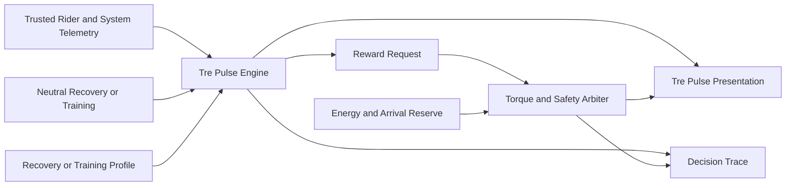

# Tre Pulse Engine

> **Preserve. Regulate. Earn.**

Tre Pulse is Ferrous Drive's shared visual, behavioural, range, and reward language.
The Tre Pulse Engine turns trusted rider and system data into progress, milestones,
earned assistance, and clear rider feedback across Neutral, Recovery, and Training.

## Status

| Area | Status |
|---|---|
| Architecture | Proposed |
| Rider-facing name | Selected |
| Three-mode model | Proposed |
| Recovery behaviour | Proposed |
| Training behaviour | Proposed |
| Golden Streak | Proposed |
| Battery-aware reward arbitration | Proposed |
| Simulation | Not started |
| Rider validation | Not started |

> [!NOTE]
> Tre Pulse is an interaction and behavioural-control subsystem. It does not
> override braking, battery protection, motor limits, telemetry trust, or safe
> arrival-reserve requirements.

---

## 1. Purpose

Tre Pulse gives Ferrous Drive one simple mental model for a technically complex
system.

It connects:

- Three rider modes: Neutral, Recovery, and Training
- Three visual segments: state, progress, and reward
- Three range layers: journey, reserve, and contingency
- Three physical battery layers: `7 + 6 + 7`

The exact meaning of each segment changes with context, but the interaction
pattern remains consistent:

```text
Understand the current state
        ↓
See progress or remaining capacity
        ↓
Know what happens next
```

Tre Pulse does not replace detailed telemetry. It provides an immediate rider
interpretation while full values remain available to diagnostics, simulation,
and ride analysis.

---

## 2. Design Principles

### Rider first

Tre Pulse rewards rider behaviour without taking control away from the rider.
Positive assistance remains pedal-assist based, and braking always has priority.

### Simple outside, rigorous inside

The rider sees three understandable segments. Internally, every state change is
supported by trusted telemetry, explicit rules, energy constraints, and a
decision trace.

### Earned assistance

Recovery and Training may unlock assistance through qualifying rider behaviour.
Assistance is contextual and earned rather than selected as a conventional
power level.

### Safety before reward

An earned reward may be shortened, delayed, or constrained. It must never
bypass braking, battery, thermal, motor, controller, or arrival-reserve limits.

### Sports-science-informed, experimentally implemented

Recovery and Training concepts are cross-checked against established endurance
training practices, including relative training zones, time in zone, Critical
Power, W-prime concepts, autoregulation, and HRV-informed readiness.

These principles shape the physiological intent. Ferrous Drive scoring,
assistance ratios, reward curves, durations, and Golden Streak mechanics remain
project-specific parameters requiring simulation and rider validation.

---

## 3. System Context



The Tre Pulse Engine owns:

- Progress accumulation
- Grace and decay behaviour
- Milestone locking
- Completion detection
- Reward eligibility
- Consecutive-cycle streaks
- Golden Streak state
- Rider-facing Tre Pulse state
- Reward requests and explanations

The Tre Pulse Engine does not own:

- Brake detection or regenerative braking control
- Motor commutation
- Battery protection
- Motor or controller thermal protection
- Telemetry validation
- Final torque arbitration
- Legal speed or power limits

---

## 4. Three Operating Modes

### Neutral

**Intent:** Preserve natural cycling.

Tre Pulse communicates:

1. Rider contribution
2. Drive and energy state
3. Battery range or regenerative flow

Neutral has no accumulation or earned-reward cycle.

Positive assistance is limited to validated compensation for penalties
introduced by Ferrous Drive, such as direct-drive drag and added-system mass.
Rider-triggered regenerative braking remains available.

### Recovery

**Intent:** Regulate a personalized Zone 2 workload.

Tre Pulse communicates:

1. Recovery compliance
2. Physiological stability and progress
3. Reward readiness or active support

Recovery targets are relative to the rider's configured physiology:

- Power Zone 2 relative to FTP or Critical Power
- Heart-rate Zone 2 relative to the selected HR model
- First threshold when a reliable LT1 or VT1 estimate is available

Recovery begins with a `1.0:1` rider-to-motor assistance ratio. Trusted HRV,
heart-rate, power, and drift trends may progressively permit assistance up to
`1.2:1` when fatigue or reduced readiness is detected.

HRV adjusts the permitted assistance envelope. HRV does not directly command
motor torque.

### Training

**Intent:** Perform structured work and earn bounded assistance.

Tre Pulse communicates:

1. Work accumulated
2. Secured milestones
3. Earned reward and remaining duration

Training is a container for workout profiles. Initial profile concepts include:

- Tempo Tailwind
- Anaerobic Shield

During qualifying work, no earned reward assistance is active. Required
system-penalty compensation may remain available. Completing the configured
work unlocks temporary assistance while valid pedalling continues.

---

## 5. Shared Behaviour Cycle

Recovery and Training use the same configurable cycle:

```text
Idle
    ↓
Qualifying
    ↓
Accumulating
    ↓
Milestone Locked
    ↓
Reward Ready
    ↓
Reward Active
    ↓
Cycle Complete
```

Road or signal interruptions may introduce:

```text
Grace
Paused
Decaying
Constrained
Resetting
Faulted
```

### Qualifying condition

A profile defines what counts as valid progress, for example:

- Remaining inside a relative Zone 2 envelope
- Accumulating time inside a sweet-spot power band
- Completing a qualifying high-power effort
- Maintaining required cadence or torque behaviour

### Accumulation

The profile defines:

- Entry commitment
- Accumulation rate
- Grace duration
- Decay rate
- Milestone thresholds
- Locked milestone floors
- Completion threshold
- Reset rules

### Reward

The profile defines:

- Requested assistance ratio or power
- Minimum rider contribution
- Ramp-in time
- Reward duration
- Ramp-out time
- Cancellation conditions
- Energy cost
- Golden duration multiplier

---

## 6. Tre Pulse Segment Meaning

The three display segments are contextual rather than permanently mapped to
one metric.

### Progress presentation

```text
Segment 1
    First milestone

Segment 2
    Second milestone

Segment 3
    Completion and reward readiness
```

### Reward presentation

During an active reward, the segments become a countdown:

```text
Three segments
    Reward has substantial duration remaining

Two segments
    Reward is progressing

One segment
    Reward is approaching completion
```

### Battery-range presentation

```text
Segment 1
    Planned journey energy

Segment 2
    Preferred arrival reserve

Segment 3
    Contingency margin
```

Suggested range interpretation:

| Active segments | Meaning | Behaviour |
|---:|---|---|
| 3 | Journey, reserve, and contingency protected | Full flexibility |
| 2 | Journey and minimum reserve protected | Optional rewards may be constrained |
| 1 | Journey completion is at risk | Destination energy takes priority |
| Pulsing final segment | Current plan is insufficient | Rider or route plan must change |

Battery Tre Pulse is based on predicted journey energy, not raw state of
charge alone.

---

## 7. Golden Streak

Tre Pulse rewards repeated consistency as well as individual completion.

### Unlock rule

```text
Complete valid cycle 1
    Streak = 1

Complete valid cycle 2
    Streak = 2

Accumulate valid cycle 3
    Tre Pulse progressively turns gold

Complete valid cycle 3
    Golden Super Reward unlocked
```

### First-generation Super Reward

The Super Reward increases duration rather than peak assistance.

```text
Normal reward
    1× configured duration

Golden Super Reward
    2× configured duration

Future validated option
    Up to 3× configured duration
```

Peak assistance remains bounded by the profile's validated limit.

### Golden presentation

During the third consecutive accumulation:

- Secured segments gradually change to gold
- The active segment pulses as completion approaches
- All three segments become solid gold at completion
- The reward begins with one synchronized pulse
- The three segments then count down the extended reward

The visual treatment must be original to Ferrous Drive and must remain readable
without relying on colour alone.

### Streak preservation

A safety-related interruption should pause rather than break a streak where
possible.

Examples include:

- Braking for traffic
- Red lights and junctions
- Battery or thermal constraints
- Temporary low-confidence telemetry
- Route conditions requiring safe interruption

### Streak termination

A streak may end when:

- The qualifying objective is abandoned
- The Recovery envelope is persistently exceeded
- A Training commitment condition fails
- The rider changes mode or profile
- The activity ends before completion

Unsafe riding must never be encouraged to preserve a streak.

---

## 8. Recovery Behaviour

### Baseline support

```text
Normal baseline
    1.0:1

Moderate validated fatigue
    Progress toward 1.1:1

Persistent validated fatigue
    Progress toward 1.2:1

HRV unavailable or unreliable
    Fall back toward 1.0:1
```

The actual request remains capped by:

- Remaining road demand
- Valid pedalling
- Battery arrival reserve
- Drive capability
- Motor, controller, and battery limits
- Brake state
- Signal confidence

### Recovery progress

Progress accumulates when:

- Rider power remains inside the configured Recovery envelope
- Heart-rate response remains appropriate
- Required telemetry is trusted
- Valid pedalling continues

If power remains appropriate but heart rate or HRV indicates excess internal
load, Ferrous Drive may increase assistance within the `1.0:1` to `1.2:1`
envelope or allow speed to fall.

### Recovery reward

The first implementation should treat completion as sustained access to the top
of the normal Recovery envelope rather than introducing a higher unvalidated
power ceiling.

A normal Recovery reward may therefore provide:

```text
Assistance ceiling
    Up to 1.2:1

Duration
    Configured and bounded

Golden duration
    Initially 2× normal duration
```

---

## 9. Training Behaviour

### Work phase

During work accumulation:

- The rider performs the qualifying training work
- Earned reward assistance remains inactive
- Valid system-penalty compensation may remain active
- Progress is visible through Tre Pulse
- Road-safety interruptions use grace or pause behaviour

### Reward phase

Completing the work unlocks bounded support:

- Valid pedalling remains required
- Assistance ramps in and out smoothly
- Braking immediately cancels positive torque
- Battery reserve may shorten or defer the reward
- Reward delivery is recorded in the decision trace

### Training profiles

Each profile supplies configuration and scoring behaviour to the shared engine.

Example profile structure:

```text
Profile identity
Qualifying workload
Accumulation rules
Grace and decay
Milestone floors
Completion target
Reward request
Golden duration rule
```

Profile-specific values remain provisional until simulation and rider testing.

---

## 10. Energy and Reward Arbitration

Tre Pulse may declare a reward earned, but only the torque and energy arbiters
may authorize delivery.

```text
Reward earned
        ↓
Estimate reward energy
        ↓
Predict destination arrival energy
        ↓
Apply battery and hardware constraints
        ↓
Deliver full, shortened, deferred, or unavailable reward
```

### Reward outcomes

```text
Full
    Reward delivered as configured

Shortened
    Reward duration reduced to protect reserve

Deferred
    Reward remains earned but cannot currently be delivered

Unavailable
    Reward cannot be delivered safely in the current activity
```

The rider-facing interface must explain constrained reward delivery rather than
silently changing behaviour.

### Priority order

```text
1. Braking and fault handling
2. Battery, motor, and controller protection
3. Valid PAS and telemetry state
4. Destination arrival reserve
5. Physiological mode objective
6. Earned reward delivery
7. Journey speed
```

---

## 11. Relationship to Regenerative Braking

Regenerative braking is independent from Tre Pulse reward logic.

- Brake intent always overrides positive assistance
- Regen remains available in all compatible modes
- Braking pauses or cancels active reward torque
- Safety-related braking does not automatically break a streak
- Regen energy may improve future reward availability through the battery budget
- The behavioural engine cannot command braking

---

## 12. Signal Trust and Degraded Behaviour

Tre Pulse consumes trusted domain state rather than raw sensor values.

Required inputs may include:

- Rider power or rider-power estimate
- Heart rate
- HRV readiness and confidence
- Cadence and pedalling validity
- Brake state
- Route and journey state
- Battery energy and reserve prediction
- Motor and controller capability

When a required signal becomes degraded:

- Progress pauses rather than being guessed
- Reward assistance falls back conservatively
- HRV adaptation returns toward baseline
- Existing secured milestones are preserved when possible
- Safety and energy constraints remain authoritative

---

## 13. Explainability and Logging

Every Tre Pulse transition should be explainable.

Suggested event data:

```text
Mode and training profile
Previous and new Tre Pulse state
Qualifying condition result
Accumulated progress
Secured milestones
Streak count
Recovery assistance ratio
Reward request
Reward outcome
Golden status
Battery reserve before and after reward estimate
Constraint reason
Signal confidence
```

Example reason strings:

```text
Recovery progress paused: heart-rate response above configured envelope
Reward shortened: preferred arrival reserve would be exceeded
Golden Streak preserved: safety braking interruption
Training milestone locked: cumulative target reached
```

---

## 14. Proposed Domain Types

The following types illustrate the architecture and are not frozen APIs.

```rust
pub enum RideMode {
    Neutral,
    Recovery,
    Training,
}

pub enum TrePulseState {
    Idle,
    Accumulating,
    Grace,
    Decaying,
    MilestoneLocked,
    RewardReady,
    Rewarding,
    GoldenAccumulation,
    SuperRewardReady,
    SuperRewardActive,
    Constrained,
    Paused,
    Resetting,
    Faulted,
}

pub enum RewardDelivery {
    Full,
    Shortened,
    Deferred,
    Unavailable,
}

pub struct TrePulseProgress {
    pub accumulated_units: u32,
    pub completed_segments: u8,
    pub consecutive_cycles: u8,
    pub state: TrePulseState,
}

pub struct RewardRequest {
    pub assistance_ratio: Option<f32>,
    pub power_watts: Option<f32>,
    pub duration_seconds: u32,
    pub golden: bool,
}
```

The final implementation should prefer fixed-point or strongly typed units where
appropriate for deterministic embedded behaviour.

---

## 15. First-Generation Scope

### Included

- Three rider modes
- Three Tre Pulse segments
- Shared accumulation and reward engine
- Configurable qualifying conditions
- Grace and decay
- Milestone locking
- Recovery assistance from `1.0:1` to `1.2:1`
- Training work and reward separation
- Battery-aware reward authorization
- Three-cycle Golden Streak
- Double-duration Golden Super Reward
- Explainable state transitions
- Simulation-first implementation

### Deferred

- Triple-duration Super Reward
- Live machine-learned scoring rules
- Automatic profile generation
- Clinical or coaching claims
- Route-predictive reward timing
- Cloud leaderboards
- Social competition
- Production UI animations
- Final physiological thresholds

---

## 16. Validation Plan

### State-machine validation

- [ ] Qualifying progress accumulates correctly
- [ ] Grace and decay are deterministic
- [ ] Locked milestones cannot regress unexpectedly
- [ ] Reset behaviour is profile-specific and explainable
- [ ] Mode changes stop or preserve state according to policy

### Recovery validation

- [ ] Relative Zone 2 configuration is explicit
- [ ] Baseline assistance starts at `1.0:1`
- [ ] HRV adaptation never exceeds `1.2:1`
- [ ] Invalid HRV returns the system toward baseline
- [ ] Heart-rate drift influences support without issuing direct torque
- [ ] Arrival reserve overrides adaptive support

### Training validation

- [ ] Earned assistance remains inactive during qualifying work
- [ ] Road interruptions use grace rather than unsafe incentives
- [ ] Assistance ramps are smooth
- [ ] Minimum rider contribution remains enforced
- [ ] Braking cancels positive reward torque

### Golden Streak validation

- [ ] Three consecutive completions are required
- [ ] Third-cycle gold presentation is understandable
- [ ] Safety interruptions do not unfairly break the streak
- [ ] Golden reward increases duration, not peak assistance
- [ ] Battery constraints shorten or defer safely
- [ ] The rider is informed when delivery is constrained

### Tre Pulse comprehension

- [ ] Segment meanings are understandable without documentation
- [ ] Colour is not the only information channel
- [ ] Battery states are distinguishable from reward states
- [ ] Daylight and night visibility are acceptable
- [ ] Fault presentation is unambiguous

---

## 17. Open Questions

1. Final Recovery Zone 2 model and configuration format
2. HRV metric, sampling method, and confidence rules
3. Normal Recovery reward duration
4. Training profile configuration schema
5. Golden Streak persistence across pauses or activities
6. Whether a deferred reward can carry into a later ride
7. Battery energy reserved for normal and Golden rewards
8. Exact colour, pulse, and non-colour accessibility treatment
9. How Tre Pulse range state interacts with active progress display
10. Whether milestone floors are shared or profile-specific
11. How external head units receive Tre Pulse state
12. Which state changes require rider notification
13. How reward tuning is promoted from simulation into firmware

---

## 18. Proposed Feature Statement

Tre Pulse is Ferrous Drive's shared visual, behavioural, range, and reward
engine.

It uses three simple segments to translate trusted rider and system data into
an understandable interaction across Neutral, Recovery, and Training.

In Recovery, Tre Pulse rewards physiological discipline and regulates
assistance from a conservative `1.0:1` baseline toward a maximum `1.2:1` when
trusted HRV, heart-rate, and power trends indicate fatigue.

In Training, Tre Pulse converts qualifying work into secured milestones and
bounded earned assistance.

Completing three valid cycles consecutively unlocks the Golden Streak, which
extends reward duration without increasing peak assistance beyond validated
limits.

All reward behaviour remains subordinate to braking, battery protection,
hardware limits, telemetry confidence, and destination arrival reserve.

### Core principle

> Measure the rider. Make progress visible. Reward the right behaviour.
