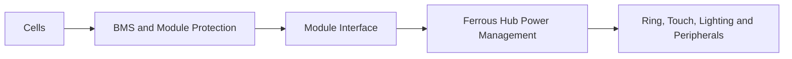

# Energy Modules

## Purpose

Energy modules supply Ferrous Drive without defining its architecture.

The Ferrous Hub consumes power through a stable module boundary. Different cell chemistries, capacities, form factors, and BMS implementations may be evaluated without rewriting ride behaviour or the rider interface.

## Current module candidates

| Module | Role | Current status |
|---|---|---|
| P2600 Power Pack XL | Immediate lighting energy source | Purchased and available |
| P60B 2S1P | Compact experimental module | Planned |
| P60B 2S2P | Extended-capacity experimental module | Planned |
| Future main drive pack | Full drive-system energy source | Deferred |
| Reclaimed ES2 cells | Early uncertainty-reduction experiment | Deprioritized |

## Architectural boundary



The module owns:

- cell chemistry;
- series and parallel arrangement;
- cell balancing;
- over-voltage protection;
- under-voltage protection;
- short-circuit and over-current protection;
- module thermal limits;
- safe charging requirements.

The Hub owns:

- system power-state decisions;
- load coordination;
- optional module telemetry consumption;
- destination and operating reserve policy;
- subsystem enable and disable requests;
- user-visible power state.

## Provisional electrical contract

The production values remain open. Every prototype module must declare:

```text
Nominal voltage
Operating voltage range
Maximum continuous current
Maximum peak current and duration
Connector and polarity
Charging method
BMS behaviour
Temperature limits
Available telemetry
Safe shutdown behaviour
```

No module may rely on undocumented compensation or scaling conventions.

## Telemetry

Telemetry levels should remain optional:

```text
Level 0
    Power only

Level 1
    Module-present indication

Level 2
    Voltage and current

Level 3
    BMS state and temperatures

Level 4
    Cell-level diagnostic data
```

Ferrous Hub V0.1 must operate with Level 0 or Level 1 capability.

INA226 may provide useful rail-level measurements for experiments, but is not required for the first Hub demonstration.

## P60B experimental modules

### 2S1P

Provisional role:

- compact lighting and Hub research;
- connector and enclosure learning;
- power-conversion validation;
- module-identification experiments.

### 2S2P

Provisional role:

- longer runtime;
- cold-weather testing;
- load-step and voltage-sag experiments;
- comparison against the commercial lighting pack.

Capacity and runtime values remain assumptions until the selected cells, operating limits, converter efficiency, and load profile are measured.

## Safety invariants

1. Every cell-based module requires appropriate protection.
2. The Hub must not substitute for cell-level protection.
3. Reverse polarity must not create a hazardous state.
4. The interface must prevent accidental contact with exposed energized conductors.
5. A disconnected telemetry link must not disable fundamental module protection.
6. Module removal must lead to a deterministic Hub state.
7. Unknown modules must be rejected or handled conservatively.
8. Experimental modules must be clearly labelled and traceable.

## Validation ladder

```text
Documented
    ↓
Electrical inspection
    ↓
Current-limited bench test
    ↓
Converter and load test
    ↓
Protected enclosure test
    ↓
Static bicycle test
    ↓
Controlled road test
```

## Deferred decisions

- production connector family;
- hot-plug support;
- production module-identification protocol;
- charging ownership;
- main drive-pack voltage;
- isolation requirements between traction and low-voltage domains;
- final BMS telemetry transport.
