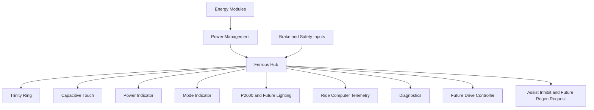
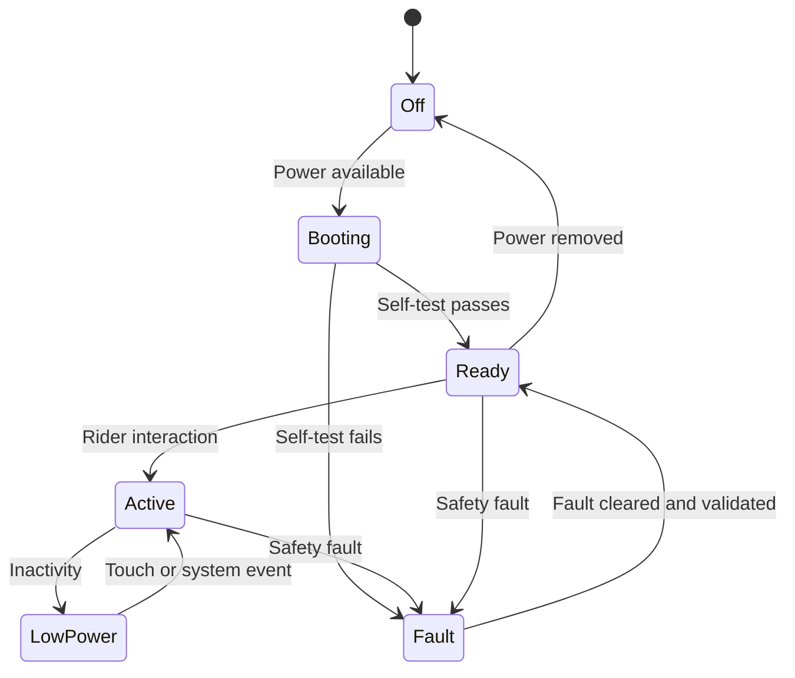

# Ferrous Hub

## Purpose

Ferrous Hub is the central orchestration component of Ferrous Drive.

It provides a stable home for rider-facing behaviour while keeping battery chemistry, board drivers, and peripheral implementations behind explicit interfaces.

## System context



## Responsibilities

Ferrous Hub owns:

- system state and mode orchestration;
- Tre Pulse accumulation and reward state;
- Trinity Ring semantic output;
- touch-event interpretation;
- lighting-mode coordination;
- telemetry aggregation;
- diagnostic state;
- power-state requests;
- peripheral health monitoring;
- future drive-controller command boundaries.

Ferrous Hub does not own:

- cell balancing;
- cell-level over-current protection;
- battery chemistry selection;
- final motor commutation;
- route navigation;
- detailed ride recording;
- post-ride analytics.

## Software boundary

```text
Board-independent core
├── ride modes
├── Tre Pulse
├── reward state
├── lighting policy
├── interaction state machine
├── power policy
├── telemetry model
└── fault policy

Board support
├── LED driver
├── touch driver
├── timers and monotonic clock
├── BLE and future ANT+ transport
├── UART adapter
├── future CAN adapter
├── voltage and current sensing
└── board power control
```

The board-independent core should remain deterministic, `no_std`, heapless where practical, and testable on a host computer.

## Initial hardware

Ferrous Hub V0.1 targets:

| Element | Initial choice | Status |
|---|---|---|
| Development board | nRF54L15 DK | Primary |
| Behaviour display | 24-LED WS2812B or SK6812 ring | Required |
| Local input | Capacitive-touch sensor | Required |
| Power indication | Dedicated LED | Required |
| Mode indication | Dedicated LED | Required |
| Power monitor | INA226 | Optional |
| Lighting peripheral | P2600 kit | Available |
| Compact alternative | Feather nRF52832 | Investigate |

## Interfaces

### Energy module

The Hub consumes a protected power input and optional module telemetry. It must not require knowledge of cell chemistry for normal behavioural operation.

### Trinity Ring

The Hub outputs semantic display states, not frame-by-frame LED knowledge from core logic.

Example boundary:

```rust
pub enum RingIntent {
    Off,
    Boot,
    Ready,
    Progress { completed: u8, total: u8 },
    RewardReady,
    RewardActive,
    GoldenReward,
    LightingState,
    Warning,
    Fault,
}
```

### Touch input

Board code reports normalized gestures to core logic:

```rust
pub enum TouchGesture {
    Tap,
    DoubleTap,
    TripleTap,
    LongPress,
}
```

Gesture-to-function mapping remains policy and must not be embedded inside the sensor driver.

### Lighting

Lighting control is initially a separate integration track. The P2600 remains usable without Ferrous Hub.

The Hub may later own:

- user lighting intent;
- mode selection;
- visible state feedback;
- peripheral-health reporting;
- a future isolated lighting-control interface.

### Ride computer

The ride computer owns:

- navigation;
- ride recording;
- detailed metrics;
- post-ride data export.

Ferrous Hub may broadcast or log compact state and event data, but must not depend on a permanently visible phone or numeric dashboard.

## State model



Behavioural sub-states for Neutral, Recovery, Training, Tre Pulse, and future commute assistance remain separate from hardware lifecycle state.

## Fault priorities

Priority order:

```text
1. Electrical safety
2. Brake and assist inhibit
3. Hardware protection
4. Destination energy reserve
5. Ride-mode intent
6. Reward delivery
7. Visual flourish
```

## V0.1 acceptance criteria

- [ ] nRF54L15 DK boots into a deterministic lifecycle state.
- [ ] Trinity Ring can render semantic states through a driver boundary.
- [ ] Touch input produces normalized gestures.
- [ ] Power and mode indicators operate independently of the ring.
- [ ] Core state transitions run in host tests.
- [ ] Lighting-control intent can be demonstrated without modifying P2600 internals.
- [ ] Optional INA226 integration cannot block basic operation.
- [ ] Fault state overrides animations and interaction.
- [ ] Board-specific code remains isolated from core behaviour.
