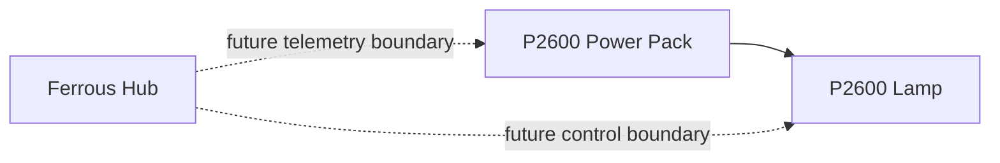

# P2600 Lighting Peripheral

## Role in Ferrous Drive

The P2600 loaded kit is the first serious Ferrous Drive peripheral.

It solves the immediate winter-lighting requirement while allowing Ferrous Hub, Trinity Ring, and energy-module development to proceed without making safe commuting dependent on an unfinished battery experiment.

## Why it was selected

The kit provides:

- a complete high-output lighting solution;
- a supplied battery;
- a charger;
- a mount;
- a remote;
- immediate standalone operation.

The purchase removes the following experimental sequence from the winter-lighting critical path:

```text
Disassemble reclaimed battery
    ↓
Validate unknown cells
    ↓
Build protected pack
    ↓
Build boost conversion
    ↓
Build charging solution
    ↓
Build enclosure
    ↓
Validate on bicycle
```

## Architectural position



The P2600 must remain useful as a standalone product. Ferrous Hub integration must not make the lamp dependent on experimental Hub firmware for basic safe operation.

## V0.1 integration scope

In scope:

- document lamp and battery interfaces;
- represent lighting state on Trinity Ring;
- use capacitive touch to demonstrate lighting intent;
- define a safe future control boundary;
- log lighting-state transitions in Hub telemetry.

Out of scope:

- opening or modifying the commercial battery;
- replacing the supplied BMS;
- bypassing the supplied charger;
- relying on undocumented connector pinouts;
- making the commercial lamp unsafe or non-standalone;
- connecting the lamp directly to a future traction pack without validated conversion and protection.

## Future possibilities

- isolated lighting-control interface;
- lighting-state diagnostics;
- shared main-pack supply downstream of validated conversion;
- destination-energy-aware brightness policy;
- low-voltage rail instrumentation;
- unified touch interaction.

Every future electrical integration requires connector, voltage, current, isolation, and failure-behaviour validation.

## Acceptance criteria

- [ ] P2600 remains immediately usable without Ferrous Hub.
- [ ] Ferrous Hub represents lighting intent independently from lamp internals.
- [ ] Trinity Ring displays lighting-state feedback.
- [ ] Touch input can exercise the prototype lighting state machine.
- [ ] No undocumented electrical modification is required for V0.1.
- [ ] Future integration questions are captured as explicit issues.
