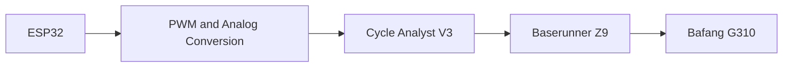
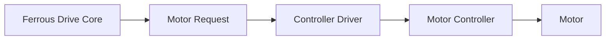
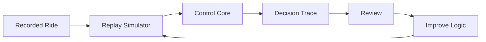
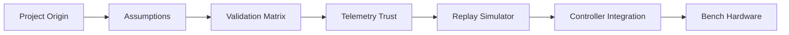
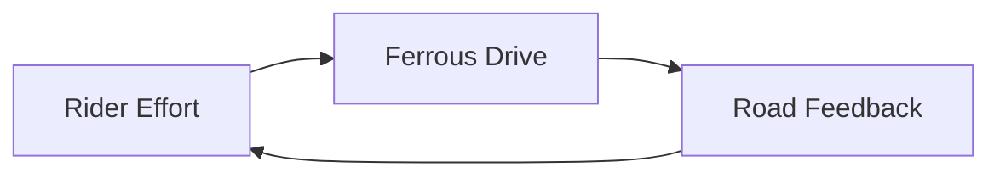

> 📚 [README](../README.md) · 🗺️ [Roadmap](roadmap.md) · 📐 [Architecture](architecture.md) · 🧠 assumptions.md · ✅ validation_matrix.md · 📜 decision_log.md

# Project Origin

****> _Measure effort > > > Preserve momentum > > > Learn from every ride_****

**Estimated reading time:** 10 minutes

## TL;DR

Ferrous Drive started as a personal Rust learning project and an experiment in making e-bike assistance more rider-aware, transparent, and testable.

The original idea was to run a Rust control core on an ESP32 and send assistance requests to a Baserunner controller through a Cycle Analyst V3. Early reviews showed that the hardest problems were not PWM generation or hardware integration. The harder problems were deciding when telemetry could be trusted, explaining why assistance decisions were made, and validating behaviour without testing every change on a moving bike.

That led to three important changes:

1. The Cycle Analyst is no longer a required part of the architecture. Ferrous Drive now aims to produce controller-independent motor requests that can be translated by hardware-specific drivers. Direct Baserunner communication remains an unverified possibility, not a supported feature.
2. Sensor data will carry freshness and quality information rather than being treated as simply present or missing.
3. Development will begin with deterministic ride replay and simulation before moving to controller integration or physical hardware.

The current direction focuses on:

- Rider-effort-aware assistance
- Predictable and explainable control decisions
- Graceful handling of stale or missing sensors
- Separation between motion states and operating constraints
- Controller-independent architecture
- Replayable simulation and regression testing
- Evidence-driven hardware integration

Ferrous Drive is still experimental. Important details such as the Baserunner protocol, thermal behaviour, sensor timing, battery modelling, and real-world ride quality remain to be validated.

The project workflow is intentionally simple:

```text
Understand It
    ↓
Simulate It
    ↓
Validate It
    ↓
Ride It
```

Ferrous Drive exists both to build a useful open-source e-bike control platform and to provide a practical, enjoyable way to learn Rust, embedded systems, simulation, and control-system design.

---

## Why Ferrous Drive Exists

Ferrous Drive began as a personal development project combining several interests:

- Learning Rust through a practical embedded-systems project
- Exploring e-bike control and rider-assistance behaviour
- Applying sports-science concepts to electric assistance
- Building a modular controller that can tolerate unreliable sensors
- Learning how simulation can reduce risk before hardware testing
- Contributing something useful to the open-source community

The project is intended to be technically meaningful while remaining enjoyable to build.

It is not intended to replace every part of an existing motor controller. Instead, Ferrous Drive aims to sit above the low-level motor-control layer and make rider-oriented assistance decisions.

```text
Rider Effort
      +
Vehicle Telemetry
      ↓
Ferrous Drive
      ↓
Assist Request
      ↓
Motor Controller
```

At its core, Ferrous Drive explores a simple question:

> Can an e-bike provide assistance that responds intelligently to rider effort, preserves momentum, protects the machine, and remains understandable when something goes wrong?

---

## The Original Idea

The initial project was named:

```text
ebike-os-core
```

Its goal was to create a highly modular e-bike control system written in Rust.

The original concept focused on:

- Watts-per-kilogram assistance profiles
- Smooth launch behaviour
- Controlled acceleration and deceleration
- Rider-effort matching
- Mechanical and thermal protection
- Wireless power, cadence, and heart-rate inputs
- Graceful fallback when wireless sensors disappear
- Platform-independent control logic
- Future deployment on an ESP32

Three initial ride profiles were proposed:

- `Sport`
- `Commute`
- `Recovery`

The intention was not simply to provide fixed assistance levels. Each profile would change how assistance responds to the rider while remaining subject to shared safety constraints.

The early design also introduced a freewheeling decay concept. Instead of immediately cutting assistance when pedalling stops, motor support would reduce gradually for a short period.

The idea was to preserve useful momentum and encourage smooth rider re-engagement. This remains a design hypothesis that must be evaluated through simulation and later rider testing.

---

## Why Rust

Rust was chosen primarily as a development and learning goal, but the language also fits the intended architecture.

The project can benefit from Rust features such as:

- Strong static typing
- Explicit handling of missing values
- Clear ownership boundaries
- Exhaustive enum matching
- Suitability for embedded development
- Support for hardware-independent core logic
- A strong testing and tooling ecosystem

The first prototype used `Option<T>` for wireless measurements so missing power, cadence, or heart-rate data could be represented without sentinel values.

That was a useful starting point, but later review revealed that sensor presence alone was not enough.

Real telemetry can be present while also being:

- Old
- Frozen
- Implausible
- Delayed
- Internally inconsistent
- Unsafe to use for a control decision

This discovery led to the planned telemetry trust model.

---

## The First Prototype

The first code was developed through an informal, AI-assisted process using Google Gemini.

The early source structure was:

```text
src/
├── constants.rs
├── types.rs
├── vehicle_spec.rs
├── profiles.rs
├── state_machine.rs
└── main.rs
```

The project used a domain-oriented structure intended to separate physical rules from hardware-specific code.

### Initial module responsibilities

| Module | Initial responsibility |
|---|---|
| `constants.rs` | Shared thresholds and environmental values |
| `types.rs` | Telemetry, ride profiles, slew configuration, and motion states |
| `vehicle_spec.rs` | Rider, bicycle, motor, and battery specifications |
| `profiles.rs` | Sport, Commute, and Recovery tuning |
| `state_machine.rs` | Motion-state transitions and assist calculations |
| `main.rs` | Prototype entry point using mock telemetry |

The initial motion states were:

```text
Stationary
Launching
Cruising
Coasting
```

The prototype also introduced a fallback hierarchy:

```text
Human Power
    ↓
Cadence
    ↓
Limited Rolling Assistance
```

This was intended to prevent a wireless sensor dropout from immediately disabling all assistance.

The early code demonstrated design intent rather than production readiness. It had not yet been validated through realistic replay, bench testing, or hardware integration.

---

## Original Hardware Concept

The first hardware architecture used the Grin Cycle Analyst V3 as an intermediary between the ESP32 and the motor controller.



The proposed design included:

- ESP32-generated PWM
- An RC low-pass filter
- 3.3 V to 5 V level conversion
- Connection to the Cycle Analyst auxiliary input
- Cycle Analyst processing of brake and thermal behaviour
- A Baserunner Z9 driving a Bafang G310 geared hub motor

This approach provided a known intermediary but introduced several additional dependencies:

- Analog scaling
- PWM generation
- Filter tuning
- Electrical noise considerations
- Additional wiring
- Dependence on a display-oriented device
- Configuration split across several devices

The Cycle Analyst architecture was therefore useful as a starting hypothesis, not a final decision.

---

## The First Major Pivot

During the early design work, an alternative architecture was identified:

> A display-free, battery-embedded Baserunner installation may support direct digital communication without requiring the Cycle Analyst as an intermediary.

This changed the conceptual architecture from:

```text
Ferrous Drive
      ↓
PWM and Analog Conversion
      ↓
Cycle Analyst V3
      ↓
Baserunner
```

to:

```text
Ferrous Drive
      ↓
Controller-Independent Motor Request
      ↓
Controller Driver
      ↓
Baserunner
```



This pivot removed the mandatory Cycle Analyst dependency from the architecture.

It did **not** prove that direct digital control is available, documented, reliable, or safe.

The new direction remains dependent on verifying:

- The exact Baserunner model and firmware
- Electrical signalling
- Connector pinout
- Available protocol documentation
- Supported command types
- Command units and ranges
- Message integrity and checksums
- Acknowledgement behaviour
- Update rates
- Timeout and watchdog behaviour
- Available telemetry
- Behaviour after malformed or missing commands
- Continued operation of independent controller and battery protections

Until those questions are answered, direct Baserunner control remains an architectural hypothesis rather than a supported feature.

---

## What the Early Review Revealed

The initial code was readable and reasonably modular, but critical review identified several hidden assumptions.

### Telemetry was too idealized

The original `Telemetry` structure treated measurements as though they were captured at the same moment.

In reality, different data sources may update at different rates.

Examples include:

- Motor-controller telemetry
- Wheel speed
- Wireless power
- Cadence
- Heart rate
- Battery voltage
- Motor temperature

A control loop may therefore process a mixture of fresh and old measurements.

### `Option<T>` was not enough

The original telemetry model represented values as either present or absent:

```rust
Option<f32>
```

This cannot distinguish between:

- Fresh data
- Aging data
- Stale data
- Implausible data
- A disconnected sensor

The architecture therefore evolved toward timestamped, quality-bearing measurements.

A future measurement type may carry:

```text
Value
Capture Time
Quality
Source
```

The exact implementation remains part of the telemetry trust-model work.

### Watts per tick depended on loop frequency

The first slew configuration expressed power changes in watts per tick.

This meant assistance behaviour would change if the control-loop frequency changed.

The revised direction uses watts per second and applies the elapsed time explicitly.

```text
Power Change
    =
Configured Rate
    ×
Elapsed Time
```

This makes behaviour easier to compare between desktop simulation and embedded execution.

### Ride state and constraints needed separation

The motion states describe what the bicycle and rider are doing:

```text
Stationary
Launching
Cruising
Coasting
```

Thermal rollback, battery limits, speed limits, and controller faults describe restrictions on assistance.

They are not additional motion states.

Combining both concepts inside one finite-state machine would eventually create an unmanageable number of state combinations.

The revised architecture therefore separates motion-state modelling from constraint handling.

### Scalar output was not sufficiently explainable

The first controller interface returned a target watt value.

That answer did not explain:

- Which assistance source was selected
- What the unconstrained demand was
- Which limits were active
- Why the final power was reduced
- Whether stale or missing telemetry affected the result

The revised design introduces an explainable assist-decision structure rather than returning only a number.

An assist decision may eventually include:

```text
Motion State
Assistance Source
Requested Assistance
Active Constraints
Final Motor Request
Decision Reason
```

### Vehicle specifications were not behavioural models

The first vehicle profile contained:

- Rider mass
- Bicycle mass
- Peak torque
- Maximum power
- Battery voltage
- Battery capacity
- Thermal thresholds

These values described hardware and tuning choices, but they did not provide a complete behavioural model.

Range and energy prediction may eventually require:

- Payload mass
- Road gradient
- Aerodynamic drag
- Rolling resistance
- Battery internal resistance
- Battery state of charge
- Battery temperature
- Motor efficiency
- Controller efficiency
- Drivetrain efficiency

These elements remain future work and should not be represented as validated facts until supported by evidence.

### Safety required more than software structure

The early project description used terms such as safety interlocks and thermal protection, but a modular architecture alone does not establish safe behaviour.

Important failure cases still need to be defined and tested, including:

- Missing speed telemetry
- A frozen power-meter value
- Brake-signal loss
- Controller communication loss
- A command path stuck at a non-zero value
- Restart or brownout while moving
- Invalid temperature data
- Sensor disagreement
- Invalid elapsed-time values

These concerns led to the validation matrix, assumptions register, and safety-oriented development workflow.

---

## How the Architecture Evolved

The original model was approximately:

```text
Telemetry
    ↓
State Machine
    ↓
Target Power
```

The current architectural direction is:


This separates the system into distinct questions:

1. What measurements have been received?
2. Can those measurements be trusted?
3. What is the current motion state?
4. What assistance would the selected ride profile request?
5. What constraints reduce or inhibit that request?
6. Why was the final request produced?
7. How is that request translated for a particular controller?

This architecture is more involved than the first prototype, but each layer has a clearer responsibility.

The control core should ultimately remain independent of:

- BLE implementation details
- ANT+ implementation details
- ESP32 peripheral registers
- Baserunner message formats
- VESC message formats
- Desktop file formats

Those details belong at the boundaries around the core.

---

## Why Simulation Comes First

The project originally planned to test its control logic using recorded ride data before moving to ESP32 hardware.

Critical review strengthened that decision.

The target workflow is:



A replay simulator should eventually make it possible to:

- Reproduce unusual behaviour
- Compare ride profiles
- Test sensor dropouts
- Test stale measurements
- Inspect state transitions
- Inspect constraint activation
- Measure assistance decisions over time
- Run regression tests
- Compare simulated behaviour with later bench or road results

The simulator does not eliminate the need for hardware testing.

It provides a safer and more repeatable place to find control-logic problems before hardware becomes involved.

The intended debugging loop is:

```text
Observe Strange Behaviour
        ↓
Capture or Recreate Inputs
        ↓
Replay the Scenario
        ↓
Inspect the Decision Trace
        ↓
Change the Logic
        ↓
Replay Again
        ↓
Compare the Result
```

This is faster and more repeatable than trying to reproduce every issue on a physical bicycle.

---

## Why Project History Is Being Preserved

Ferrous Drive was created through conversation, experimentation, AI-assisted drafting, and human review.

That process created a risk of losing the reasoning behind the current design.

A repository containing only the latest code would not explain:

- Why the original CA3 architecture was proposed
- Why that architecture was later removed
- Which values came from hardware specifications
- Which values were guesses or placeholders
- Which ideas came from early AI-assisted prototyping
- Which ideas survived critical review
- Which assumptions remain unverified
- Why simulation precedes hardware work
- Why the state machine is intentionally limited to motion

The project therefore records several different forms of history:

| Document | Purpose |
|---|---|
| `project_origin.md` | Explains how and why the project began |
| `decision_log.md` | Records significant decisions and their reasoning |
| `assumptions.md` | Records what the project currently believes but has not proven |
| `validation_matrix.md` | Shows what has actually been designed, simulated, or tested |
| `CHANGELOG.md` | Records notable changes to project artefacts and behaviour |
| GitHub issues | Capture planned work and technical discussion |
| Pull requests | Capture implementation, review, and validation evidence |

The goal is not to preserve every AI conversation.

The goal is to preserve the useful engineering context that would otherwise disappear.

---

## Current Project Direction

Ferrous Drive is currently focused on five foundation areas.

### 1. Repository Foundation and Project Origin

Establish the repository structure, contribution process, project history, and decision trail.

### 2. Engineering Assumptions

Make important unknowns visible before those unknowns become embedded in source code.

### 3. Validation Matrix

Create a simple view of what is still an idea, what has been designed, what has been simulated, and what has been physically tested.

### 4. Telemetry Trust Model

Define how sensor presence, freshness, quality, plausibility, and fallback behaviour are represented.

### 5. Replay Simulator Foundation

Create a deterministic development environment for replaying ride data and inspecting assistance decisions without physical hardware.

These foundations come before controller-specific implementation.



---

## What Remains Unproven

The following areas remain open or unverified.

### Controller integration

- Direct Baserunner command support
- Digital protocol details
- Electrical interface
- Controller acknowledgement behaviour
- Controller watchdog behaviour
- Available controller telemetry
- Safe behaviour after communications loss

### Telemetry

- Sensor-specific freshness thresholds
- Plausibility ranges
- Power-meter update behaviour
- Cadence fallback behaviour
- Recovery after sensor reconnection
- Handling of frozen but plausible values

### Control behaviour

- Human-power filtering interval
- Cadence scaling
- Launch detection
- Launch exit criteria
- Zero-cadence debounce
- Freewheeling decay behaviour
- Simultaneous-constraint reporting
- Startup and restart arming

### Physical modelling

- Motor-temperature interpretation
- Thermal lag
- Battery internal resistance
- Battery state-of-charge estimation
- Motor and controller efficiency
- Aerodynamic drag
- Rolling resistance
- Gradient handling
- Drivetrain efficiency

### Validation

- Repeatable ride replay
- Golden regression datasets
- Bench-test setup
- Fault injection
- Comparison between simulation and real hardware
- Road-test entry criteria

These unknowns are intentional project inputs, not hidden defects in the documentation.

---

## Project Principles

Ferrous Drive currently follows these principles.

### Make assumptions visible

An undocumented assumption is likely to become a hidden defect.

### Separate facts from policies

Motor specifications, controller capabilities, safety limits, and ride-profile preferences are different concepts.

### Keep constraints out of the motion state machine

Motion state describes movement. Constraints describe what assistance is permitted.

### Make decisions explainable

A final motor request should include enough context to explain how it was produced.

### Normalize behaviour by time

Control behaviour should not depend accidentally on scheduler frequency.

### Simulate before connecting hardware

A moving bicycle should not be the first place a control algorithm is debugged.

### Preserve independent protections

Ferrous Drive should not replace or bypass brake cut-offs, battery-management protection, or motor-controller protection.

### Treat controller support as evidence-based

A controller is not supported until its interface and failure behaviour have been verified.

### Keep the project enjoyable

Engineering discipline should make the project easier to understand and contribute to, not turn a hobby project into paperwork for its own sake.

---

## Closing Perspective

Ferrous Drive began as a Rust learning project and an exploration of more rider-aware e-bike assistance.

The first prototype helped make the core ideas concrete:

- Match assistance to rider effort
- Preserve useful momentum
- Reduce abrupt behaviour
- Degrade gracefully when sensors disappear
- Protect the machine from avoidable stress

Critical review then exposed the difference between a clean prototype and a trustworthy control system.

The project now prioritizes:

```text
Visible Assumptions
        ↓
Clear Architecture
        ↓
Replayable Simulation
        ↓
Evidence-Based Validation
        ↓
Bench Testing
        ↓
Riding
```

Ferrous Drive remains early and experimental.

That is not something the project intends to hide.

The purpose of the repository is to turn a promising idea into a transparent, testable, and useful open-source system one piece of evidence at a time.

---

## Project Mantra

```text
Measure effort.
Preserve momentum.
Learn from every ride.
```

Ferrous Drive is not a motor controller.

It is a feedback system that helps riders maintain momentum, protects the machine from unnecessary stress, and measures the results of its decisions.



The rider provides effort.

The controller provides support.

The road provides feedback.
