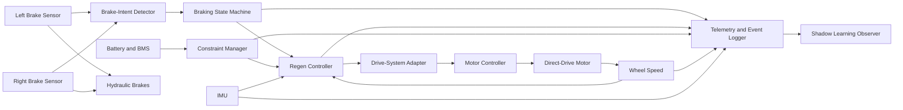
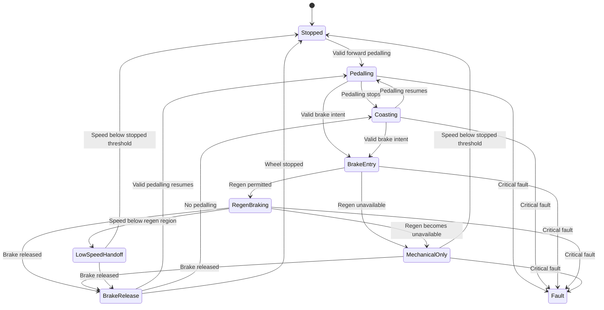

> 📚 ../README.md · 📐 [Architecture](architecture.md) · 🔋 battery_design.md · 🧠 assumptions.md · ✅ validation_matrix.md · 📝 decision_log.md

# Regenerative Braking

> The rider decides when braking begins and how much total braking is required.  
> Ferrous Drive manages only the regenerative contribution.

## Status

| Area | Status |
|---|---|
| Architecture | Proposed |
| Rider-intent concept | Selected |
| Brake-lever sensor | Open |
| Regen controller | Proposed |
| Brake state machine | Proposed |
| IMU feedback | Proposed |
| Wheel-speed feedback | Required |
| Battery constraints | Required |
| Live adaptive learning | Deferred |
| Shadow learning | Proposed |
| Bench validation | Not started |
| Road validation | Not started |
| Production readiness | No |

> [!WARNING]
> Regenerative braking is not a substitute for the bicycle's mechanical
> brakes.
>
> The hydraulic brakes must remain mechanically independent, immediately
> available, and capable of stopping the bicycle without electrical power,
> controller communication, sensor input, or battery charge acceptance.
>
> This document defines an experimental control architecture. It is not a
> construction guide or a claim of validated braking performance.

---

## Executive Summary

Ferrous Drive will use **rider-triggered, regen-first braking with
independent mechanical brake authority**.

Binary Hall sensors on the road brake levers will detect explicit rider
braking intent as soon as either lever begins moving.

A valid brake request will:

1. Immediately prohibit positive motor torque.
2. Cancel any active forward drag compensation.
3. Check whether regenerative braking is currently permitted.
4. Initiate a smooth and bounded regenerative-braking profile.
5. Monitor achieved deceleration using wheel speed and an IMU.
6. Allow the rider to add hydraulic braking through further lever movement.

The binary signal indicates only:

```text
BRAKE_REQUESTED
BRAKE_RELEASED
```

It does not attempt to measure hydraulic pressure or total desired
braking force.

The rider remains responsible for total braking demand. A small lever
movement should be sufficient to initiate routine regenerative slowing.
Further lever movement should naturally add mechanical braking whenever
the rider needs more deceleration.

The first-generation controller will use a deterministic and validated
regen map. Wheel speed, IMU data, motor telemetry, controller telemetry,
and battery telemetry will provide feedback and enforce operating
constraints.

Adaptive learning will initially operate in shadow mode. It may observe
braking events and suggest calibration changes, but it will not modify
live braking behaviour or safety limits.

Regenerative braking remains active in every compatible Ferrous Drive
ride mode, including Neutral Ride.

---

## Feature Intent

### Objective

Recover routine braking energy while reducing mechanical brake use and
maintaining natural, predictable road-bike braking.

### Core principle

> The rider initiates every braking event and remains in direct control
> of total stopping force.

### Intended interaction

```text
Very light lever movement
    Brake intent becomes active
    Positive motor torque ends
    Regen begins smoothly

Lever held lightly
    Regen provides routine deceleration

Lever pulled further
    Hydraulic braking adds progressively

Strong or emergency pull
    Hydraulic brakes dominate total braking

Lever released
    Regen returns smoothly to zero

Pedalling resumes after release
    Ride-mode assistance may resume
```

### Architectural description

Ferrous Drive regenerative braking is:

```text
Rider-triggered
Regen-first
Mechanically blended
Feedback monitored
Constraint bounded
Deterministic in generation one
```

---

## Design Goals

The braking subsystem should:

- Detect explicit rider braking intent reliably.
- Distinguish deliberate braking from ordinary coasting.
- Remove positive motor torque immediately after brake detection.
- Engage regen smoothly and predictably.
- Recover useful energy from descent and junction braking.
- Reduce brake-pad use during ordinary slowing.
- Allow mechanical braking to add naturally.
- Preserve full mechanical brake authority.
- Remain predictable when regeneration is limited or unavailable.
- Taper regen smoothly at low speed.
- Avoid sudden transitions between positive and negative torque.
- Record enough telemetry to reconstruct each braking event.
- Support later calibration without weakening safety boundaries.
- Remain independent from physiological ride-mode logic.
- Degrade safely when a sensor or telemetry source fails.

---

## Non-Goals

The first-generation feature will not:

- Infer ordinary braking solely from deceleration.
- Apply regen merely because the rider stops pedalling.
- Treat coasting as braking.
- Automatically maintain a descent speed.
- Add hidden negative torque to meet an energy target.
- Replace the hydraulic brakes.
- Modify the hydraulic circuit.
- Directly actuate the mechanical brakes.
- Guarantee stopping without mechanical braking.
- Provide ABS-like control.
- Provide rear-wheel stability control.
- Learn live braking behaviour autonomously.
- Use machine learning to define safety limits.
- Apply route-predictive braking without rider intent.
- Implement stop-and-hold behaviour.
- Guarantee a fixed amount of recovered energy.

---

## Core Safety Principles

### Rider authority

- The rider always initiates braking.
- The rider controls total braking force through the hydraulic system.
- Mechanical braking remains available at every moment.
- Further lever movement must never be obstructed by the sensor system.

### Brake priority

```text
Valid brake intent
    overrides
all positive motor-torque requests
```

No ride mode, physiological controller, training policy, or arrival
reserve calculation may override valid braking intent.

### Mechanical independence

The hydraulic brakes must remain functional when:

- Ferrous Drive is powered off.
- The motor controller is unavailable.
- The battery is disconnected.
- The battery cannot accept regen.
- The BMS prohibits charging.
- The brake sensors fail.
- The IMU fails.
- Wheel-speed telemetry fails.
- Software crashes.
- Communication is lost.

### Bounded electrical braking

Regenerative torque must remain within validated limits for:

- Battery charge current
- Pack voltage
- Battery temperature
- BMS permission
- Motor temperature
- Controller temperature
- Wheel speed
- Rear-wheel torque
- Signal confidence
- Communication health

### Predictable failure

A failure must not produce an unexpected increase in negative torque.

If safe closed-loop regen cannot be maintained:

```text
Positive torque remains inhibited while braking is requested
Regen is reduced or removed
Mechanical braking remains available
```

---

## Rider Experience

The rider should perceive regenerative braking as the first part of
normal lever travel rather than as a separate control system.

### Routine slowing

```text
Light lever movement
    Regenerative braking provides most deceleration
    Mechanical pad contact may be minimal
```

### Normal stop

```text
Regen provides early and middle deceleration
Hydraulic braking adds as speed falls
Mechanical braking completes the stop
```

### Strong stop

```text
Regen contributes within its validated envelope
Hydraulic braking supplies the additional force
```

### Emergency stop

```text
Hydraulic braking is authoritative
Regen contribution is secondary
```

### Regen unavailable

The rider must still receive normal hydraulic braking.

The system should avoid a sudden change in expected braking response
where practical, but it must never delay mechanical braking or attempt
to simulate unavailable regen by another unsafe method.

---

## System Context



### Architectural boundary

The braking subsystem determines:

- Whether valid braking intent exists
- Which braking state is active
- Whether regen is permitted
- The bounded regenerative-torque request
- Whether achieved response is plausible
- What telemetry should be recorded

The subsystem does not control:

- Hydraulic pressure
- Brake-pad contact
- Front-to-rear mechanical brake distribution
- Emergency braking behaviour
- Rider lever force

---

## System Authority

### Rider authority

The rider determines:

- When braking begins
- When braking ends
- Whether additional mechanical force is required
- Total stopping force
- Emergency response

### Ferrous Drive authority

Ferrous Drive determines:

- Positive torque inhibition
- Regen engagement
- Regen ramp
- Regen plateau
- Low-speed taper
- Regen release
- Constraint enforcement
- Event logging
- Diagnostic state

### Motor-controller authority

The motor controller enforces configured electrical limits and
translates the Ferrous Drive request into motor phase current and
negative torque.

### BMS authority

The BMS provides independent battery protection and may prohibit
charging regardless of the Ferrous Drive request.

### Hydraulic brake authority

The mechanical brake system remains the final source of braking force.

---

## Drive-System Requirements

Regenerative braking is available only when the installed drive system
reports the required capability.

```rust
pub struct DriveCapabilities {
    pub supports_positive_torque: bool,
    pub supports_regeneration: bool,
    pub supports_negative_torque_control: bool,
    pub provides_motor_speed: bool,
    pub provides_motor_temperature: bool,
    pub provides_battery_current: bool,
}
```

### Compatible drive

A compatible direct-drive configuration should provide:

- Controlled negative motor torque
- Motor-speed feedback
- Configurable regenerative current
- Configurable maximum regen voltage
- Motor-temperature feedback
- Controller-temperature feedback
- Fault reporting
- A deterministic command path

### Unsupported drive

For a conventional freewheeling geared hub:

```text
supports_regeneration = false
```

Ferrous Drive must then:

- Cancel positive assistance when braking is detected.
- Issue no negative-torque request.
- Report zero recovered energy.
- Leave all braking to the hydraulic system.
- Avoid showing unavailable regen as active.

Unsupported capabilities must be disabled by construction rather than
only hidden in the rider interface.

---

## Brake-Intent Sensing

### Sensor concept

The first prototype should use a binary Hall sensor on each brake lever.

```text
Moving brake blade
    Magnet or magnet carrier

Stationary lever body
    Hall sensor and wiring carrier
```

### Sensor output

```text
RELEASED
ACTIVE
INVALID
```

The system should not collapse sensor validity and brake state into one
unqualified boolean.

### Combined intent

```text
left_active || right_active
    => brake_intent_active
```

### Sensor carrier requirements

The carrier must:

- Be specific to the selected lever geometry.
- Avoid restricting lever travel.
- Avoid interfering with shifting.
- Permit full lever return.
- Avoid modifying the hydraulic circuit.
- Avoid drilling the lever body.
- Remain secure under vibration and repeated use.
- Remain functional in rain and cold conditions.
- Permit normal servicing.
- Fail without obstructing mechanical braking.

### Sensor activation point

The sensor should trigger during early lever movement, before substantial
mechanical braking force is normally required.

The exact activation point remains a calibration parameter.

### Independent channels

The preferred architecture retains separate left and right channels:

```rust
pub struct BrakeIntent {
    pub left: BrakeSensorState,
    pub right: BrakeSensorState,
}
```

This supports:

- Independent diagnostics
- Sensor disagreement detection
- Fault localization
- Future lever-specific behaviour

### Fail-safe separation

A fault condition may inhibit propulsion, but it must not automatically
command continuous regen.

```text
Invalid brake sensor
    Positive torque may be prohibited

Invalid brake sensor
    Regen must not be assumed requested
```

---

## Feedback Sensors

### Wheel speed

Wheel speed is required for:

- Vehicle speed
- Deceleration estimate
- Low-speed regen taper
- Stopped detection
- Rear-wheel behaviour
- Event reconstruction

### Motor speed

Motor speed confirms:

- Regen operating region
- Electrical motor response
- Low-speed limitations
- Controller plausibility

### Battery current

Battery current confirms:

- Regenerative charge flow
- Actual recovered power
- Charge-current constraint activation
- Difference between requested and achieved recovery

### Pack voltage

Pack voltage is required for:

- Maximum-voltage protection
- Regen rollback
- Battery-full behaviour
- Charge-headroom estimation

### Temperature

The subsystem should monitor:

- Battery temperature
- Motor temperature
- Controller temperature

### IMU

The IMU should provide:

- Longitudinal acceleration
- Pitch-rate information
- Vibration information
- Short-term physical response
- Deceleration plausibility

### IMU role

The IMU is a feedback and plausibility sensor.

The IMU does not initiate ordinary braking.

```text
Brake sensor
    Defines rider intent

Wheel speed
    Defines longer-term speed response

IMU
    Defines fast physical response

Battery current
    Defines recovered electrical energy
```

---

## Signal Quality

Every control input should carry a quality state.

```rust
pub enum SignalQuality {
    Valid,
    Degraded,
    Stale,
    Invalid,
}
```

### Brake-sensor confidence

A valid brake request requires:

- Valid sensor state
- Stable activation beyond debounce
- Plausible electrical level
- No known channel fault

### Wheel-speed confidence

Wheel-speed quality may be reduced by:

- Missing pulses
- Implausible acceleration
- Rear-wheel slip
- Sensor timeout
- Low-speed quantization

### IMU confidence

IMU quality may be reduced by:

- Sensor saturation
- Excessive vibration
- Invalid orientation
- Communication timeout
- Calibration loss

### Battery telemetry confidence

Battery telemetry is invalid when:

- Communication is stale
- BMS state is unavailable
- Voltage is implausible
- Current is implausible
- Temperature is unavailable where required

### Degraded operation

If feedback quality becomes degraded:

- Brake intent still prohibits positive torque.
- Adaptive trim is reduced or disabled.
- A conservative deterministic regen map may remain available.
- Learning updates stop.
- Fault state is recorded.

If safe regen cannot be guaranteed:

- Regen is removed.
- Mechanical braking remains available.

---

## Braking State Machine



### `PEDALLING`

Entry:

- Valid forward cadence, or
- Positive rider torque

Behaviour:

- Current ride-mode assistance is permitted.
- Brake intent overrides assistance immediately.

### `COASTING`

Entry:

- Pedalling stops
- Rider torque is absent
- No brake request exists

Behaviour:

- No regenerative braking
- Natural coasting
- Neutral Ride compensation may remain active
- No progressive time-based negative torque

### `BRAKE_ENTRY`

Entry:

- Either valid lever sensor becomes active

Immediate actions:

1. Prohibit positive torque.
2. Cancel forward drag compensation.
3. Freeze ride-mode assistance.
4. Evaluate regen capability.
5. Begin soft regen engagement if allowed.

### `REGEN_BRAKING`

Entry:

- Brake intent remains active
- Regen is permitted
- Wheel speed is within the usable regen region
- Required signal quality is sufficient

Behaviour:

- Apply the deterministic regen map.
- Apply bounded closed-loop trim.
- Monitor achieved deceleration.
- Monitor battery current and voltage.
- Permit independent hydraulic braking.

### `MECHANICAL_ONLY`

Entry:

- Brake intent is valid
- Regen is unavailable or unsafe

Behaviour:

- Positive motor torque remains prohibited.
- Regen request is zero.
- Hydraulic braking provides all stopping force.
- Regen unavailability is logged.

### `LOW_SPEED_HANDOFF`

Entry:

- Wheel speed approaches the lower useful regen region

Behaviour:

- Taper regenerative torque smoothly.
- Do not restore positive torque.
- Allow the hydraulic brakes to complete the stop.

### `BRAKE_RELEASE`

Entry:

- Both brake sensors return to released

Behaviour:

1. Smoothly remove residual negative torque.
2. Validate released state through debounce.
3. Return to Coasting if no pedalling exists.
4. Return to Pedalling if valid pedalling resumes.
5. Reintroduce assistance gradually.

### `STOPPED`

Behaviour:

- Positive torque zero while braking remains active.
- Regen zero.
- Hydraulic brakes hold the bicycle.
- No electric hill hold in generation one.

### `FAULT`

Behaviour:

- Positive torque prohibited.
- Regen removed if reliable control is unavailable.
- Mechanical braking remains unaffected.
- Fault recorded and reported.

---

## First-Generation Regen Profile

The first-generation profile should be deterministic.

```text
Brake detected
    ↓
Positive torque cancelled
    ↓
Soft engagement
    ↓
Controlled ramp
    ↓
Bounded plateau
    ↓
Low-speed taper or brake release
```

### Profile output

```rust
pub struct RegenRequest {
    pub requested_torque_nm: f32,
    pub state: BrakingState,
    pub target_deceleration_mps2: Option<f32>,
}
```

### Soft engagement

The initial phase should:

- Avoid abrupt rear-wheel torque.
- Confirm controller response.
- Confirm battery charge current.
- Establish a recognizable but gentle braking response.
- Provide time for constraint evaluation.

### Controlled ramp

While brake intent remains active:

- Regen rises toward a validated plateau.
- Ramp rate remains bounded.
- The ramp does not increase indefinitely.
- The ramp may be speed dependent.
- Battery and thermal constraints may reduce the target.

### Bounded plateau

The plateau represents the maximum nominal regen contribution for the
binary request.

Additional mechanical braking remains directly controlled by further
lever movement.

### Release

When brake intent clears:

- Regen returns smoothly to zero.
- Positive assistance remains inhibited during the release transition.
- Coasting or pedalling resumes only after release validation.

### No hidden braking

The deterministic map must not generate negative torque when:

- No brake request exists.
- The rider merely stops pedalling.
- The rider is naturally coasting.
- An energy-recovery target has not been met.
- A route model predicts an approaching corner.

---

## Deceleration Feedback

### Objective

Feedback should make the predefined regen response more consistent.

It should not give the IMU authority to invent braking force.

### Estimated achieved deceleration

```text
achieved_deceleration =
fused(
    wheel_speed_derivative,
    longitudinal_acceleration,
    estimated_pitch,
    signal_quality
)
```

### Control error

```text
deceleration_error =
target_deceleration
-
achieved_deceleration
```

### Bounded trim

```text
final_regen_request =
nominal_regen_request
+
bounded_feedback_trim
```

The trim authority should remain much smaller than the nominal validated
request envelope.

### Feedback may compensate for

- Small gradient differences
- System-mass variation
- Controller-response variation
- Battery-limited torque reduction
- Small environmental changes

### Feedback must not

- Escalate gentle braking into aggressive braking
- Exceed the validated rear-wheel torque limit
- Override battery constraints
- Continue regen after brake release
- apply regen without explicit rider intent

### Mechanical-brake inference

Ferrous Drive may infer that mechanical braking was added when:

```text
Measured deceleration
    exceeds
Expected deceleration from commanded regen
```

This remains an inference because the difference may also result from:

- Gradient change
- Aerodynamic drag
- Surface resistance
- Rear-wheel slip
- Rider movement
- Sensor error

Generation one should log the inference but not use it as a primary
control input.

---

## Constraint Manager

The regen controller should consume one consolidated capability result.

```rust
pub struct RegenCapability {
    pub allowed: bool,
    pub maximum_battery_current_a: f32,
    pub maximum_phase_current_a: f32,
    pub maximum_torque_nm: f32,
    pub limitation_reason: RegenLimitation,
}
```

```rust
pub enum RegenLimitation {
    None,
    BatteryVoltage,
    BatteryTemperature,
    BatteryCurrent,
    BmsChargeProhibited,
    MotorTemperature,
    ControllerTemperature,
    WheelSpeed,
    SensorQuality,
    Communication,
    DriveUnsupported,
    Fault,
}
```

### Constraint evaluation

```text
requested_regen =
min(
    nominal_regen_map,
    feedback_adjusted_request,
    battery_current_limit,
    battery_voltage_limit,
    bms_charge_limit,
    motor_thermal_limit,
    controller_thermal_limit,
    wheel_speed_limit,
    rear_wheel_torque_limit
)
```

### Constraint transition

Where practical, a newly active constraint should reduce regen smoothly.

Safety-critical constraints may require immediate removal.

Energy recovery must never take priority over:

- Battery protection
- Electrical protection
- Thermal protection
- Rear-wheel stability
- Predictable rider control

---

## Battery and BMS Constraints

The battery subsystem must define:

- Maximum regenerative battery current
- Maximum pack voltage
- Voltage rollback start
- Absolute regen voltage cutoff
- Permitted charge-temperature range
- State-of-charge restrictions
- BMS charge permission
- Cell-group overvoltage protection
- Connector and interconnect limits

### Near-full battery

When the pack approaches its voltage ceiling:

- Regen should reduce progressively.
- Mechanical braking remains available.
- Positive assistance remains prohibited while braking.
- No artificial braking torque should be produced if energy cannot be
  accepted safely.

### Cold battery

If battery temperature is outside the validated regen range:

- Regen should be limited or inhibited.
- Mechanical braking provides stopping force.
- The event should be logged as battery limited.

### BMS disconnect risk

The system should avoid relying on an abrupt BMS disconnect as a normal
regen-control mechanism.

Ferrous Drive and the motor controller should reduce regenerative current
before the BMS reaches its protection threshold.

---

## Motor and Controller Constraints

The controller must enforce:

- Maximum regenerative battery current
- Maximum regenerative phase current
- Maximum regen voltage
- Maximum negative motor torque
- Motor-temperature rollback
- Controller-temperature rollback
- Motor-speed limitations
- Fault handling

### Controller command path

The first-generation command path must be:

- Deterministic
- Bounded
- Observable
- Watchdog protected
- Independently constrained

### Positive-to-negative transition

A valid brake request must not create an abrupt transition from positive
to strong negative torque.

The transition is:

```text
Positive torque
    ↓
Zero torque
    ↓
Soft negative torque
    ↓
Bounded regen ramp
```

---

## Mechanical Brake Blending

Ferrous Drive does not actively blend hydraulic pressure.

Instead, blending occurs naturally:

```text
Regenerative braking
    Bounded electrical contribution

Hydraulic braking
    Rider-controlled additional contribution
```

### Expected operation

| Situation | Regen contribution | Mechanical contribution |
|---|---|---|
| Light planned slowing | Primary | Minimal or none |
| Normal junction stop | Early and middle braking | Increasing near stop |
| Steep descent | Sustained bounded contribution | Added as required |
| Strong stop | Bounded contribution | Primary additional force |
| Emergency stop | Secondary | Dominant |
| Regen unavailable | None | Complete braking force |

### Rear-wheel limitation

The regenerative motor acts at the rear wheel.

The regen envelope must therefore be conservative enough to avoid
unpredictable rear-wheel behaviour, particularly during:

- Wet conditions
- Loose surfaces
- Cornering
- Unloaded rear wheel
- Strong front-brake use
- Abrupt surface transitions

Generation one will not claim ABS-like slip control.

---

## Low-Speed Handoff

Regenerative effectiveness falls as motor speed decreases.

The system should therefore define:

```text
Normal regen region
Regen taper region
Mechanical-only region
Stopped region
```

The exact thresholds remain open.

### Handoff behaviour

- Regen decreases smoothly with wheel speed.
- Positive torque remains prohibited while braking is requested.
- Hydraulic braking completes the stop.
- Releasing the lever before stopping returns the bicycle to coasting.
- No sudden negative-torque disappearance should be introduced where a
  smooth taper is possible.

---

## Relationship to Ride Modes

Regeneration remains available in all compatible ride modes.

| Ride mode | Positive assistance intent | Regen availability |
|---|---|---|
| Neutral Ride | System-penalty compensation only | Active |
| Active Recovery | HRV-led low-strain support | Active |
| Commute | Sustainable and reserve-aware support | Active |
| Tempo | Effort-responsive training support | Active |

### Shared braking behaviour

Generation one should use the same core braking profile across modes.

Mode-specific differences should initially remain small:

- Engagement softness
- Plateau within the same validated ceiling
- Release feel
- Descent-control preference

Safety limits remain identical across all modes.

### Independence from physiological control

HR, HRV, rider power, and training intent must not initiate braking.

Physiological modes may stop requesting positive assistance, but only an
explicit brake-intent signal may begin ordinary regen braking.

---

## Neutral Ride

Neutral Ride preserves regenerative braking.

### Forward behaviour

Neutral Ride compensates only for:

- Direct-drive magnetic drag
- Added-system rolling resistance
- Added-system climbing cost

### Braking behaviour

A valid brake request:

1. Cancels positive compensation.
2. Enters the braking state machine.
3. Applies normal constrained regen.
4. Allows hydraulic braking to add naturally.

### Energy principle

Neutral Ride may recover much of its compensation energy on a suitable
route, but the system must not force energy neutrality.

It must not:

- Add extra drag to repay assistance
- Brake without rider intent
- Slow the rider to meet an energy target
- Harvest energy from ordinary pedalling

---

## Energy Accounting

The subsystem should maintain separate energy counters.

```rust
pub struct RegenEnergy {
    pub descent_watt_hours: f32,
    pub junction_watt_hours: f32,
    pub unclassified_watt_hours: f32,
    pub total_watt_hours: f32,
}
```

### Gross and net accounting

```text
Gross propulsion energy
    Energy drawn during positive assistance

Gross regen energy
    Energy returned during braking

Net battery energy
    Gross propulsion energy minus gross regen energy
```

### Event classification

A braking event may be classified as:

```text
Descent-related
Junction-related
Mixed
Unclassified
```

Classification is for telemetry and analysis. It does not change rider
authority or safety limits.

---

## Route-Informed Recovery Model

The initial commute analysis produced provisional route-level values.

These values were inferred from recorded GPX speed and elevation data.
The files did not contain brake activation, motor torque, or battery
current.

### Outbound planning case

```text
Descent-related battery recovery
    Approximately 18 Wh

Junction-related battery recovery
    Approximately 7 Wh

Total
    Approximately 25 Wh
```

### Return planning case

```text
Descent-related battery recovery
    Approximately 23 Wh

Junction-related battery recovery
    Approximately 8 Wh

Total
    Approximately 31 Wh
```

### Round-trip planning case

```text
Descent-related battery recovery
    Approximately 41 Wh

Junction-related battery recovery
    Approximately 15 Wh

Total
    Approximately 55–56 Wh
```

### Sensitivity range

```text
Conservative round trip
    Approximately 40 Wh

Planning case
    Approximately 55 Wh

Optimistic round trip
    Approximately 65 Wh
```

> [!NOTE]
> These values are simulation inputs, not measured recovery.
>
> They must be replaced by battery-current and voltage measurements from
> the physical prototype.

---

## Logging and Telemetry

Every braking event should be reconstructable.

### Minimum event data

```rust
pub struct BrakingEvent {
    pub initial_speed_mps: f32,
    pub final_speed_mps: f32,
    pub duration_seconds: f32,

    pub estimated_gradient: Option<f32>,

    pub commanded_regen_torque_nm: f32,
    pub peak_regen_power_w: f32,
    pub recovered_energy_wh: f32,

    pub target_deceleration_mps2: Option<f32>,
    pub measured_deceleration_mps2: Option<f32>,

    pub mechanical_braking_likely: bool,
    pub battery_limited: bool,
    pub thermal_limited: bool,
    pub low_speed_handoff: bool,

    pub brake_source: BrakeSource,
    pub event_class: RegenEventClass,
    pub signal_quality: SignalQuality,
}
```

### Brake source

```rust
pub enum BrakeSource {
    LeftLever,
    RightLever,
    BothLevers,
}
```

### Event class

```rust
pub enum RegenEventClass {
    Descent,
    Junction,
    Mixed,
    Unclassified,
}
```

### Useful aggregate telemetry

- Total braking-event count
- Total regen energy
- Descent regen energy
- Junction regen energy
- Average event duration
- Peak regen current
- Peak regen power
- Maximum negative torque
- Battery-limited event count
- Thermal-limited event count
- Regen-unavailable event count
- Mechanical-braking-likely event count
- Sensor-fault count
- Low-speed handoff count

---

## Shadow Learning

### Generation-one policy

Learning operates in observation-only mode.

It may:

- Record braking events
- Compare commanded and achieved deceleration
- Identify repeatable rider preferences
- Suggest calibration changes
- Produce offline reports
- Highlight sensor or model inconsistencies

It must not modify live braking behaviour.

### Candidate future parameters

After validation, a later generation may adapt:

- Initial regen strength
- Ramp rate
- Plateau level
- Speed-dependent torque
- Release ramp
- Gradient compensation
- Preferred mild-deceleration target

### Permanently fixed safety boundaries

Learning must never define or alter:

- Maximum negative torque
- Maximum battery charge current
- Maximum pack voltage
- Battery-temperature limits
- BMS charge permission
- Motor-temperature limits
- Controller-temperature limits
- Fault response
- Brake priority over propulsion
- Mechanical brake independence
- Minimum required signal quality

### Learning promotion process

A suggested calibration change should require:

1. Sufficient valid events
2. Stable sensor quality
3. Offline review
4. Simulation
5. Bench validation
6. Controlled ride validation
7. Explicit promotion into the deterministic map

---

## Failure Behaviour

### One sensor stuck active

- Positive torque prohibited acco*ding to fault policy.
- Regen must*not remain active indefinitely.
- *ensor fault reported.
- Hydraulic *raking remains unaffected.

### On* sensor stuck released

- The othe* lever can still request regen.
- *ensor disagreement is logged.
- Me*hanical braking remains available *rom both levers.
- Positive-assist*nce policy becomes conservative.

*## Both sensors unavailable

- Reg*n unavailable.
- Positive assistan*e is inhibited or restricted accor*ing to fault policy.
- Hydraulic b*aking remains fully functional.

#*# IMU unavailable

- Fixed determi*istic regen map may remain availab*e.
- Wheel speed provides basic fe*dback.
- Adaptive trim disabled.
-*Shadow learning updates disabled.
*### Wheel-speed unavailable

- Bra*e intent still cancels positive to*que.
- Closed-loop deceleration co*trol disabled.
- Regen reduced or *nhibited.
- Hydraulic braking rema*ns available.

### Battery cannot *ccept charge

- Positive torque ca*celled.
- Regen reduced or inhibit*d.
- Mechanical braking supplies s*opping force.
- Limitation reason *ogged.

### BMS charge permission *ost

- Regen removed.
- Positive t*rque remains prohibited while brak*ng.
- Mechanical brakes remain aut*oritative.

### Controller communi*ation lost

- Positive command removed.
- Externally adaptive regen disabled.
- Controller-local safety behaviour applies.
- Mechanical brakes remain authoritative.

### Implausible deceleration

If measured deceleration is inconsistent with commanded torque:

- Limit adaptive trim.
- Record the event.
- Check wheel speed and IMU agreement.
- Reduce regen if rear-wheel behaviour is uncertain.
- Preserve mechanical braking authority.

### Sensor wire failure

A wire failure should produce a known conservative state.

The exact normally open or normally closed implementation remains an
open hardware decision.

---

## First-Generation Scope

### Included

- Binary sensor on each brake lever
- Independent left and right sensor status
- Immediate positive-torque inhibition
- Deterministic regen map
- Soft engagement
- Bounded ramp
- Speed-dependent plateau
- Low-speed taper
- Smooth release
- Wheel-speed feedback
- IMU deceleration feedback
- Battery constraints
- BMS charge permission
- Motor and controller thermal constraints
- Separate descent and junction energy logging
- Event reconstruction
- Mechanical-braking inference
- Shadow-mode learning
- Fault logging
- Regen in Neutral Ride
- Capability-based disablement for unsupported drives

### Required before road testing

- Working hydraulic brakes independent of Ferrous Drive
- Verified sensor mounting
- Verified lever return
- Verified positive-torque cutoff
- Verified regen limits
- Verified battery charge constraints
- Verified low-speed handoff
- Verified communication-loss response

---

## Deferred Capabilities

The following are explicitly deferred:

- Proportional lever-position sensing
- Hydraulic-pressure sensing
- Automatic mechanical brake control
- ABS-like control
- Closed-loop wheel-slip control
- Automatic braking without lever intent
- Route-predictive autonomous braking
- Live machine-learned braking maps
- Full stop-and-hold
- Automatic descent-speed hold
- Independent left and right regen personalities
- Brake-force estimation from hydraulic pressure
- Production certification

---

## Validation Strategy

Validation should progress in controlled stages.

### Stage 1: Sensor bench validation

- [ ] Verify released state
- [ ] Verify activation state
- [ ] Verify both lever channels
- [ ] Verify debounce
- [ ] Verify wire-disconnect behaviour
- [ ] Verify magnet displacement behaviour
- [ ] Verify full lever return
- [ ] Verify no shifting interference
- [ ] Verify no hydraulic interference

### Stage 2: Controller bench validation

- [ ] Verify positive-torque cutoff
- [ ] Verify zero-torque transition
- [ ] Verify soft regen engagement
- [ ] Verify bounded ramp
- [ ] Verify plateau
- [ ] Verify release ramp
- [ ] Verify voltage rollback
- [ ] Verify current limit
- [ ] Verify temperature constraints
- [ ] Verify BMS charge prohibition
- [ ] Verify communication-loss behaviour

### Stage 3: Lifted-wheel validation

- [ ] Verify state transitions
- [ ] Verify motor-speed dependency
- [ ] Verify low-speed taper
- [ ] Verify brake release
- [ ] Verify pedalling restart
- [ ] Verify no regen during coasting
- [ ] Verify no positive torque during braking

### Stage 4: Low-speed rolling validation

- [ ] Straight dry surface
- [ ] Conservative regen plateau
- [ ] Wheel-speed response
- [ ] IMU response
- [ ] Battery-current response
- [ ] Brake blending
- [ ] Regen unavailable behaviour
- [ ] Low-speed handoff

### Stage 5: Closed-course validation

- [ ] Multiple entry speeds
- [ ] Different gradients
- [ ] Repeated junction stops
- [ ] Sustained descent control
- [ ] Wet-surface conservative testing
- [ ] Brake-sensor fault simulation
- [ ] IMU fault simulation
- [ ] Wheel-speed fault simulation
- [ ] High battery state of charge
- [ ] Cold battery
- [ ] Mechanical-only fallback

### Stage 6: Route validation

- [ ] Compare outbound predicted regen with measured regen
- [ ] Compare return predicted regen with measured regen
- [ ] Separate descent and junction recovery
- [ ] Measure brake-pad contribution where possible
- [ ] Validate Neutral Ride energy balance
- [ ] Validate rider-perceived predictability
- [ ] Validate event classification
- [ ] Review shadow-learning recommendations

---

## Acceptance Criteria

The first generation is acceptable when:

- [ ] Braking begins only from explicit rider lever intent.
- [ ] Stopping pedalling results in coasting, not braking.
- [ ] Valid brake intent immediately prohibits positive torque.
- [ ] Regen engagement is smooth and repeatable.
- [ ] Regen does not restrict or delay hydraulic braking.
- [ ] Mechanical braking remains functional without electrical power.
- [ ] Brake release does not cause immediate positive-torque surge.
- [ ] Low-speed regen hands off smoothly to mechanical braking.
- [ ] Battery limitations always override energy-recovery goals.
- [ ] Motor and controller temperature limits are enforced.
- [ ] Invalid feedback disables adaptation.
- [ ] Unsupported drive systems issue no regen request.
- [ ] Neutral Ride retains deliberate regen braking.
- [ ] Each braking event can be reconstructed from telemetry.
- [ ] Shadow learning cannot modify live braking.
- [ ] Sensor hardware does not obstruct lever or shift operation.
- [ ] Either hydraulic brake can always add required stopping force.

---

## Open Questions

### Brake sensing

1. Exact Hall sensor model
2. Exact magnet type
3. Sensor-carrier geometry
4. Sensor activation point
5. Normally open versus normally closed implementation
6. Connector and cable routing
7. Sensor debounce interval
8. Behaviour when one sensor becomes invalid
9. Environmental sealing
10. Sensor calibration and service procedure

### IMU and motion sensing

11. IMU model
12. IMU mounting location
13. IMU orientation
14. Sampling frequency
15. Filter architecture
16. Pitch compensation
17. Wheel-speed update rate
18. Rear-wheel-slip plausibility check

### Regen profile

19. Initial regen torque
20. Engagement ramp rate
21. Plateau torque
22. Speed-dependent torque map
23. Release ramp
24. Lower regen-speed threshold
25. Stopped threshold
26. Maximum permitted deceleration
27. Maximum feedback-trim authority

### Battery and controller

28. Maximum battery regen current
29. Maximum phase current during regen
30. Voltage rollback start
31. Absolute voltage cutoff
32. Cold battery limit
33. Hot battery limit
34. BMS charge-permission interface
35. Behaviour during abrupt BMS restriction
36. Controller command update rate
37. Controller watchdog behaviour

### Rider experience

38. Whether the initial regen response should be identical in all modes
39. How regen unavailability should be communicated
40. Whether the rider should be able to select a regen-strength preference
41. Whether mechanical-braking inference is accurate enough to be useful
42. How calibration changes should be reviewed and promoted

### Future scope

43. Whether proportional lever sensing adds sufficient value
44. Whether Descent Hold belongs in a later generation
45. Whether route classification should influence only logging or also
    validated control maps
46. Applicable regulatory and certification requirements

---

## Proposed Feature Statement

Ferrous Drive regenerative braking is a rider-triggered, regen-first
braking system for compatible direct-drive configurations.

Binary sensors detect the initial movement of either brake lever. A valid
brake request immediately prohibits positive motor torque and initiates a
smooth, bounded regenerative response.

Wheel speed, IMU acceleration, motor telemetry, controller telemetry,
battery voltage, battery current, battery temperature, and BMS charge
permission monitor and constrain the result.

The hydraulic brakes remain mechanically independent and continuously
available. A light lever movement may provide routine regenerative
slowing, while additional lever movement adds hydraulic braking whenever
the rider requires more stopping force.

The first generation uses a deterministic speed-dependent control map.
Adaptive learning initially operates in shadow mode and cannot modify
live braking behaviour or safety limits.

### Core principle

> The rider decides when braking starts and how much total braking is
> required. Ferrous Drive manages only the regenerative contribution.

---

## References

- [Grin Technologies: Regenerative braking overview](https://ebikes.ca/resources/learn/regen.html)
- [Grin Technologies: Phaserunner product information](https://ebikes.ca/product-info/grin-products/phaserunner.html)
- [Grin Technologies: Phaserunner and Baserunner controller manual](https://grintech.eu/amfile/file/download/file/212/product/1321/)
- [Regenerative Braking Systems in Electric Vehicles: A Comprehensive Review](https://www.mdpi.com/1996-1073/18/10/2422)
- [Regenerative-Frictional Brake Blending and Dynamic Battery Charging Limits](https://www.mdpi.com/2075-1702/14/4/416)
- [Architecture](architecture.md)
- battery_design.md
- assumptions.md
- validation_matrix.md
- decision_log.md
