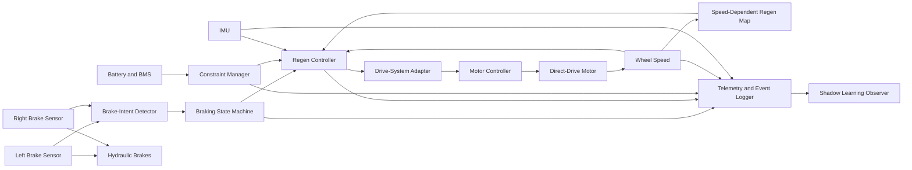
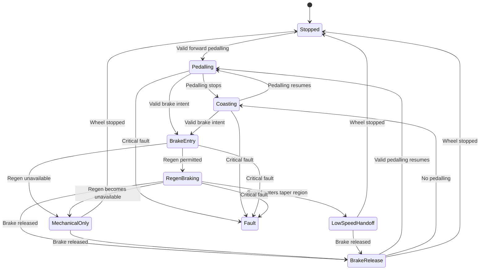

> 📚 [README](../README.md) · 📐 [Architecture](architecture.md) · 🔋 [Battery Design](battery_design.md) · 🧠 [Assumptions](assumptions.md) · ✅ [Validation Matrix](validation_matrix.md) · 📝 [Decision Log](decision_log.md)

# Regenerative Braking

> The rider decides when braking begins and how much total braking is required.  
> Ferrous Drive manages only the regenerative contribution.

## Status

| Area | Status |
|---|---|
| Architecture | Proposed |
| Rider-intent concept | Selected |
| Brake-lever sensor | Open |
| Speed-dependent regen relationship | Proposed |
| Deterministic regen controller | Proposed |
| IMU and wheel-speed feedback | Proposed |
| Battery constraints | Required |
| Live adaptive learning | Deferred |
| Shadow learning | Proposed |
| Bench validation | Not started |
| Road validation | Not started |
| Production readiness | No |

> [!WARNING]
> Regenerative braking is not a substitute for the bicycle's hydraulic brakes.
>
> The hydraulic brakes must remain mechanically independent, immediately
> available, and capable of stopping the bicycle without electrical power,
> controller communication, sensor input, or battery charge acceptance.
>
> This document defines an experimental control architecture. It is not a
> construction guide or a claim of validated braking performance.

---

## Executive Summary

Ferrous Drive will use **rider-triggered, regen-first braking with independent
mechanical brake authority**.

Binary Hall sensors on the road brake levers detect explicit braking intent as
soon as either lever begins moving. A valid brake request immediately prohibits
positive motor torque and starts a smooth, bounded regenerative response.

The binary signal communicates only:

```text
BRAKE_REQUESTED
BRAKE_RELEASED
```

It does not estimate hydraulic pressure or the rider's complete braking-force
request.

Vehicle speed is a primary input to the regenerative response. The binary
sensor establishes *whether* braking is requested; a validated speed-dependent
map determines the nominal regenerative torque. A time-based engagement ramp
softens the initial response, and bounded wheel-speed and IMU feedback trims the
resulting deceleration.

```text
Brake intent
    ↓
Validated wheel speed
    ↓
Speed-dependent regen target
    ↓
Soft engagement ramp
    ↓
Battery, motor, thermal, and stability constraints
    ↓
Bounded deceleration feedback
    ↓
Final negative-torque request
```

The rider retains complete braking authority:

- Minimal lever movement requests regenerative braking.
- Continued lever movement applies the normal hydraulic brakes.
- Mechanical braking remains available regardless of controller, battery,
  sensor, or software state.
- Ferrous Drive never decides independently that ordinary coasting is braking.

The first generation uses a deterministic speed-dependent control map.
Adaptive learning initially operates in shadow mode and cannot alter live
braking behaviour or safety boundaries.

Regenerative braking remains active in every compatible ride mode, including
Neutral Ride.

---

## Feature Intent

### Objective

Recover routine braking energy while reducing brake-pad use and maintaining
natural, predictable road-bike braking.

### Core principle

> The rider initiates every braking event and remains in direct control of total
> stopping force.

### Intended interaction

```text
Very light lever movement
    Brake intent becomes active
    Positive motor torque ends
    Regen begins smoothly

Lever held lightly
    Regen supplies routine deceleration

Lever pulled further
    Hydraulic braking adds progressively

Strong or emergency pull
    Hydraulic brakes dominate total braking

Lever released
    Regen returns smoothly to zero

Pedalling resumes after release
    Ride-mode assistance may resume
```

### Architectural description

Ferrous Drive regenerative braking is:

```text
Rider-triggered
Speed-scheduled
Regen-first
Mechanically blended
Feedback monitored
Constraint bounded
Deterministic in generation one
```

---

## Design Goals

The subsystem should:

- Detect explicit rider braking intent reliably.
- Distinguish deliberate braking from ordinary coasting.
- Remove positive motor torque immediately after brake detection.
- Scale the nominal regenerative response with validated wheel speed.
- Engage and release regen smoothly.
- Recover useful energy from descents and junction braking.
- Reduce brake-pad use during ordinary slowing.
- Allow hydraulic braking to add naturally.
- Preserve full mechanical brake authority.
- Remain predictable when regen is limited or unavailable.
- Taper regen smoothly at low speed.
- Avoid abrupt transitions between positive and negative torque.
- Record enough telemetry to reconstruct each braking event.
- Support later calibration without weakening safety boundaries.
- Remain independent from physiological ride-mode logic.
- Degrade safely when a sensor or telemetry source fails.

---

## Non-Goals

The first-generation feature will not:

- Infer ordinary braking solely from deceleration.
- Apply regen merely because the rider stops pedalling.
- Treat coasting as braking.
- Use a simple linear rule such as twice the speed equals twice the braking
  torque.
- Automatically maintain a descent speed.
- Add hidden negative torque to meet an energy target.
- Replace or alter the hydraulic brakes.
- Guarantee stopping without mechanical braking.
- Provide ABS-like control or rear-wheel stability control.
- Learn live braking behaviour autonomously.
- Use machine learning to define safety limits.
- Apply route-predictive braking without rider intent.
- Implement stop-and-hold behaviour.
- Guarantee a fixed amount of recovered energy.

---

## Core Safety Principles

### Rider authority

- The rider always initiates braking.
- The rider controls total braking force through the hydraulic system.
- Mechanical braking remains available at every moment.
- Further lever movement must never be obstructed by the sensor system.

### Brake priority

```text
Valid brake intent
    overrides
all positive motor-torque requests
```

No ride mode, training controller, physiological controller, or arrival-reserve
calculation may override valid braking intent.

### Mechanical independence

The hydraulic brakes must remain functional when:

- Ferrous Drive is powered off.
- The motor controller is unavailable.
- The battery is disconnected.
- The battery cannot accept regen.
- The BMS prohibits charging.
- Brake sensors, IMU, or wheel-speed telemetry fail.
- Software crashes or communication is lost.

### Predictable failure

A fault must not produce an unexpected increase in negative torque.

```text
Positive torque remains inhibited while valid braking is requested
Regen is reduced or removed when safe control cannot be maintained
Mechanical braking remains available
```

---

## Rider Experience

The rider should perceive regenerative braking as the first part of normal
lever travel rather than as a separate vehicle control.

| Situation | Regenerative contribution | Hydraulic contribution |
|---|---|---|
| Light planned slowing | Primary | Minimal or none |
| Normal junction stop | Early and middle braking | Increasing near stop |
| Steep descent | Sustained, bounded | Added as required |
| Strong stop | Bounded contribution | Primary additional force |
| Emergency stop | Secondary | Dominant |
| Regen unavailable | None | Complete braking force |

The system should minimize changes in braking feel when regen availability is
reduced, but it must never delay mechanical braking.

---

## System Context



The braking subsystem controls only the electrical regenerative contribution.
It does not control hydraulic pressure, pad contact, front-to-rear mechanical
brake distribution, or emergency braking.

---

## Drive-System Requirements

Regeneration is available only when the installed drive reports negative-torque
capability.

```rust
pub struct DriveCapabilities {
    pub supports_positive_torque: bool,
    pub supports_regeneration: bool,
    pub supports_negative_torque_control: bool,
    pub provides_motor_speed: bool,
    pub provides_motor_temperature: bool,
    pub provides_battery_current: bool,
}
```

For a conventional freewheeling geared hub:

```text
supports_regeneration = false
```

Ferrous Drive then inhibits positive assistance when braking is detected but
issues no negative-torque request.

---

## Brake-Intent Sensing

The first prototype should use a binary Hall sensor on each brake lever.

```text
Moving brake blade
    Magnet or magnet carrier

Stationary lever body
    Hall sensor and wiring carrier
```

### Sensor states

```text
RELEASED
ACTIVE
INVALID
```

### Combined brake intent

```text
left_active || right_active
    => brake_intent_active
```

A disconnected or implausible sensor may inhibit propulsion, but it must not be
interpreted automatically as a request for continuous regen.

The carrier must not restrict lever travel, shifting, hydraulic operation, or
full lever return. It should avoid permanent lever modification and must fail
without obstructing mechanical braking.

---

## Feedback Sensors

### Required

- Wheel speed
- Motor speed
- Battery current
- Pack voltage
- Battery temperature
- BMS charge permission
- Motor temperature
- Controller temperature and faults

### IMU

The IMU provides:

- Longitudinal acceleration
- Pitch-rate information
- Vibration context
- Fast deceleration response
- Plausibility checks

The IMU does not initiate ordinary braking.

```text
Brake sensor
    Defines rider intent

Wheel speed
    Defines longer-term speed response

IMU
    Defines fast physical response

Battery current
    Confirms recovered electrical energy
```

---

## Signal Quality

Every control input carries a quality state.

```rust
pub enum SignalQuality {
    Valid,
    Degraded,
    Stale,
    Invalid,
}
```

If feedback quality degrades:

- Brake intent still prohibits positive torque.
- Adaptive trim is reduced or disabled.
- A conservative deterministic map may remain available.
- Learning updates stop.
- If safe regen cannot be guaranteed, regen is removed.

---

## Braking State Machine



### Coasting

Stopping pedalling without a brake request means free coasting. No time-based
negative torque is introduced.

### Brake entry

A valid brake request immediately:

1. Prohibits positive torque.
2. Cancels forward drag compensation.
3. Freezes ride-mode assistance.
4. Evaluates current regen capability.
5. Starts soft engagement if permitted.

### Mechanical-only state

When regen is unavailable, positive torque remains inhibited and the hydraulic
brakes supply all braking force.

---

## Speed-Dependent Regenerative Torque

Vehicle speed is a primary input to the first-generation regen profile.

The binary brake signal indicates that the rider wants to slow down. It does not
directly define regenerative torque. The nominal request comes from a validated,
continuous speed map.

### Why speed matters

```text
Braking power = braking force × vehicle speed
```

```text
Motor power = motor torque × motor angular speed
```

For a given braking force, recoverable power tends to increase with speed.
Regeneration also becomes less effective as motor speed approaches zero.
Therefore neither constant torque nor constant recovered power is suitable over
the complete braking event.

### Four operating regions

```text
Mechanical-only region
    No useful regen

Low-speed taper region
    Regen rises smoothly from or falls smoothly to zero

Normal-speed region
    Stable, predictable routine regen

High-speed bounded region
    Higher available recovery within validated limits
```

Conceptually:

```text
Regenerative torque
^
|                           ┌──────── validated ceiling
|                      ┌────┘
|                 ┌────┘
|            ┌────┘        normal riding region
|       ┌────┘
|  ┌────┘
|__┘________________________________________> vehicle speed
   low-speed taper
```

The implementation should use continuous interpolation rather than abrupt
thresholds.

### Mechanical-only region

Below the minimum useful regen speed:

- Regen request is zero.
- Positive propulsion remains prohibited while braking is requested.
- Hydraulic braking supplies all stopping force.

### Low-speed taper

Above the minimum useful speed:

- Regen increases smoothly from zero.
- Torque discontinuities and threshold chatter are avoided.
- Regen progressively reduces as the bicycle approaches a stop.

### Normal-speed region

At normal road speeds:

- Regen provides a stable and familiar routine braking contribution.
- Consistent rider feel takes priority over maximum energy recovery.
- Further lever movement adds hydraulic braking independently.

### High-speed bounded region

At higher speed:

- A modestly stronger regenerative contribution may be permitted.
- Battery current, pack voltage, motor temperature, controller temperature, and
  rear-wheel stability remain authoritative.
- The validated maximum negative torque is never exceeded.

### Nominal speed map

A provisional mathematical form is:

```text
T_nominal(v) =
    0
        when v <= v_stop

    smoothstep(v) × T_normal
        when v_stop < v < v_taper_end

    scheduled_torque(v)
        when v_taper_end <= v < v_high

    T_max_validated
        when v >= v_high
```

The exact thresholds and torque values remain open until bench and controlled
ride validation.

### Relationship between speed and time

Speed and brake-request duration have different responsibilities:

```text
Vehicle speed
    Selects the nominal regen envelope

Time since brake activation
    Shapes the soft engagement ramp

IMU and wheel speed
    Trim achieved deceleration

Constraint manager
    Bounds the final command
```

The first-generation request is conceptually:

```text
T_request =
    T_speed_map(vehicle_speed)
    × engagement_ramp(time_since_brake_request)
    + bounded_feedback_trim
```

The final command is:

```text
T_command =
    clamp(
        T_request,
        0,
        T_regen_capability
    )
```

A simple rule such as doubling speed doubles torque is explicitly rejected.

---

## First-Generation Regen Profile

```text
Brake detected
    ↓
Positive torque cancelled
    ↓
Speed-dependent nominal target selected
    ↓
Soft engagement
    ↓
Controlled ramp
    ↓
Bounded plateau
    ↓
Low-speed taper or brake release
```

### Soft engagement

The initial phase should avoid abrupt rear-wheel torque, confirm controller and
battery response, and establish a gentle recognizable braking effect.

### Controlled ramp

While brake intent remains active, regen rises toward the current speed-based
plateau. The ramp rate remains bounded and does not increase indefinitely.

### Plateau

The plateau represents the normal maximum electrical contribution for the
current speed and current constraints. Additional mechanical braking remains
under direct rider control.

### Release

When brake intent clears, regen returns smoothly to zero. Positive assistance
must not restart until release validation is complete and valid pedalling
resumes.

---

## Deceleration Feedback

The speed map provides the nominal command. Feedback adjusts it only within a
small validated correction band.

```text
achieved_deceleration =
    fused(
        wheel_speed_derivative,
        longitudinal_acceleration,
        estimated_pitch,
        signal_quality
    )
```

```text
deceleration_error =
    target_deceleration
    - achieved_deceleration
```

```text
final_regen_request =
    nominal_regen_request
    + bounded_feedback_trim
```

Feedback may compensate for small gradient, mass, controller-response, and
battery variations. It must not escalate gentle braking into aggressive
braking, apply regen without explicit rider intent, or override constraints.

Possible rear-wheel instability should freeze positive trim, reduce negative
torque, preserve hydraulic braking, and be logged.

---

## Constraint Manager

```rust
pub struct RegenCapability {
    pub allowed: bool,
    pub maximum_battery_current_a: f32,
    pub maximum_phase_current_a: f32,
    pub maximum_torque_nm: f32,
    pub limitation_reason: RegenLimitation,
}
```

```rust
pub enum RegenLimitation {
    None,
    BatteryVoltage,
    BatteryTemperature,
    BatteryCurrent,
    BmsChargeProhibited,
    MotorTemperature,
    ControllerTemperature,
    WheelSpeed,
    SensorQuality,
    Communication,
    DriveUnsupported,
    RearWheelPlausibility,
    Fault,
}
```

The final request is bounded by the lowest active capability limit.

```text
T_final = min(
    T_speed_map,
    T_feedback_adjusted,
    T_battery_limit,
    T_voltage_limit,
    T_bms_limit,
    T_motor_limit,
    T_controller_limit,
    T_rear_wheel_limit
)
```

---

## Battery and BMS Constraints

The battery subsystem owns:

- Maximum regenerative battery current
- Maximum pack voltage
- Voltage rollback start
- Absolute regen voltage cutoff
- Permitted charge-temperature range
- State-of-charge restrictions
- BMS charge permission
- Cell-group overvoltage protection
- Connector and interconnect limits

Near full charge or outside the permitted charge-temperature range, regen must
be reduced or inhibited. Mechanical braking remains available.

The architecture should reduce regen before an abrupt BMS disconnect is needed.

---

## Mechanical Brake Blending

Ferrous Drive does not command hydraulic pressure. Blending occurs naturally:

```text
Regenerative braking
    Bounded electrical contribution

Hydraulic braking
    Rider-controlled additional contribution
```

Because the motor acts at the rear wheel, the regen envelope must remain
conservative in wet conditions, loose surfaces, cornering, strong front-brake
use, and abrupt surface transitions.

---

## Low-Speed Handoff

The low-speed handoff defines four regions:

```text
Normal regen region
Regen taper region
Mechanical-only region
Stopped region
```

Regen decreases smoothly with wheel speed. Positive torque remains inhibited
while the brake request is active. Hydraulic braking completes the stop.

---

## Relationship to Ride Modes

Regeneration remains available in all compatible modes.

| Ride mode | Positive assistance intent | Regen availability |
|---|---|---|
| Neutral Ride | Installed-system compensation only | Active |
| Active Recovery | HRV-led low-strain support | Active |
| Commute | Sustainable and reserve-aware support | Active |
| Tempo | Effort-responsive training support | Active |

Generation one should use the same core speed map across modes. Minor validated
differences may later adjust engagement softness or plateau preference, but
safety limits remain identical.

HR, HRV, rider power, and training intent must not initiate braking.

---

## Neutral Ride

Neutral Ride preserves deliberate regen braking.

A valid brake request:

1. Cancels positive drag and mass compensation.
2. Enters the common braking state machine.
3. Applies the common speed-dependent regen map.
4. Allows hydraulic braking to add naturally.

Neutral Ride may recover much of its compensation energy on a suitable route,
but it must not force energy neutrality or add negative torque without rider
intent.

---

## Energy Accounting

```rust
pub struct RegenEnergy {
    pub descent_watt_hours: f32,
    pub junction_watt_hours: f32,
    pub unclassified_watt_hours: f32,
    pub total_watt_hours: f32,
}
```

The system should separately report gross propulsion energy, gross recovered
energy, and net battery energy.

A braking event may be classified for analysis as descent-related,
junction-related, mixed, or unclassified. Classification does not alter rider
authority or safety limits.

---

## Route-Informed Recovery Model

The current commute GPX analysis provides provisional simulation inputs, not
measured electrical recovery.

| Direction | Descent-related recovery | Junction-related recovery | Planning total |
|---|---:|---:|---:|
| Outbound | ~18 Wh | ~7 Wh | ~25 Wh |
| Return | ~23 Wh | ~8 Wh | ~31 Wh |
| Round trip | ~41 Wh | ~15 Wh | ~55–56 Wh |

Sensitivity range:

```text
Conservative round trip
    Approximately 40 Wh

Planning case
    Approximately 55 Wh

Optimistic round trip
    Approximately 65 Wh
```

These values must be replaced by measured battery voltage and current from the
physical prototype.

---

## Logging and Telemetry

```rust
pub struct BrakingEvent {
    pub initial_speed_mps: f32,
    pub final_speed_mps: f32,
    pub duration_seconds: f32,
    pub estimated_gradient: Option<f32>,

    pub nominal_speed_map_torque_nm: f32,
    pub commanded_regen_torque_nm: f32,
    pub peak_regen_power_w: f32,
    pub recovered_energy_wh: f32,

    pub target_deceleration_mps2: Option<f32>,
    pub measured_deceleration_mps2: Option<f32>,

    pub mechanical_braking_likely: bool,
    pub battery_limited: bool,
    pub thermal_limited: bool,
    pub low_speed_handoff: bool,

    pub brake_source: BrakeSource,
    pub event_class: RegenEventClass,
    pub signal_quality: SignalQuality,
}
```

Useful aggregate telemetry includes braking-event count, descent and junction
recovery, peak current and power, limitation counts, low-speed handoffs, and
sensor faults.

---

## Shadow Learning

Generation-one learning is observation only.

It may compare speed, nominal torque, commanded torque, achieved deceleration,
recovered energy, and inferred mechanical braking. It may suggest changes to:

- Initial regen strength
- Engagement ramp
- Speed-dependent plateau
- Release ramp
- Gradient compensation
- Mild-deceleration target

It must never alter live braking behaviour or redefine absolute hardware,
battery, thermal, fault, or rider-authority boundaries.

A suggested calibration change requires offline review, simulation, bench
validation, controlled ride validation, and explicit promotion into the
deterministic map.

---

## Failure Behaviour

### Sensor stuck active

- Positive torque is prohibited according to fault policy.
- Regen must not remain active indefinitely.
- The fault is reported.
- Hydraulic braking remains unaffected.

### Sensor stuck released

- The other lever can still request regen.
- Sensor disagreement is logged.
- Assistance behaviour becomes conservative.

### IMU unavailable

- The fixed speed map may remain available.
- Wheel speed provides basic feedback.
- Adaptive trim and learning updates are disabled.

### Wheel speed unavailable

- Brake intent still cancels positive torque.
- Speed-dependent closed-loop regen cannot be trusted.
- Regen is reduced or inhibited.

### Battery cannot accept charge

- Positive torque is cancelled.
- Regen is reduced or inhibited.
- Hydraulic braking supplies stopping force.

### Implausible rear-wheel response

- Positive trim is frozen.
- Negative torque is reduced.
- Hydraulic braking remains available.
- The event is logged.

---

## First-Generation Scope

### Included

- Binary Hall sensor on each brake lever
- Independent left and right sensor status
- Immediate positive-torque inhibition
- Deterministic speed-dependent regen map
- Time-based soft engagement
- Bounded ramp and plateau
- Low-speed taper
- Smooth release
- Wheel-speed and IMU feedback
- Battery, BMS, motor, and controller constraints
- Rear-wheel plausibility reduction
- Descent and junction energy logging
- Event reconstruction
- Shadow learning
- Regen in Neutral Ride
- Capability-based disablement for unsupported drives

### Deferred

- Proportional lever-position sensing
- Hydraulic-pressure sensing
- Automatic mechanical brake control
- ABS-like wheel-slip control
- Automatic braking without lever intent
- Autonomous route-predictive braking
- Live machine-learned braking maps
- Full stop-and-hold
- Automatic descent-speed hold
- Production certification

---

## Validation Strategy

### Sensor bench validation

- [ ] Verify both lever channels and released state
- [ ] Verify activation point and debounce
- [ ] Verify wire-disconnect behaviour
- [ ] Verify full lever return and no shifting interference
- [ ] Verify environmental retention

### Controller bench validation

- [ ] Verify positive-to-zero-to-negative torque transition
- [ ] Verify speed-map interpolation
- [ ] Verify soft engagement and bounded ramp
- [ ] Verify high-speed ceiling
- [ ] Verify low-speed taper and zero-speed cutoff
- [ ] Verify battery voltage and current limits
- [ ] Verify BMS and thermal constraints
- [ ] Verify communication-loss behaviour

### Lifted-wheel validation

- [ ] Verify state transitions
- [ ] Verify no regen during ordinary coasting
- [ ] Verify no positive torque during braking
- [ ] Verify release and pedalling restart

### Controlled rolling validation

- [ ] Test multiple entry speeds
- [ ] Compare requested and achieved deceleration
- [ ] Validate IMU and wheel-speed agreement
- [ ] Validate mechanical brake blending
- [ ] Test high battery state of charge
- [ ] Test cold-battery limitations
- [ ] Test wet-surface conservative response
- [ ] Test low-speed mechanical handoff

### Route validation

- [ ] Compare predicted and measured descent regen
- [ ] Compare predicted and measured junction regen
- [ ] Validate speed-map behaviour across the route
- [ ] Validate Neutral Ride energy balance
- [ ] Validate braking-event classification
- [ ] Review shadow-learning recommendations

---

## Acceptance Criteria

Generation one is acceptable when:

- [ ] Braking begins only from explicit lever intent.
- [ ] Stopping pedalling results in coasting, not braking.
- [ ] Brake intent immediately prohibits positive torque.
- [ ] Nominal regen varies predictably with speed.
- [ ] Regen is zero below the validated minimum speed.
- [ ] Low-speed taper is smooth and repeatable.
- [ ] High-speed regen remains within the validated ceiling.
- [ ] Engagement and release are smooth.
- [ ] Regen never restricts or delays hydraulic braking.
- [ ] Invalid feedback disables trim rather than inventing a response.
- [ ] Battery and thermal constraints override recovery goals.
- [ ] Unsupported drives issue no regen request.
- [ ] Neutral Ride retains deliberate regen.
- [ ] Events can be reconstructed from telemetry.
- [ ] Shadow learning cannot modify live braking.

---

## Open Questions

### Brake sensing

1. Exact Hall sensor, magnet, and carrier geometry
2. Activation point and debounce
3. Normally open versus normally closed implementation
4. Connector, sealing, and cable routing
5. One-sensor fault policy

### Speed relationship

6. Minimum useful regen speed, `v_stop`
7. End of low-speed taper, `v_taper_end`
8. Start of high-speed region, `v_high`
9. Shape of `T_speed_map(v)`
10. Normal-speed target deceleration
11. High-speed target deceleration
12. Maximum validated rear-wheel torque
13. Maximum trim authority
14. Map interpolation and fixed-point representation
15. Threshold hysteresis and chatter prevention

### IMU and wheel sensing

16. IMU device and mounting location
17. Sampling and filter rates
18. Pitch compensation
19. Wheel-speed update rate
20. Rear-wheel plausibility logic

### Battery and controller

21. Maximum battery and phase regen current
22. Voltage rollback and cutoff
23. Cold and hot battery limits
24. BMS charge-permission interface
25. Controller command rate and watchdog

### Rider experience

26. Whether all ride modes use an identical generation-one map
27. How regen unavailability is communicated
28. Whether a rider-selectable comfort preference is desirable later
29. Whether inferred mechanical braking is accurate enough to guide calibration

---

## Proposed Feature Statement

Ferrous Drive regenerative braking is a rider-triggered, speed-scheduled,
regen-first braking system for compatible direct-drive configurations.

Binary sensors detect the initial movement of either brake lever. A valid brake
request immediately prohibits positive motor torque. Validated wheel speed then
selects a nominal regenerative response from a continuous speed-dependent map.
A soft engagement ramp, battery and thermal constraints, and bounded IMU and
wheel-speed feedback produce the final negative-torque command.

The hydraulic brakes remain mechanically independent and continuously
available. A light lever movement may provide routine regenerative slowing,
while additional lever movement adds hydraulic braking whenever the rider
requires more stopping force.

The first generation uses deterministic live control. Adaptive learning
operates in shadow mode and cannot modify braking behaviour or safety limits.

### Core principle

> The rider decides when braking starts and how much total braking is required.
> Speed shapes the regenerative contribution. Ferrous Drive keeps that
> contribution smooth, bounded, observable, and subordinate to the rider.

---

## References

- [Grin Technologies regenerative braking overview](https://ebikes.ca/resources/learn/regen.html)
- [Grin Technologies Phaserunner product information](https://ebikes.ca/product-info/grin-products/phaserunner.html)
- [Grin Technologies controller manual](https://grintech.eu/amfile/file/download/file/212/product/1321/)
- [Regenerative Braking Systems in Electric Vehicles: A Comprehensive Review](https://www.mdpi.com/1996-1073/18/10/2422)
- [Regenerative-Frictional Brake Blending and Dynamic Battery Charging Limits](https://www.mdpi.com/2075-1702/14/4/416)
- [Architecture](architecture.md)
- [Battery Design](battery_design.md)
- [Assumptions](assumptions.md)
- [Validation Matrix](validation_matrix.md)
- [Decision Log](decision_log.md)
