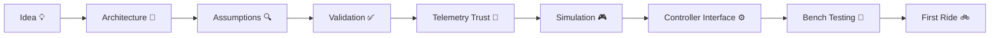
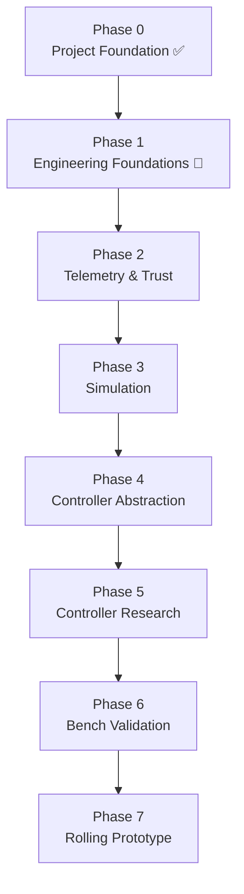
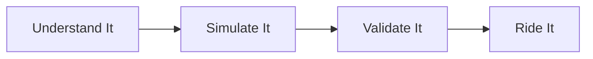
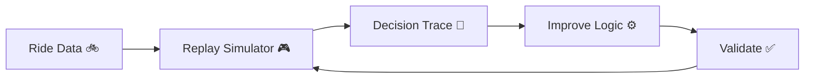

# Ferrous Drive Roadmap

Ferrous Drive is being built from the ground up with a strong focus on safety, simulation, validation, and maintainability.

Before targeting hardware, the project will establish confidence in its assumptions, telemetry handling, control architecture, and validation workflows.

---

# Project Journey



---

# Roadmap Progress



---

# Development Philosophy



---

# Engineering Confidence Pyramid

```text
            🚲 ROAD TESTED
                  ▲

             🧪 BENCH TESTED
                  ▲

              🎮 SIMULATED
                  ▲

               📐 DESIGNED
                  ▲

                💡 IDEA
```

Every major feature should climb this pyramid before being considered "trusted".

---

# Development Loop



---

# Phase 0 · Project Foundation ✅

## Completed

- Repository created
- Project vision established
- Initial architecture documented
- Initial requirements defined
- Changelog created
- Decision trail started
- Initial issues created

---

# Phase 1 · Engineering Foundations

## Current Issues

### #1 Repository Foundation & Project Origin

Document the project's history, design evolution, contributor workflows, and major architectural decisions.

### #2 Capture Our Engineering Assumptions

Record project assumptions, evidence, confidence levels, and validation plans.

### #3 Validation Matrix

Create a simple dashboard showing what is designed, simulated, tested, and trusted.

### Outcome

By the end of this phase we should be able to answer:

```text
Why was this built?
What assumptions exist?
What has been validated?
What still needs proving?
```

---

# Phase 2 · Telemetry & Trust

## Current Issues

### #4 Telemetry Trust Model

Define:

- Freshness handling
- Trust levels
- Timeout behaviour
- Invalid telemetry handling
- Sensor fallback pathways

### Outcome

Ferrous Drive understands when telemetry is:

```text
VALID
AGING
STALE
INVALID
```

and responds safely.

---

# Phase 3 · Simulation First

## Current Issues

### #5 Replay Simulator Foundation

Create a deterministic replay engine capable of:

```text
Load Ride
    ↓
Replay Telemetry
    ↓
Run Controller Logic
    ↓
Record Decisions
```

### Outcome

The simulator becomes the primary development environment.

---

# Phase 4 · Controller Abstraction

## Planned Work

- MotorRequest definition
- Controller interface
- Telemetry interface
- Controller health monitoring

### Outcome

The core should not care whether it talks to:

- Baserunner
- VESC
- Future controllers

---

# Phase 5 · Controller Research

## Planned Work

- Investigate direct Baserunner communication
- Validate telemetry availability
- Understand command behaviour
- Review failure modes

### Outcome

Answer:

```text
Can we safely and reliably
control a Baserunner digitally?
```

with evidence rather than assumptions.

---

# Phase 6 · Bench Validation

## Planned Work

- ESP32 experimentation
- Protocol testing
- Telemetry acquisition
- Controller interaction
- Fault injection
- Safety validation

### Outcome

Validate assumptions without putting a rider at risk.

---

# Phase 7 · Rolling Prototype

## Planned Work

- First hardware integration
- Compare simulation vs reality
- Validate assist behaviour
- Capture replay datasets
- Refine algorithms

### Outcome

Close the loop between:

```text
Architecture
    ↓
Simulation
    ↓
Reality
```

---

# Long-Term Vision

Ferrous Drive aims to become an open-source, controller-independent Rust e-bike platform focused on:

- Safety
- Determinism
- Simulation
- Transparency
- Community-driven engineering

---

